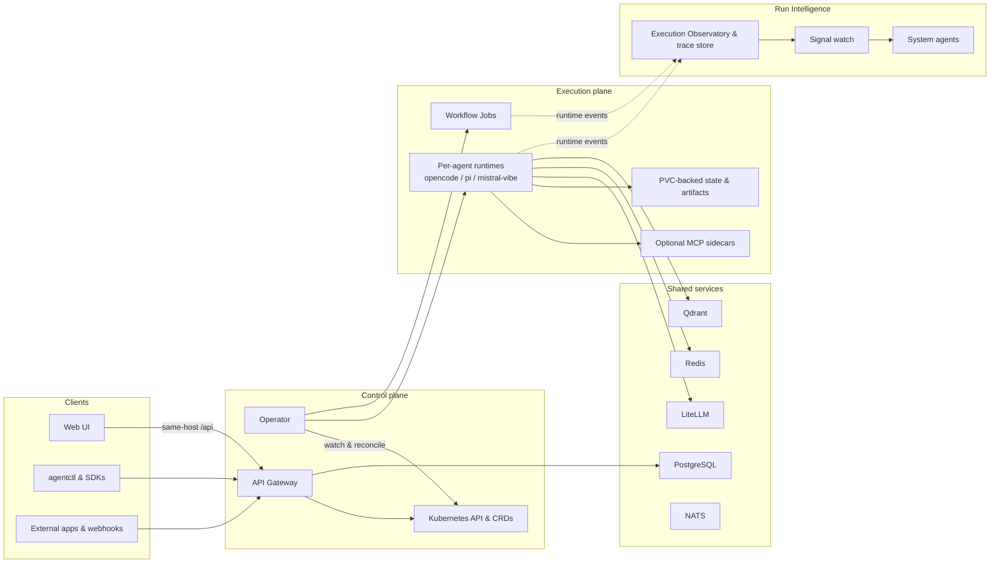

<p align="center">
  <picture>
    
  </picture>
</p>

<h1 align="center">KubeSynapse</h1>

<p align="center">
  <strong>Ship AI agents the same way you ship everything else — as Kubernetes resources.</strong>
</p>

<p align="center">
  <a href="https://github.com/ykbytes/kubesynapse.ai/stargazers"></a>
  <a href="LICENSE"></a>
  <a href="https://github.com/ykbytes/kubesynapse.ai/releases"></a>
  <a href="https://kubernetes.io/"></a>
  <a href="https://www.python.org/"></a>
  <a href="https://react.dev/"></a>
</p>

<p align="center">
  <a href="#-quickstart">Quickstart</a>
  &nbsp;|&nbsp;
  <a href="#-features">Features</a>
  &nbsp;|&nbsp;
  <a href="#-architecture">Architecture</a>
  &nbsp;|&nbsp;
  <a href="#-cli">CLI</a>
  &nbsp;|&nbsp;
  <a href="#-docs">Docs</a>
</p>

<br>

KubeSynapse is an open-source, self-hosted AI agent platform that runs entirely inside your Kubernetes cluster. Agents, workflows, policies, tool integrations, and observability are all Kubernetes CRDs — reconciled into isolated `StatefulSets`, worker `Jobs`, and live dashboards by the platform operator.

**No local-only toy frameworks. No mandatory SaaS control plane. Just your cluster, your models, your rules.**

<br>

---

## ⚡ Quickstart

### Kind (local, under 5 minutes)

```powershell
# 1. Deploy the platform (sets admin password)
pwsh -NoProfile -ExecutionPolicy Bypass -File ./scripts/deploy-kind.ps1 `
  -ClusterName kubesynapse-dev -Namespace kubesynapse -ReleaseName kubesynapse `
  -AdminPassword "KubesynapseAdmin9!"

# 2. Port-forward the gateway and UI
kubectl port-forward svc/kubesynapse-api-gateway -n kubesynapse 8080:8080
kubectl port-forward svc/kubesynapse-web-ui -n kubesynapse 3000:80

# 3. Open the UI, log in with admin / your password
open http://localhost:3000
kubectl apply -f examples/sample-agent.yaml
```

### Default Credentials

After install, log in with:
- **Username:** `admin`
- **Password:** The value you passed to `-AdminPassword` (e.g., `KubesynapseAdmin9!`)

Forgot your password? Retrieve it from the Kubernetes secret:

```bash
kubectl get secret kubesynapse-llm-api-keys -n kubesynapse \
  -o jsonpath='{.data.API_GATEWAY_SHARED_TOKEN}' | base64 -d
```

Or if you didn't set a password and want the default:

```bash
# The bootstrap admin password is stored in the gateway deployment env
kubectl get deploy kubesynapse-api-gateway -n kubesynapse \
  -o jsonpath='{.spec.template.spec.containers[0].env[?(@.name=="AUTH_BOOTSTRAP_ADMIN_PASSWORD")].valueFrom.secretKeyRef}'
```

> **Note:** Local auth requires a password of at least 8 characters. The quickstart script enforces this.

### Helm (any cluster)

```bash
helm upgrade --install kubesynapse ./charts/kubesynapse -n kubesynapse --create-namespace \
  --set platformSecrets.native.litellmMasterKey=$(openssl rand -hex 32) \
  --set platformSecrets.native.apiGatewaySharedToken=$(openssl rand -hex 32) \
  --set platformSecrets.native.databasePassword=$(openssl rand -hex 16) \
  --set platformSecrets.native.jwtSecret=$(openssl rand -hex 32) \
  --set apiGateway.auth.bootstrapAdminPassword="YourStrongPassword!"
```

After install, log in at `http://<your-cluster>:8080` with username `admin` and the password you set above.

<br>

---

## 🚀 Features

### Define agents as code

Describe your AI agent in a YAML manifest — model, system prompt, tools, and policy — and `kubectl apply` it. The operator provisions an isolated `StatefulSet` with persistent storage, network policies, and optional MCP sidecars. No manual pod management.

### Hardened by default

Agent runtimes ship with defense-in-depth across four layers:

- **Runtime Isolation** — Plugin auto-discovery disabled. No dynamic code execution from config files.
- **Immutable Baseline** — Hardened security policy enforced at the config layer. Agents cannot relax restrictions.
- **Traffic Enforcement** — All model calls routed through audited proxy. Provider redirect attacks prevented.
- **Full Audit Trail** — Request tracing with `x-request-id` propagation. Structured JSON logs ready for your SIEM.

[Learn more about the security model →](docs/architecture-overview.md#10-security-model)

- 12 CRDs model every platform concern: agents, workflows, policies, approvals, tenants, MCP connections, webhooks, and observability targets
- Three runtimes included: `opencode` (default), `pi`, and `mistral-vibe`
- Model calls proxy through LiteLLM with cost tracking and fallback
- Persistent workspace state on PVC with session checkpointing

### Orchestrate multi-step workflows

Define DAGs of agent steps with dependencies, approval gates, retries, timeouts, and conditional branching. The operator topologically sorts steps and dispatches them in parallel waves through worker Jobs.

- Step types: `agent`, `loop`, `conditional`, `review`
- Human-in-the-loop approval gates pause execution until a human approves
- Loop steps with circuit breakers and exit conditions
- Auto-retry with configurable failure classes

### Chat, collaborate, and observe

A full web console with chat workbench, workflow composer, and execution observatory. Stream agent responses in real-time via SSE. Trace every LLM call, tool invocation, and token spent.

- Chat Workbench with saved sessions and memory-backed continuity
- Workflow Composer with visual DAG editing and live execution state
- Execution Observatory: timeline, step detail, LLM/tool call inspection, HTML/JSON export
- System agents auto-analyze failures, anomalies, and cost spikes

### Secure and govern

Security is built in, not bolted on. Every layer — network, container, token, and policy — is enforced by default.

- Constant-time token comparison, argon2id password hashing
- Per-agent network policies (deny-all egress, explicit allows)
- Non-root runtimes with read-only root filesystem and dropped capabilities
- Rate limiting on login and agent invocation
- Audit logging with structured errors and correlation IDs

### Operate with a single CLI

`agentctl` covers every platform operation. Manage agents, trigger workflows, stream logs, query observatory data, and administer users — all from the terminal.

- 82 commands across 13 command groups
- Tab-completion for bash, zsh, fish, and PowerShell
- Live Kind cluster smoke tests with real resource validation
- Streaming invoke, live events, and interactive chat sessions

### Run in production

Schema changes use Alembic migrations, not ad-hoc `CREATE TABLE` calls. Backups are automated via CronJob. Logs are structured JSON with standard fields for aggregation.

- Alembic-powered database migrations with auto-generated baseline
- PostgreSQL backup CronJob with PVC and S3 support, retention cleanup, documented restore
- Structured JSON logging (`component`, `namespace`, `agent_name`, `request_id`, `duration_ms`)
- Correlation IDs flow through invoke, logs, and error responses

<details>
<summary><strong>The 12 CRDs installed by the chart</strong></summary>

| Kind | Purpose |
| --- | --- |
| `AIAgent` | Agent definition and runtime configuration |
| `AgentPolicy` | Guardrails, MCP/tool policy, memory, outbound A2A policy |
| `AgentApproval` | Human approval records for gated actions |
| `AgentWorkflow` | Multi-step workflow DAGs |
| `AgentTenant` | Namespace isolation and tenant metadata |
| `McpConnection` | Saved MCP connection definitions |
| `WebhookReceiver` | Signed inbound webhook configuration |
| `WorkflowTrigger` | Trigger metadata and history for workflow integrations |
| `ConnectorPlugin` | Observability connector definition |
| `ObservationTarget` | Observability target definition |
| `ObservationPolicy` | Observability evaluation policy |
| `ObservationReport` | Observability report output |

</details>

### Bundled MCP Sidecars

`code-exec` · `web-search` · `browser-automation` · `database` · `git` · `github` · `kubernetes-ops` · `messaging` · `rag` · `documents`

### UI Surfaces

**Chat Workbench** — direct agent interaction, SSE streaming, saved sessions, memory-backed continuity. **Team View** — explicit agent-to-agent collaboration. **Workflow Composer** — visual DAG editing, run history, inline approvals. **Execution Observatory** — execution lists, timelines, step inspection, LLM/tool calls, HTML/JSON export. **Catalog** — MCP registry and skills. **Intelligence** — observability resources and collector-driven flows.

<br>

---

## 🏗 Architecture



- Kubernetes is the source of truth for the control plane.
- Each agent is an isolated singleton `StatefulSet`.
- Workflow detail lives in worker artifacts and logs; CRD status stays summary-oriented.
- The API gateway is the public edge AND the application backend for auth, sessions, memory, chat, and observability.
- The [runtime API contract](docs/runtime-api-spec.md) defines core endpoints every runtime implements.

<br>

---

## 💻 CLI — `agentctl`

```bash
pip install -e ./cli
```

`agentctl` is the command-line interface to KubeSynapse. It covers every platform operation:

### Shell completion (tab-autocomplete)

**Install once, use everywhere:**

```bash
# bash (~/.bashrc)
eval "$(agentctl completion bash)"

# zsh (~/.zshrc)
eval "$(agentctl completion zsh)"

# fish
agentctl completion fish > ~/.config/fish/completions/agentctl.fish

# PowerShell ($PROFILE)
agentctl completion pwsh | Out-String | Invoke-Expression
```

After installing, tab-completion works for all commands, subcommands, and options:

```
agentctl <TAB>          -> health, apply, invoke, logs, agents, workflows, chat...
agentctl agents <TAB>   -> list, show, create, update, delete, invoke, logs...
agentctl --<TAB>        -> --gateway, --profile, --namespace, --output, --token...
```

### Quick workflow

```bash
# Login and configure
agentctl --gateway-url http://localhost:8080 auth login -u admin -p "<password>"
export AGENT_GATEWAY_TOKEN="<token>"

# CRUD
agentctl agents list
agentctl agents create -f examples/sample-agent.yaml
agentctl agents show research-assistant

# Invoke (streaming)
agentctl agents invoke research-assistant "What is Kubernetes?" --stream

# Workflows
agentctl workflows list
agentctl workflows trigger research-workflow
agentctl workflows status research-workflow

# Observatory
agentctl observatory metrics --window 24h
agentctl observatory traces --limit 10
agentctl observatory alerts --all

# Admin
agentctl admin users
agentctl admin user-create --username dev --password "Str0ngPass!" --role operator
```

PowerShell note: use `$env:AGENT_GATEWAY_TOKEN="<token>"` instead of `export`.

Read [`cli/README.md`](cli/README.md) for the full command surface.

<br>

---

## 📁 Repo Map

| Path | What it contains |
| --- | --- |
| [`api-gateway/`](api-gateway/) | FastAPI backend: auth, CRUD, invoke, chat, A2A, webhooks, observability |
| [`operator/`](operator/) | Kopf operator, manifest builders, worker orchestration, trace emission |
| [`opencode-runtime/`](opencode-runtime/) | Default AI agent runtime |
| [`pi-runtime/`](pi-runtime/) | Pi runtime bridge |
| [`vibe-runtime/`](vibe-runtime/) | Mistral Vibe runtime bridge |
| [`web-ui/`](web-ui/) | React 18 + Vite + Tailwind v4 console |
| [`mcp-sidecars/`](mcp-sidecars/) | Bundled MCP sidecars (10 tools) |
| [`cli/`](cli/) | `agentctl` CLI with shell completion |
| [`charts/kubesynapse/`](charts/kubesynapse/) | Main Helm chart (12 CRDs) |
| [`deploy/`](deploy/) | Environment overlays and deployment notes |
| [`examples/`](examples/) | Sample CRDs, workflows, and demo bundles |
| [`docs/`](docs/) | Architecture, runtime contract, operations, walkthrough |

<br>

---

## 📚 Docs & Guides

| Topic | Link |
| --- | --- |
| Current architecture overview | [`docs/architecture-overview.md`](docs/architecture-overview.md) |
| Full architecture reference | [`docs/architecture.md`](docs/architecture.md) |
| Current implementation walkthrough | [`docs/walkthrough.md`](docs/walkthrough.md) |
| Runtime API contract | [`docs/runtime-api-spec.md`](docs/runtime-api-spec.md) |
| Execution Observatory & run intelligence | [`docs/observability-explained.md`](docs/observability-explained.md) |
| Getting started guide | [`docs/getting-started.md`](docs/getting-started.md) |
| Installation & operations | [`INSTALL.md`](INSTALL.md) |
| Helm chart guide | [`charts/kubesynapse/README.md`](charts/kubesynapse/README.md) |
| Deployment guide | [`deploy/README.md`](deploy/README.md) |
| API reference | [`docs/api-reference.md`](docs/api-reference.md) |
| Troubleshooting | [`docs/troubleshooting.md`](docs/troubleshooting.md) |

<br>

---

## 🔧 Development

```bash
# All tests
make test

# Linting
make lint          # Ruff + mypy
make helm-lint     # Helm validation

# UI build
make ui-build

# Component tests
cd api-gateway && python -m pytest tests/ -v
cd operator && python -m pytest tests/ -v
cd cli && python -m pytest tests/ -v -q
cd web-ui && npm run build
```

Windows note: the root `Makefile` uses POSIX shell constructs. Use Git Bash, WSL, or invoke component commands directly in PowerShell.

### Local Kind development

```bash
# Build and load images
docker build -t kubesynapse-api-gateway:latest api-gateway/
kind load docker-image kubesynapse-api-gateway:latest --name kubesynapse-dev
kubectl rollout restart deployment/kubesynapse-api-gateway -n kubesynapse

# Port-forward
kubectl port-forward svc/kubesynapse-api-gateway -n kubesynapse 8080:8080
kubectl port-forward svc/kubesynapse-web-ui -n kubesynapse 3000:80
```

### CLI tests against live Kind

```bash
agentctl --profile kind health
agentctl --profile kind agents list
agentctl --profile kind agents invoke cli-e2e-agent "Reply with: smoke ok"
cd cli && python -m pytest tests/ -v -q
```

<br>

---

## 🤝 Contributing

KubeSynapse is Apache 2.0 licensed and welcomes contributions.

- Start with [`CONTRIBUTING.md`](CONTRIBUTING.md)
- Repo-specific agent guidance in [`AGENTS.md`](AGENTS.md)
- Security disclosures: [`SECURITY.md`](SECURITY.md)

<br>

## 📄 License

[Apache License 2.0](LICENSE)
