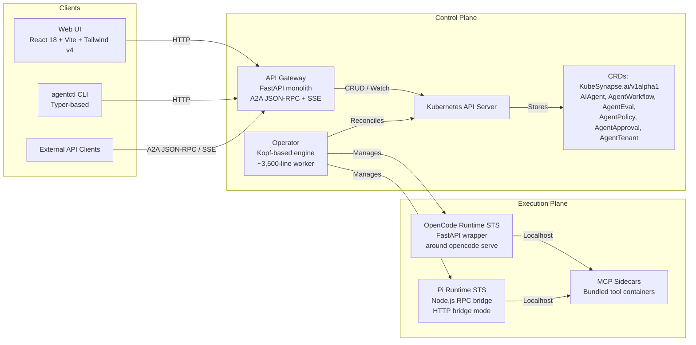

# KubeSynapse

<p align="center">
  <a href="https://github.com/kubesynapse/kubesynapse/stargazers"></a>
  <a href="https://github.com/kubesynapse/kubesynapse/blob/main/LICENSE"></a>
  <a href="https://github.com/kubesynapse/kubesynapse/releases"></a>
  <a href="https://kubernetes.io/"></a>
</p>

**The production-grade, Kubernetes-native AI agent platform.**
Deploy, orchestrate, and govern AI agents using declarative custom resources. KubeSynapse unifies an operator-driven control plane, A2A-ready API gateway, OpenCode runtime, and an extensible MCP tool ecosystem into a single Helm install.

---

## Architecture

KubeSynapse separates the **control plane** (CRDs, operator, gateway) from the **execution plane** (per-agent runtimes and sidecars).



---

## Quick Start

### Production Install (Helm OCI + Docker Hub)

The fastest path uses pre-built images from Docker Hub. Requires Kubernetes 1.25+, Helm 3.12+, and an LLM API key.

```bash
# 1. Install via Helm OCI (no git clone needed)
helm install KubeSynapse oci://docker.io/kubesynapse/charts/kubesynapse \
  --set platformSecrets.native.openaiApiKey="sk-..." \
  --set litellm.masterKey="your-secure-key"

# 2. Verify
kubectl port-forward svc/kubesynapse-api-gateway 8080:8080
curl http://localhost:8080/api/health

# 3. Create your first agent (runtimeKind: opencode or pi)
kubectl apply -f - <<EOF
apiVersion: kubesynapse.ai/v1alpha1
kind: AIAgent
metadata:
  name: my-agent
  namespace: default
spec:
  runtimeKind: opencode   # or runtimeKind: pi
  systemPrompt: "You are a helpful assistant."
  model: gpt-4o
  storageSize: 1Gi
EOF
```

### Install via Python SDK

```bash
pip install kubesynapse-sdk
```

```python
from KubeSynapse import KubeSynapseClient

client = KubeSynapseClient(base_url="http://localhost:8080")
health = await client.health_check()
print(health)  # {"status": "ok"}
```

### Install via TypeScript SDK

```bash
npm install @kubesynapse/sdk
```

```typescript
import { KubeSynapseClient } from "@kubesynapse/sdk";

const client = new KubeSynapseClient({ baseUrl: "http://localhost:8080" });
const agents = await client.listAgents();
console.log(agents);
```

### Install CLI

```bash
pip install kubesynapse-cli

agentctl health
agentctl agent list
agentctl workflow create --file my-workflow.yaml
```

### Install via Homebrew (macOS/Linux)

```bash
brew tap KubeSynapse/tap
brew install kubesynapse-cli
```

### Local Development (Kind)

Build locally and load into a Kind cluster. No registry required.

```bash
# 1. Create cluster
kind create cluster --name KubeSynapse-dev

# 2. Build platform images + MCP sidecars
make docker-build REGISTRY=localhost/KubeSynapseai VERSION=dev CONTAINER_CLI=docker

# 3. Install
helm upgrade --install KubeSynapse ./charts/kubesynapse \
  -f ./deploy/values.local-images.example.yaml

# 4. Port-forward
kubectl port-forward svc/kubesynapse-api-gateway 8080:8080
kubectl port-forward svc/kubesynapse-web-ui 3000:80

# 5. Install CLI
pip install ./cli
agentctl health
```

---

## Features

| # | Capability | What it means |
|---|------------|---------------|
| 1 | **Kubernetes-Native Orchestration** | Agents, policies, workflows, and tenants are `KubeSynapse.ai/v1alpha1` CRDs reconciled by a production Kopf operator. |
| 2 | **A2A Protocol Support** | Native JSON-RPC and Server-Sent Events (SSE) streaming for agent-to-agent delegation and real-time responses. |
| 3 | **Dual Runtime Support** | OpenCode runtime (FastAPI wrapper) AND Pi runtime (Node.js RPC bridge) with session persistence and checkpoint recovery. |
| 4 | **MCP Tool Ecosystem** | 11 bundled sidecar containers including code execution, web search, browser automation, database, git, Kubernetes ops, RAG, messaging, and more. |
| 5 | **Live Agent Observability** | Terminal-style live reasoning logs, execution trace replay, step-level status streaming, and artifact browsing with ZIP download. |
| 6 | **Policy-Driven Governance** | `AgentPolicy` CRDs enforce input/output guardrails, token caps, PII masking, prompt-injection detection, and allowed model lists. |
| 7 | **Multi-Tenant Isolation** | `AgentTenant` CRDs provision isolated namespaces, resource quotas, RBAC, and network policies per team. |
| 8 | **Workflow Engine** | `AgentWorkflow` CRDs define DAG-based multi-agent pipelines with dependency chains, parallel execution, and human-in-the-loop approval gates. |
| 9 | **Continuous Evaluation** | `AgentEval` CRDs run scheduled test suites measuring relevance, toxicity, latency, and exact-match thresholds against live agents. |

---

## Comparison

| Capability | KubeSynapse | LangChain | AutoGen | CrewAI | Dify | LangFlow |
|------------|-----------|-----------|---------|--------|------|----------|
| **Kubernetes Native** | Yes (Operator + CRDs) | No | No | No | Partial | Partial |
| **Self-Hosted** | Yes (Full stack via Helm) | Library only | Partial | Partial | Yes | Yes |
| **Multi-Agent Orchestration** | Yes (CRD-based DAGs) | LangGraph | Code-based | Code-based | Yes | Yes |
| **A2A Protocol (JSON-RPC/SSE)** | Yes (Native gateway) | No | No | No | No | No |
| **MCP Tool Ecosystem** | Yes (11 sidecars) | Requires setup | Requires setup | Requires setup | Limited | Limited |
| **Policy & Governance** | Yes (CRD guardrails) | Manual | Manual | Manual | Basic | Basic |
| **Human-in-the-Loop** | Yes (AgentApproval CRD) | External | External | External | Basic | Basic |
| **Eval Framework** | Yes (Built-in CRD) | External | External | External | Limited | Limited |
| **Live Observability & Artifacts** | Yes (trace replay + ZIP) | No | No | No | Limited | Limited |
| **Primary Model** | Platform | Library | Framework | Framework | Platform | Platform |

---

## Screenshots

> **Dashboard Overview** — Real-time agent status, tenant utilization, and system health.
> 

> **Agent Workflow Editor** — Visual DAG builder for multi-agent pipelines with approval gates.
> 

> **Policy Governance Panel** — Guardrail configuration, blocked patterns, and audit logs.
> 

---

## Contributing

We welcome contributions. See [`CONTRIBUTING.md`](CONTRIBUTING.md) for the full guide.

```bash
# Fork, clone, and build
git clone https://github.com/your-username/KubeSynapse.git
cd KubeSynapse

# Run the test suite
make test

# Lint Python services
make lint

# Deploy to local Kind
make deploy-ai-sandbox-kind
```

---

## License

KubeSynapse is licensed under the Apache License 2.0. See [LICENSE](LICENSE) for details.
