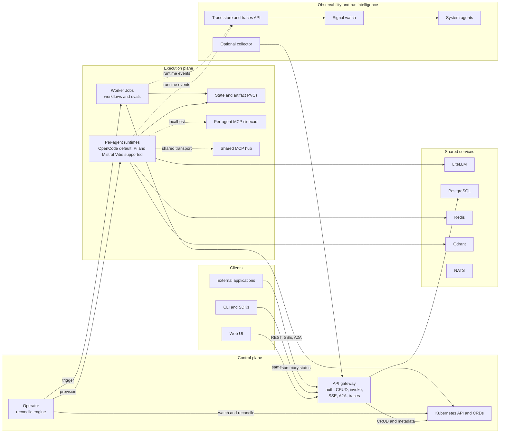

# KubeSynapse

<p align="center">
  <a href="https://github.com/ykbytes/kubesynapse.ai/stargazers"></a>
  <a href="https://github.com/ykbytes/kubesynapse.ai/blob/main/LICENSE"></a>
  <a href="https://github.com/ykbytes/kubesynapse.ai/releases"></a>
  <a href="https://kubernetes.io/"></a>
</p>

KubeSynapse is a Kubernetes-native AI agent platform built around CRDs, a Python operator, a FastAPI gateway, per-agent runtimes, worker Jobs, and a React web console. It is aimed at teams that want cluster-native lifecycle management, policy enforcement, traceability, and deployment surfaces instead of a local-only agent framework.

## Architecture

KubeSynapse separates the control plane from the execution plane. The Kubernetes API and CRDs are the source of truth, the gateway is the main application backend, and the operator materializes agents and automation into runtime workloads.



Current repo truths:

- Agents, policies, workflows, evals, approvals, tenants, MCP, and observability resources are modeled as CRDs.
- The API gateway owns authentication, session handling, CRUD, invoke routing, A2A, SSE, trace APIs, and UI-facing metadata.
- The operator reconciles `AIAgent` resources into singleton runtime StatefulSets and turns workflows or evals into worker Jobs.
- `runtime.kind: opencode` is the default path used in most checked-in examples and tooling. `runtime.kind: pi` and `runtime.kind: mistral-vibe` remain wired through the CRD, gateway, operator, CLI, chart, and UI.
- New clients should use `/api/v1/*`. Legacy `/api/*` routes are redirected with deprecation headers.

For the full architecture, see [docs/architecture-overview.md](docs/architecture-overview.md) and [docs/architecture.md](docs/architecture.md).

## Runtime Support

- `opencode` is the default in-tree runtime. It backs the checked-in examples, the OpenCode config-file workflow, persistent workspace state, and the memory features described in [opencode-runtime/README.md](opencode-runtime/README.md).
- `pi` is the supported alternative runtime. It stays wired through the CRD, gateway, operator, CLI, chart values, and UI so clusters can run Pi-backed agents without custom patches.
- `mistral-vibe` is the supported Mistral-backed runtime bridge. It exposes the same core invoke, session, artifact, and SSE contract surfaces as the other in-tree runtimes.
- New specs and docs should target only `runtime.kind: opencode`, `runtime.kind: pi`, or `runtime.kind: mistral-vibe`.

## What The Platform Includes

- Kubernetes-native control plane for agents, policies, workflows, evals, approvals, and tenants.
- Gateway-backed UI, CLI, Python SDK, and TypeScript SDK.
- Three supported in-tree agent runtimes: OpenCode for the default persistent/memory-heavy path, Pi for an alternative bridge-based backend, and Mistral Vibe for a Mistral-backed runtime bridge.
- Shared services for model routing and state: LiteLLM, PostgreSQL, Redis, Qdrant, and NATS.
- MCP integration in two forms: per-agent sidecars and the shared MCP hub.
- Worker-job execution for workflows and evals, with detailed artifacts and summary CRD status.
- Run-intelligence plumbing: runtime events, trace storage, signal watch, system agents, and an optional collector path.

## Quick Start

### Local Stack With Docker Compose

```bash
docker compose up -d
curl http://localhost:8080/api/v1/health
```

Then open:

- Web UI: `http://localhost:3000`
- API docs: `http://localhost:8080/api/v1/docs`

The checked-in compose stack brings up PostgreSQL, Redis, NATS, Qdrant, the API gateway, web UI, OpenCode runtime, LiteLLM, and the operator in mock mode for local development.

### Kubernetes Install With Helm

```bash
cp ./deploy/values.cluster.example.yaml ./deploy/values.cluster.yaml
# Edit deploy/values.cluster.yaml before installing.

helm upgrade --install kubesynapse ./charts/kubesynapse \
  --namespace kubesynapse \
  --create-namespace \
  -f ./deploy/values.cluster.yaml

kubectl port-forward -n kubesynapse svc/kubesynapse-api-gateway 8080:8080
kubectl port-forward -n kubesynapse svc/kubesynapse-web-ui 3000:80
curl http://localhost:8080/api/v1/health
```

### Apply Sample Resources

```bash
kubectl apply -f ./examples/sample-policy.yaml
kubectl apply -f ./examples/sample-agent.yaml
kubectl get aiagents -n default
```

The sample agent uses the current CRD shape, including `spec.runtime.kind`, `spec.storage.size`, and inline `skills.files`.

### Tooling

- CLI: `python -m pip install -e ./cli`
- Python SDK: `pip install kubesynapse-sdk`
- TypeScript SDK: `npm install @kubesynapse/sdk`

Related docs:

- [cli/README.md](cli/README.md)
- [clients/python/README.md](clients/python/README.md)
- [clients/typescript/README.md](clients/typescript/README.md)
- [opencode-runtime/README.md](opencode-runtime/README.md)
- [pi-runtime/README.md](pi-runtime/README.md)

Auth note:

- The compose stack defaults to shared-token auth.
- The Helm chart defaults to hybrid auth with local auth enabled.
- See [docs/configuration-reference.md](docs/configuration-reference.md) and [charts/kubesynapse/values.yaml](charts/kubesynapse/values.yaml) before wiring clients into a real environment.

## Repository Map

- [api-gateway/](api-gateway/) FastAPI backend for auth, CRUD, invoke routing, A2A, SSE, traces, and UI metadata.
- [operator/](operator/) Kopf controllers, builders, workers, and reconciliation logic.
- [opencode-runtime/](opencode-runtime/), [pi-runtime/](pi-runtime/) runtime implementations.
- [web-ui/](web-ui/) Vite, React, and TypeScript frontend served in production by Nginx with `/api` proxied to the gateway.
- [mcp-sidecars/](mcp-sidecars/) bundled MCP tool containers and adapters.
- [charts/kubesynapse/](charts/kubesynapse/) main platform Helm chart, CRDs, control-plane manifests, MCP hub, system agents, and collector wiring.
- [charts/agents/](charts/agents/) starter charts that install single `AIAgent` resources.
- [deploy/](deploy/) deployment overlays and local or cluster install guidance.
- [examples/](examples/) sample CRDs and demo resources.
- [catalog/](catalog/) skill and agent catalog artifacts used by the platform UI.

## Common Commands

From the repository root:

```bash
make test
make lint
make helm-lint
make helm-template
make ui-build
make compose-up
make compose-down
make docker-build
```

Targeted checks:

```bash
cd api-gateway && python -m pytest tests/ -v
cd operator && python -m pytest tests/ -v
cd web-ui && npm run build
```

The root Makefile uses POSIX shell constructs. On Windows, use Git Bash or WSL, or run the component-local commands directly.

## Documentation

- Architecture overview: [docs/architecture-overview.md](docs/architecture-overview.md)
- Full architecture reference: [docs/architecture.md](docs/architecture.md)
- Configuration reference: [docs/configuration-reference.md](docs/configuration-reference.md)
- Deployment guide: [deploy/README.md](deploy/README.md)
- Helm chart guide: [charts/kubesynapse/README.md](charts/kubesynapse/README.md)
- API gateway guide: [api-gateway/README.md](api-gateway/README.md)
- Operator guide: [operator/README.md](operator/README.md)
- Web UI guide: [web-ui/README.md](web-ui/README.md)
- Runtime API spec: [docs/runtime-api-spec.md](docs/runtime-api-spec.md)
- Troubleshooting: [docs/troubleshooting.md](docs/troubleshooting.md)

## Contributing

See [CONTRIBUTING.md](CONTRIBUTING.md) for contribution guidelines and [AGENTS.md](AGENTS.md) for the repo-specific context used by coding agents.

## License

KubeSynapse is licensed under the Apache License 2.0. See [LICENSE](LICENSE) for details.
