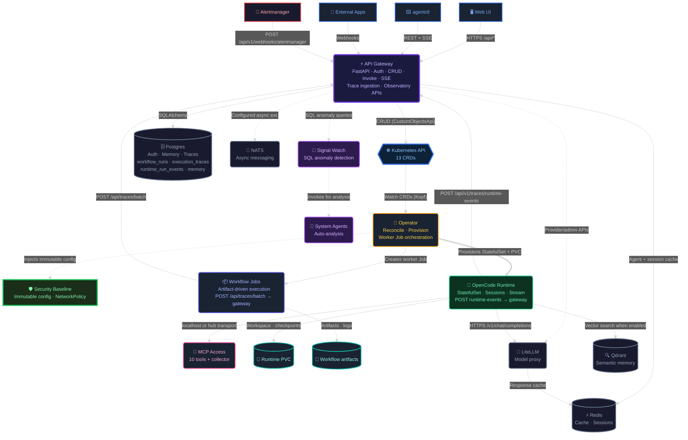

<p align="center">
  <svg viewBox="0 0 370 360" width="100" fill="none" xmlns="http://www.w3.org/2000/svg" aria-label="KubeSynapse icon">
    <defs>
      <linearGradient id="ks-badgeGrad-icon-readme" x1="80" y1="70" x2="310" y2="295" gradientUnits="userSpaceOnUse">
        <stop offset="0" stop-color="#0B7CFF"/>
        <stop offset="0.52" stop-color="#2F5BFF"/>
        <stop offset="1" stop-color="#7A3FF2"/>
      </linearGradient>
    </defs>
    <path d="M170 36L278 98C292 106 300 121 300 136V224C300 239 292 254 278 262L170 324C156 332 139 332 126 324L18 262C4 254 -4 239 -4 224V136C-4 121 4 106 18 98L126 36C139 28 156 28 170 36Z" transform="translate(74 0)" fill="url(#ks-badgeGrad-icon-readme)"/>
    <path d="M188 112V248" stroke="#FFFFFF" stroke-width="26" stroke-linecap="round"/>
    <path d="M259 104L199 171" stroke="#FFFFFF" stroke-width="24" stroke-linecap="round"/>
    <path d="M199 189L260 256" stroke="#FFFFFF" stroke-width="24" stroke-linecap="round"/>
    <circle cx="246" cy="180" r="13" fill="#FFFFFF"/>
    <circle cx="293" cy="146" r="13" fill="#FFFFFF"/>
    <circle cx="294" cy="214" r="13" fill="#FFFFFF"/>
    <path d="M257 174L281 155" stroke="#FFFFFF" stroke-width="8" stroke-linecap="round"/>
    <path d="M257 186L282 205" stroke="#FFFFFF" stroke-width="8" stroke-linecap="round"/>
  </svg>
</p>

<h1 align="center" style="color: #0B7CFF;">KubeSynapse</h1>

<p align="center">
  <strong>Ship AI agents the same way you ship everything else — as Kubernetes resources.</strong>
</p>

<p align="center">
  <a href="https://github.com/ykbytes/kubesynapse.ai/stargazers"></a>
  <a href="LICENSE"></a>
  <a href="https://github.com/ykbytes/kubesynapse.ai/releases"></a>
  <a href="https://kubernetes.io/"></a>
  <a href="https://www.python.org/"></a>
  <a href="https://react.dev/"></a>
</p>

<p align="center">
  <a href="#-quickstart">Quickstart</a>
  &nbsp;|&nbsp;
  <a href="#-features">Features</a>
  &nbsp;|&nbsp;
  <a href="#-architecture">Architecture</a>
  &nbsp;|&nbsp;
  <a href="#-cli">CLI</a>
  &nbsp;|&nbsp;
  <a href="#-docs">Docs</a>
</p>

<br>

KubeSynapse is an open-source, self-hosted AI agent platform that runs entirely inside your Kubernetes cluster. Agents, workflows, policies, tool integrations, and observability are all Kubernetes CRDs — reconciled into isolated `StatefulSets`, worker `Jobs`, and live dashboards by the platform operator.

**No local-only toy frameworks. No mandatory SaaS control plane. Just your cluster, your models, your rules.**

<br>

---

## ⚡ Quickstart

### Kind (local, under 5 minutes)

The repo ships with two first-time installers that do exactly the same work
so you can pick the shell that matches your machine. Both build the platform
images, load them into kind, install the Helm chart with the same overlays,
and print the admin URL and credentials at the end.

```powershell
# 1. Deploy the platform (sets admin password)
pwsh -NoProfile -ExecutionPolicy Bypass -File ./scripts/deploy-kind.ps1 `
  -ClusterName kubesynapse-dev -Namespace kubesynapse -ReleaseName kubesynapse `
  -AdminPassword "KubesynapseAdmin9!"
```

```bash
# Same flow on macOS / Linux (requires bash, docker, kind, kubectl, helm, openssl, base64)
./scripts/install.sh
```

```powershell
# 2. Port-forward the gateway and UI (run each in a separate terminal)
kubectl port-forward svc/kubesynapse-api-gateway -n kubesynapse 8080:8080
kubectl port-forward svc/kubesynapse-web-ui -n kubesynapse 3000:80

# 3. Configure an LLM API key (required before invoking agents)
#    Open the UI → Settings → Providers, or set via kubectl:
#    (PowerShell)
kubectl patch secret kubesynapse-llm-api-keys -n kubesynapse `
  --patch "{`"data`":{`"OPENAI_API_KEY`":`"$([Convert]::ToBase64String([Text.Encoding]::UTF8.GetBytes('sk-your-key')))`"}}"
#    (bash)
#    kubectl patch secret kubesynapse-llm-api-keys -n kubesynapse -p '{"data":{"OPENAI_API_KEY":"'$(echo -n 'sk-your-key' | base64)'"}}'

# 4. Deploy the sample policy and agent
kubectl apply -f examples/sample-policy.yaml
kubectl apply -f examples/sample-agent.yaml

# 5. Open the UI and log in
Start-Process http://localhost:3000
```

### Default Credentials

After install, log in with:
- **Username:** `admin`
- **Password:** The value you passed to `-AdminPassword` (e.g., `KubesynapseAdmin9!`)

Forgot your password? The deploy script prints it on success. You can also retrieve it:

```bash
kubectl get secret kubesynapse-llm-api-keys -n kubesynapse \
  -o jsonpath='{.data.AUTH_BOOTSTRAP_ADMIN_PASSWORD}' | base64 -d
```

### Helm (any cluster)

```bash
helm upgrade --install kubesynapse ./charts/kubesynapse -n kubesynapse --create-namespace \
  --set platformSecrets.native.litellmMasterKey=$(openssl rand -hex 32) \
  --set platformSecrets.native.apiGatewaySharedToken=$(openssl rand -hex 32) \
  --set platformSecrets.native.databasePassword=$(openssl rand -hex 16) \
  --set platformSecrets.native.jwtSecret=$(openssl rand -hex 32) \
  --set platformSecrets.native.authBootstrapAdminPassword="YourStrongPassword!" \
  --set platformSecrets.native.openaiApiKey="sk-your-openai-key"
```

After install, log in at `http://<your-cluster>:8080` with username `admin` and the password you set above.

> **Note:** Local auth requires a password of at least 8 characters. Include an LLM API key (`openaiApiKey` or `openrouterApiKey`) or agents won't be able to invoke models.

<br>

---

## 🚀 Features

### Define agents as code

Describe your AI agent in a YAML manifest — model, system prompt, tools, and policy — and `kubectl apply` it. The operator provisions an isolated `StatefulSet` with persistent storage, network policies, and optional MCP sidecars. No manual pod management.

### Hardened by default

Agent runtimes ship with defense-in-depth across four layers:

- **Runtime Isolation** — Plugin auto-discovery disabled. No dynamic code execution from config files.
- **Immutable Baseline** — Hardened security policy enforced at the config layer. Agents cannot relax restrictions.
- **Traffic Enforcement** — All model calls routed through audited proxy. Provider redirect attacks prevented.
- **Full Audit Trail** — Request tracing with `x-request-id` propagation. Structured JSON logs ready for your SIEM.

[Learn more about the security model →](docs/architecture-overview.md#10-security-model)

Recent security hardening:

- **JWT_SECRET decoupled** — `JWT_SECRET` is now a dedicated required secret for JWT signing, no longer falls back to `API_GATEWAY_SHARED_TOKEN`. Set it via `--set platformSecrets.native.jwtSecret=$(openssl rand -hex 32)`.
- **Chart secrets hardened** — `LITELLM_MASTER_KEY` and `API_GATEWAY_SHARED_TOKEN` are now `optional: false` in the chart — the gateway and operator refuse to start without them. No silent fallback to empty strings.
- **Credential-proxy path fix** — Remote MCP targets with concrete path suffixes (e.g., `https://host.com/mcp`) no longer double-append `/mcp` on proxy requests. See `credential-proxy/main.go` director logic for the fix.
- **Manual-override annotation** — Annotate a namespace-local runtime secret with `kubesynapse.ai/secret-manual-override: "true"` to prevent the operator from overwriting it during reconciliation. Keeps migration and edge-case sidecar configs stable.

### Platform at a glance

- **13 CRDs** model every platform concern: agents, workflows, policies, approvals, tenants, MCP connections, webhooks (provider-signed, claim-dispatched), observability targets, and incidents (Alertmanager lifecycle)
- **OpenCode runtime** for production workloads (Pi and Mistral Vibe available in alpha)
- **LiteLLM proxy** for model calls with cost tracking and provider fallback
- **Persistent workspace state** on PVC with session checkpointing

### Orchestrate multi-step workflows

Define DAGs of agent steps with dependencies, approval gates, retries, timeouts, and conditional branching. The operator topologically sorts steps and dispatches them in parallel waves through worker Jobs.

- Step types: `agent`, `loop`, `conditional`, `review`
- Human-in-the-loop approval gates pause execution until a human approves
- Loop steps with circuit breakers and exit conditions
- Auto-retry with configurable failure classes

### Chat, collaborate, and observe

A full web console with chat workbench, workflow composer, and execution observatory. Stream agent responses in real-time via SSE. Trace every LLM call, tool invocation, and token spent.

- Chat Workbench with saved sessions and memory-backed continuity
- Workflow Composer with visual DAG editing and live execution state
- Execution Observatory: overview, steps, logs, models and tools, compare, HTML/JSON export
- System agents auto-analyze failures, anomalies, and cost spikes

#### Observability features

The Execution Observatory captures the full lifecycle of every agent invocation and workflow run. Recent improvements:

- **Token breakdown** — every LLM call now reports prompt, completion, **cache_read**, **cache_write**, and **reasoning** token counts end-to-end (runtime → operator → gateway → UI). The Observatory renders a stacked token bar plus a **cache hit ratio** indicator so you can see at a glance when prompt caching is paying off.
- **Per-tool duration** — every tool call record carries a `duration_ms` field extracted natively from OpenCode's `state.time.start`/`state.time.end` timestamps. The **Tool Mix** chart weights tools by real wall-clock time, not just call counts.
- **Quality flags** — Observatory Overview surfaces warnings for missing token data, error events, tool failures, and longest quiet gaps so a green run can still be flagged "shaky" when something is off.
- **Run-level insight charts** (pure CSS, no charting library): *Recent Run Trend* sparkline, *Step Contribution* share bars, *Step Variability* min/median/max range, *Tool Mix*, *Model Efficiency* (token-vs-latency scatter), and the *Quality Flags* strip — all derived from the same `ExecutionTrace` payload.
- **Idempotent run history** — the operator's enqueue path now does a live-status guard before creating a worker Job, preventing duplicate run records when a trigger fans out into a spec change + status patch.

Full data model, troubleshooting recipes, and the trace payload schema live in [`docs/observability-explained.md`](docs/observability-explained.md).

### Manage incidents

KubeSynapse has a built-in incident management system driven by the `AgentIncident` CRD, the Alertmanager webhook receiver, and the operator's incident lifecycle controller.

- **Alertmanager integration** — Alertmanager POSTs to `POST /api/v1/webhooks/alertmanager` on the gateway, which upserts an `AgentIncident` record and creates the corresponding Kubernetes CR
- **Full state machine** — incidents transition through `firing → acknowledged → diagnosing → remediating → resolved → closed`, with configurable escalation timers per severity (`15m` critical, `30m` warning, `1h` info)
- **Auto-remediation** — incidents can trigger linked `AgentWorkflow` runs automatically on status transitions via `workflowRef`
- **Signal Watch integration** — the operator's anomaly detection controller (`signal_watch.py`) proactively creates incidents when it detects anomalous patterns in execution traces
- **REST API surface** — `GET/POST /api/v1/incidents`, `PUT/PATCH /api/v1/incidents/{name}`, `POST /api/v1/incidents/{name}/escalate`, `GET /api/v1/incidents/{name}/timeline`
- **UI** — dedicated **Incidents** tab within the Intelligence workspace for viewing and managing incident state

### Receive and dispatch webhooks

Webhooks are first-class platform resources with provider-specific signature verification, claim-based dispatch, and full lineage tracking.

- **Provider-specific HMAC verification** — GitHub, Slack, Stripe, PagerDuty, Grafana, or generic HMAC-SHA256. Falls back cleanly for unknown providers.
- **API key authentication** — optional `X-API-Key` header verification per webhook receiver
- **Key rotation** — `X-KubeSynapse-Key-Id` header support for multiple active secrets per receiver
- **Replay attack prevention** — configurable timestamp window validation
- **Defense-in-depth rate limiting** — Redis-backed + DB counting for concurrent invocation caps and payload size limits
- **Claim-based dispatch** — the operator atomically claims each trigger execution via compare-and-set, preventing duplicate dispatches when multiple operator replicas pick up the same NATS event
- **Dead-letter replay** — failed or dead-lettered trigger executions can be replayed through the gateway API without losing lineage
- **Lineage tracking** — every dispatch records its path (`nats`, `http`, `operator`), workflow run ID, job name, session ID, and operator instance for end-to-end traceability

### Secure and govern

Security is built in, not bolted on. Every layer — network, container, token, and policy — is enforced by default.

- Constant-time token comparison, argon2id password hashing
- Per-agent network policies (deny-all egress, explicit allows)
- Non-root runtimes with read-only root filesystem and dropped capabilities
- Rate limiting on login and agent invocation
- Audit logging with structured errors and correlation IDs
- Optional Gatekeeper admission constraints for policy references, sealed policies, and tool-ceiling validation

### Operate with a single CLI

`agentctl` covers every platform operation. Manage agents, trigger workflows, stream logs, query observatory data, and administer users — all from the terminal.

- 82 commands across 13 command groups
- Tab-completion for bash, zsh, fish, and PowerShell
- Live Kind cluster smoke tests with real resource validation
- Streaming invoke, live events, and interactive chat sessions

### Run in production

Schema changes use Alembic migrations, not ad-hoc `CREATE TABLE` calls. Backups are automated via CronJob. Logs are structured JSON with standard fields for aggregation.

- Alembic-powered database migrations with auto-generated baseline
- PostgreSQL backup CronJob with PVC and S3 support, retention cleanup, documented restore
- Structured JSON logging (`component`, `namespace`, `agent_name`, `request_id`, `duration_ms`)
- Correlation IDs flow through invoke, logs, and error responses

<details>
<summary><strong>The 13 CRDs installed by the chart</strong></summary>

| Kind | Purpose |
| --- | --- |
| `AIAgent` | Agent definition and runtime configuration |
| `AgentPolicy` | Guardrails, MCP/tool policy, memory, outbound A2A policy |
| `AgentApproval` | Human approval records for gated actions |
| `AgentWorkflow` | Multi-step workflow DAGs |
| `AgentTenant` | Namespace isolation and tenant metadata |
| `McpConnection` | Saved MCP connection definitions |
| `WebhookReceiver` | Signed inbound webhook configuration |
| `WorkflowTrigger` | Trigger metadata and history for workflow integrations |
| `ConnectorPlugin` | Observability connector definition |
| `ObservationTarget` | Observability target definition |
| `ObservationPolicy` | Observability evaluation policy |
| `ObservationReport` | Observability report output |
| `AgentIncident` | Automated incident lifecycle and Alertmanager webhook integration |

</details>

### Bundled MCP Sidecars

`code-exec` · `web-search` · `documents` · `browser` · `database` · `git` · `github-adapter` · `kubernetes` · `messaging` · `rag`

A separate `collector` sidecar is available for intelligence workflows and is counted separately from the 10 bundled tool sidecars above.

### Public Landing Page

An optimized public-facing site is deployed alongside the platform at [kubesynapse.ai](https://kubesynapse.ai):

- **Static backgrounds** — removes animated mesh gradients for peak Lighthouse performance
- **Branded logo** — icon + HTML text wordmark (no external image dependencies)
- **Documentation panel** — interactive docs surfacing the full API reference
- **SEO-optimized** — structured data (JSON-LD), Open Graph, Twitter cards, sitemap
- **Build** — standalone `vite.config.public.ts` entry point; served by the same Nginx that proxies `/api` to the gateway

### UI Surfaces

**Chat Workbench** — direct agent interaction, SSE streaming, saved sessions, memory-backed continuity. **Team View** — explicit agent-to-agent collaboration. **Workflow Composer** — visual DAG editing, run history, inline approvals. **Execution Observatory** — overview, step inspection, logs, models and tools, compare, HTML/JSON export. **Catalog** — MCP registry and skills. **Intelligence** — observability resources, collector-driven flows, and incident lifecycle management (Incidents tab).

<br>

---

## 🏗 Architecture


> **Layers:** 🔵 Clients → 🟣 Gateway → 🔵 K8s API → 🟡 Operator → 🟢 Runtimes → ⚫ Shared Services → 🟣 Intelligence → 🟢 Security
>
> **Data flow:** The gateway reads/writes CRDs via the Kubernetes API, persists durable platform state to Postgres + Redis, and fronts provider/admin APIs. It is also the **trace ingestion point** — both OpenCode runtimes and worker Jobs POST events to the gateway (`/api/v1/traces/runtime-events` and `/api/traces/batch`), which persists them into `execution_traces`, `runtime_run_events`, and `workflow_runs`. The operator watches CRDs and provisions isolated runtimes plus worker Jobs. The primary model-call path is runtime → LiteLLM → provider; workflow jobs keep detailed evidence in artifacts and logs; Signal Watch runs SQL anomaly queries against the same Postgres tables and can invoke system agents for AI-powered explanations.

<br>

---

## 💻 CLI — `agentctl`

```bash
pip install -e ./cli
```

`agentctl` is the command-line interface to KubeSynapse. It covers every platform operation:

### Shell completion (tab-autocomplete)

**Install once, use everywhere:**

```bash
# bash (~/.bashrc)
eval "$(agentctl completion bash)"

# zsh (~/.zshrc)
eval "$(agentctl completion zsh)"

# fish
agentctl completion fish > ~/.config/fish/completions/agentctl.fish

# PowerShell ($PROFILE)
agentctl completion pwsh | Out-String | Invoke-Expression
```

After installing, tab-completion works for all commands, subcommands, and options:

```
agentctl <TAB>          -> health, apply, invoke, logs, agents, workflows, chat...
agentctl agents <TAB>   -> list, show, create, update, delete, invoke, logs...
agentctl --<TAB>        -> --gateway, --profile, --namespace, --output, --token...
```

### Quick workflow

```bash
# Login and configure (use the same password you set at deploy time)
agentctl --gateway http://localhost:8080 auth login -u admin -p "<password>"
export AGENT_GATEWAY_TOKEN="<token-from-login-output>"
export AGENT_GATEWAY_URL="http://localhost:8080"

# CRUD
agentctl agents list
agentctl agents show research-assistant

# Invoke (streaming)
agentctl agents invoke research-assistant "What is Kubernetes?" --stream

# Create a new agent from YAML
agentctl agents create -f examples/sample-opencode-agent.yaml

# Workflows
agentctl workflows list
agentctl workflows trigger feature-pipeline
agentctl workflows status feature-pipeline

# Observatory
agentctl observatory metrics --window 24h
agentctl observatory traces --limit 10
agentctl observatory alerts --all

# Admin
agentctl admin users
agentctl admin user-create --username dev --password "Str0ngPass!" --role operator
```

PowerShell note: use `$env:AGENT_GATEWAY_TOKEN="<token>"` instead of `export`.

Read [`cli/README.md`](cli/README.md) for the full command surface.

<br>

---

## 📁 Repo Map

| Path | What it contains |
| --- | --- |
| [`api-gateway/`](api-gateway/) | FastAPI backend: auth, CRUD, invoke, chat, A2A, webhooks, observability |
| [`operator/`](operator/) | Kopf operator, manifest builders, worker orchestration, trace emission |
| [`opencode-runtime/`](opencode-runtime/) | Default AI agent runtime |
| [`pi-runtime/`](pi-runtime/) | Pi runtime bridge (alpha) |
| [`vibe-runtime/`](vibe-runtime/) | Mistral Vibe runtime bridge (alpha) |
| [`web-ui/`](web-ui/) | React 18 + Vite + Tailwind v4 console |
| [`mcp-sidecars/`](mcp-sidecars/) | Bundled MCP sidecars (10 tools) |
| [`cli/`](cli/) | `agentctl` CLI with shell completion |
| [`charts/kubesynapse/`](charts/kubesynapse/) | Main Helm chart (13 CRDs) |
| [`deploy/`](deploy/) | Environment overlays and deployment notes |
| [`examples/`](examples/) | Sample CRDs, workflows, and demo bundles |
| [`docs/`](docs/) | Architecture, runtime contract, operations, walkthrough |

<br>

---

## 📚 Docs & Guides

| Topic | Link |
| --- | --- |
| Current architecture overview | [`docs/architecture-overview.md`](docs/architecture-overview.md) |
| Full architecture reference | [`docs/architecture.md`](docs/architecture.md) |
| Current implementation walkthrough | [`docs/walkthrough.md`](docs/walkthrough.md) |
| Runtime API contract | [`docs/runtime-api-spec.md`](docs/runtime-api-spec.md) |
| Execution Observatory & run intelligence | [`docs/observability-explained.md`](docs/observability-explained.md) |
| Configuration reference | [`docs/configuration-reference.md`](docs/configuration-reference.md) |
| Getting started guide | [`docs/getting-started.md`](docs/getting-started.md) |
| Installation & operations | [`docs/operator-guide.md`](docs/operator-guide.md) |
| Helm chart guide | [`charts/kubesynapse/README.md`](charts/kubesynapse/README.md) |
| Deployment guide | [`deploy/README.md`](deploy/README.md) |
| API reference | [`docs/api-reference.md`](docs/api-reference.md) |
| Troubleshooting | [`docs/troubleshooting.md`](docs/troubleshooting.md) |
| Secrets management | [`docs/secrets-management.md`](docs/secrets-management.md) |

<br>

---

## 🔧 Development

```bash
# All tests
make test

# Linting
make lint          # Ruff + mypy
make helm-lint     # Helm validation

# UI build
make ui-build

# Component tests
cd api-gateway && python -m pytest tests/ -v
cd operator && python -m pytest tests/ -v
cd cli && python -m pytest tests/ -v -q
cd web-ui && npm run build
```

Windows note: the root `Makefile` uses POSIX shell constructs. Use Git Bash, WSL, or invoke component commands directly in PowerShell.

### Local Kind development

```bash
# Build and load images (use :dev tag matching values.local-images.example.yaml)
docker build -t localhost/kubesynapse/kubesynapse-api-gateway:dev api-gateway/
docker build -t localhost/kubesynapse/kubesynapse-operator:dev operator/
docker build -t localhost/kubesynapse/kubesynapse-web-ui:dev web-ui/
docker build -t localhost/kubesynapse/kubesynapse-opencode-rt:dev opencode-runtime/
kind load docker-image localhost/kubesynapse/kubesynapse-api-gateway:dev --name kubesynapse-dev
kind load docker-image localhost/kubesynapse/kubesynapse-operator:dev --name kubesynapse-dev
kind load docker-image localhost/kubesynapse/kubesynapse-web-ui:dev --name kubesynapse-dev
kind load docker-image localhost/kubesynapse/kubesynapse-opencode-rt:dev --name kubesynapse-dev
kubectl rollout restart deployment/kubesynapse-api-gateway -n kubesynapse
kubectl rollout restart deployment/kubesynapse-operator -n kubesynapse
kubectl rollout restart deployment/kubesynapse-web-ui -n kubesynapse

### CLI tests against live Kind

```bash
agentctl --profile kind health
agentctl --profile kind agents list
agentctl --profile kind agents invoke cli-e2e-agent "Reply with: smoke ok"
cd cli && python -m pytest tests/ -v -q
```

<br>

---

## 🤝 Contributing

KubeSynapse is Apache 2.0 licensed and welcomes contributions.

- Start with [`CONTRIBUTING.md`](CONTRIBUTING.md)
- Repo-specific agent guidance in [`AGENTS.md`](AGENTS.md)
- Security disclosures: [`SECURITY.md`](SECURITY.md)

<br>

## 📄 License

[Apache License 2.0](LICENSE)
