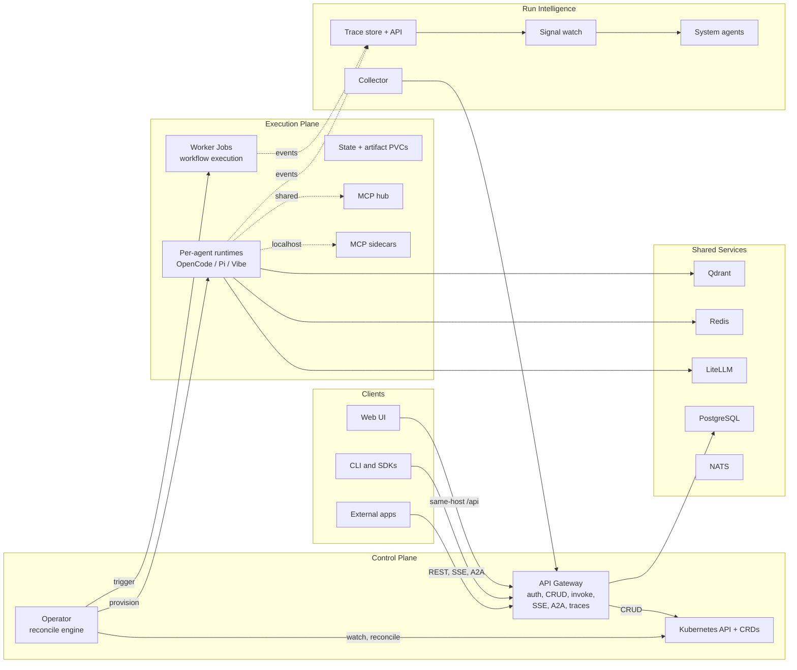

<p align="center">
  <picture>
    <source media="(prefers-color-scheme: light)">
    
  </picture>
</p>

<p align="center">
  <a href="https://github.com/ykbytes/kubesynapse.ai/stargazers"></a>
  <a href="https://github.com/ykbytes/kubesynapse.ai/blob/main/LICENSE"></a>
  <a href="https://github.com/ykbytes/kubesynapse.ai/releases"></a>
  <a href="https://kubernetes.io/"></a>
  <a href="https://www.python.org/"></a>
  <a href="https://react.dev/"></a>
</p>

<br>

# KubeSynapse

**Ship AI agents the same way you ship everything else — as Kubernetes resources.**

KubeSynapse is an open-source, Kubernetes-native platform that turns AI agents into first-class cluster citizens. Define agents, workflows, policies, and observability targets as CRDs. The operator materializes them into runtime pods. The gateway handles auth, invoke routing, streaming, and traces. The web console gives you a real-time dashboard over everything.

No local-only toy frameworks. No vendor lock-in. Just your cluster, your models, your rules.

---

## Why KubeSynapse?

| Need | How KubeSynapse Solves It |
|---|---|
| **Lifecycle management** | Agents are CRDs — create, update, scale, and delete with `kubectl`. The operator handles StatefulSet provisioning, PVCs, and health checks. |
| **Security & compliance** | Policy CRDs enforce model allowlists, tool restrictions, MCP access, rate limits, and memory rules. RBAC integrates with your existing OIDC provider. |
| **Multi-agent coordination** | Workflow CRDs define multi-step pipelines with agents, reviews, loops, and conditional branching. Worker Jobs execute them with full artifact capture. |
| **Observability** | Built-in trace store captures every LLM call, tool invocation, and step execution. Signal watch detects anomalies. System agents investigate automatically. |
| **No vendor lock-in** | Bring your own models via LiteLLM (OpenAI, Anthropic, OpenRouter, Mistral, and 100+ providers). BYO runtimes with the standard Runtime API. |
| **Team-ready** | Multi-tenancy via AgentTenant CRDs. A2A protocol for agent-to-agent communication. Shared MCP hub for tool discovery. |

---

## Quick Start

### Prerequisites

- [Kind](https://kind.sigs.k8s.io/) or any Kubernetes cluster + [Helm](https://helm.sh/) 3.x
- 8 GB RAM, 4 CPUs

### Local Kind Deployment

```bash
# Create a local Kind cluster (skip if you have one)
kind create cluster

# Build and load images (or use pre-built from GHCR)
docker build -t kubesynapse/kubesynapse-api-gateway:latest api-gateway/
docker build -t kubesynapse/kubesynapse-operator:latest operator/
docker build -t kubesynapse/kubesynapse-web-ui:latest web-ui/
kind load docker-image kubesynapse/kubesynapse-api-gateway:latest kubesynapse/kubesynapse-operator:latest kubesynapse/kubesynapse-web-ui:latest

# Generate secrets (keep these safe in production)
export LITELLM_KEY=$(openssl rand -hex 16)
export API_TOKEN=$(openssl rand -hex 32)
export DB_PASS=$(openssl rand -hex 16)
export JWT_SECRET=$(openssl rand -hex 32)

# Install
helm install kubesynapse ./charts/kubesynapse \
  --namespace kubesynapse --create-namespace \
  --values deploy/values.kind.quickstart.yaml \
  --set global.imagePullPolicy=Never \
  --set platformSecrets.native.litellmMasterKey="$LITELLM_KEY" \
  --set platformSecrets.native.apiGatewaySharedToken="$API_TOKEN" \
  --set platformSecrets.native.databasePassword="$DB_PASS" \
  --set platformSecrets.native.jwtSecret="$JWT_SECRET" \
  --wait --timeout 3m

# Connect
kubectl port-forward -n kubesynapse svc/kubesynapse-web-ui 3000:80
# Open http://localhost:3000
```

### Deploy Your First Agent

```bash
kubectl apply -f examples/sample-policy.yaml
kubectl apply -f examples/sample-agent.yaml

# Watch it come to life
kubectl get aiagents -w
kubectl get pods -l app=ai-agent
```

---

## What's Inside

```
kubesynapse/
├── api-gateway/        FastAPI backend — auth, CRUD, invoke, SSE, A2A, traces
├── operator/           Kopf controllers — reconcile CRDs into pods and jobs
├── opencode-runtime/   Default agent runtime (OpenCode-powered)
├── pi-runtime/         Alternative runtime bridge (Pi-powered)
├── vibe-runtime/       Mistral-backed runtime bridge
├── web-ui/             React 18 + Vite console with live agent dashboard
├── mcp-sidecars/       10+ bundled MCP tools (git, web, db, k8s, etc.)
├── cli/                Python CLI (`agentctl`)
├── charts/             Helm chart with 12 CRDs, control plane, and shared services
├── deploy/             Environment overlays (Kind, staging, production)
├── examples/           Sample CRDs, workflows, and demo bundles
└── docs/               Architecture, API reference, operator guide, troubleshooting
```

---

## Features

### Agent Lifecycle
- **CRD-native:** `AIAgent` resources become StatefulSets with PVCs, env vars, and health probes
- **Multiple runtimes:** OpenCode (default), Pi, Mistral Vibe — swap with one field
- **Skills & MCP:** Attach skill files and MCP tool connections via the CRD spec
- **A2A protocol:** Agents discover and invoke peers via JSON-RPC with NetworkPolicy enforcement
- **Git integration:** Clone repos, manage credentials, auto-checkout on startup

### Security & Policy
- **Policy CRDs:** 22+ fields covering model allowlists, tool restrictions, rate limits, MCP access, memory rules, and approval requirements
- **Hybrid auth:** Shared token, OIDC PKCE, JWT rotation, brute-force protection — all in one middleware stack
- **Network policies:** Per-component isolation policies generated by the Helm chart
- **Enterprise auth:** SAML and LDAP support with session management

### Workflow Engine
- **DAG-based pipelines:** Define sequential and parallel steps with dependency edges
- **Step types:** Agent invocation, review/eval, loop iteration, conditional branching
- **Artifact capture:** Every run produces structured artifacts on persistent volumes
- **Retry & resume:** Failed steps retry; long workflows resume from checkpoints
- **Webhook triggers:** Kick off workflows from external events with signature verification

### Observability & Intelligence
- **Trace store:** Every LLM call, tool invocation, and step execution recorded with timestamps
- **Execution observatory:** Compare runs side-by-side, inspect logs, replay timelines
- **Signal watch:** Automated anomaly detection across traces
- **System agents:** Built-in diagnostic agents investigate issues autonomously
- **Observation CRDs:** Define collection targets, policies, and generate structured reports

### Console
- **Real-time dashboard:** Live agent status, resource usage, workflow progress
- **Agent composer:** YAML-aware editor with template wizard and validation
- **Workflow designer:** Visual DAG editor with step configuration
- **Chat interface:** Interact with agents directly from the browser with SSE streaming
- **Documentation panel:** Built-in CRD reference, API docs, and architecture guide
- **Dark theme:** High-contrast design with keyboard navigation and screen reader support

### Tooling
- **CLI (`agentctl`):** Rich terminal UI for managing agents, workflows, policies, and users
- **Python SDK:** Programmatic access to all 100+ API endpoints
- **TypeScript SDK:** Type-safe client for Node.js and browser applications

---

## Architecture



**12 CRDs** drive the platform: `AIAgent`, `AgentPolicy`, `AgentWorkflow`, `AgentApproval`, `AgentTenant`, `McpConnection`, `WebhookReceiver`, `WorkflowTrigger`, `ObservationTarget`, `ObservationPolicy`, `ObservationReport`, `ConnectorPlugin`.

**100+ API endpoints** across 10 router groups: agents, workflows, policies, chat, auth, admin, LLM, A2A, observability, webhooks.

For deeper architecture docs, see [docs/architecture-overview.md](docs/architecture-overview.md) and [docs/architecture.md](docs/architecture.md).

---

## Documentation

| Topic | Link |
|---|---|
| Architecture overview | [docs/architecture-overview.md](docs/architecture-overview.md) |
| Full architecture reference | [docs/architecture.md](docs/architecture.md) |
| Configuration reference | [docs/configuration-reference.md](docs/configuration-reference.md) |
| Runtime API spec | [docs/runtime-api-spec.md](docs/runtime-api-spec.md) |
| Deployment guide | [deploy/README.md](deploy/README.md) |
| Helm chart guide | [charts/kubesynapse/README.md](charts/kubesynapse/README.md) |
| API gateway guide | [api-gateway/README.md](api-gateway/README.md) |
| Operator guide | [operator/README.md](operator/README.md) |
| Web UI guide | [web-ui/README.md](web-ui/README.md) |
| CLI guide | [cli/README.md](cli/README.md) |
| Getting started | [docs/getting-started.md](docs/getting-started.md) |
| Troubleshooting | [docs/troubleshooting.md](docs/troubleshooting.md) |
| FAQ | [docs/faq.md](docs/faq.md) |

---

## Development

```bash
# Run tests
make test

# Lint (Python + Helm)
make lint
make helm-lint

# Build web UI
make ui-build

# Targeted checks
cd api-gateway && python -m pytest tests/ -v
cd operator && python -m pytest tests/ -v
cd web-ui && npm run build

# Build all images
make docker-build
```

> **Windows users:** The root Makefile uses POSIX shell. Use Git Bash, WSL, or run component commands directly. See [INSTALL.md](INSTALL.md) for platform-specific guidance.

---

## Contributing

KubeSynapse is Apache 2.0 licensed and welcomes contributions. See [CONTRIBUTING.md](CONTRIBUTING.md) for guidelines and [AGENTS.md](AGENTS.md) for repo context used by AI coding agents.

---

## License

[Apache License 2.0](LICENSE) — use it, modify it, ship it.
