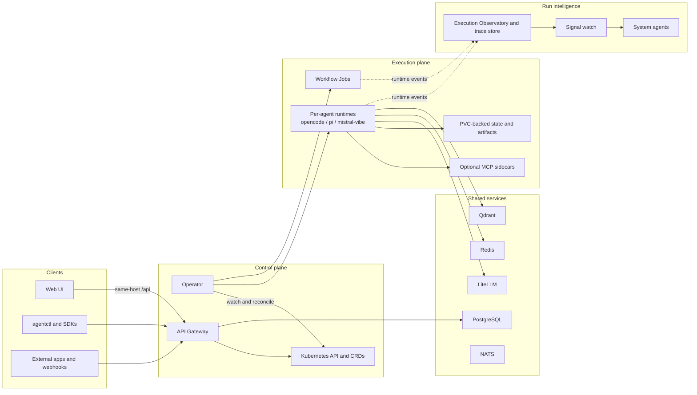

<p align="center">
  <picture>
    
  </picture>
</p>

<h1 align="center">KubeSynapse</h1>

<p align="center">
  <strong>Ship AI agents the same way you ship everything else - as Kubernetes resources.</strong>
</p>

<p align="center">
  Open-source, self-hosted agent infrastructure for teams that want agents, workflows, tools, and observability to live inside the cluster.
</p>

<p align="center">
  <a href="https://github.com/ykbytes/kubesynapse.ai/stargazers"></a>
  <a href="LICENSE"></a>
  <a href="https://github.com/ykbytes/kubesynapse.ai/releases"></a>
  <a href="https://kubernetes.io/"></a>
  <a href="https://www.python.org/"></a>
  <a href="https://react.dev/"></a>
</p>

<p align="center">
  <a href="#why-kubesynapse">Why</a>
  &nbsp;|&nbsp;
  <a href="#what-ships-today">What Ships Today</a>
  &nbsp;|&nbsp;
  <a href="#quick-start">Quick Start</a>
  &nbsp;|&nbsp;
  <a href="#architecture">Architecture</a>
  &nbsp;|&nbsp;
  <a href="#docs-and-guides">Docs</a>
</p>

---

## Why KubeSynapse

KubeSynapse turns AI agents into first-class Kubernetes workloads.

- Agents are defined as `AIAgent` CRDs and reconciled into isolated singleton `StatefulSet`s with Services and PVC-backed workspace state.
- Workflows are defined as `AgentWorkflow` CRDs and executed by worker `Job`s with artifact-backed run history.
- Policies, approvals, tenants, MCP connections, webhook receivers, workflow triggers, and observability resources are all modeled in the cluster.
- The API gateway is a real backend, not a thin proxy: it owns auth, CRUD, invoke routing, chat sessions, durable memory, traces, A2A, admin APIs, webhooks, and UI-facing metadata.
- The web console gives you live surfaces for agent management, chat, workflow composition, MCP cataloging, and execution observability.

No local-only toy frameworks. No mandatory SaaS control plane. Just your cluster, your models, your rules.

<table>
  <tr>
    <td width="33%" valign="top">
      <strong>Kubernetes-native control plane</strong><br>
      CRDs are the source of truth. The operator materializes them into `StatefulSet`s, `Service`s, `PVC`s, `ConfigMap`s, and workflow `Job`s.
    </td>
    <td width="33%" valign="top">
      <strong>Multi-runtime execution plane</strong><br>
      The shipped in-tree runtimes are <code>opencode</code>, <code>pi</code>, and <code>mistral-vibe</code>, all aligned to the platform runtime contract.
    </td>
    <td width="33%" valign="top">
      <strong>Built-in observability</strong><br>
      Direct invokes and workflow runs feed the Execution Observatory with timeline views, step detail, LLM/tool call data, exports, and run intelligence signals.
    </td>
  </tr>
</table>

---

## What Ships Today

<table>
  <tr>
    <th align="left">Area</th>
    <th align="left">What is implemented in this repo</th>
  </tr>
  <tr>
    <td><strong>Control plane</strong></td>
    <td>12 chart-installed CRDs, Helm chart, and a Python operator built on Kopf</td>
  </tr>
  <tr>
    <td><strong>Runtime plane</strong></td>
    <td>Per-agent runtime sandboxes with <code>opencode</code>, <code>pi</code>, and <code>mistral-vibe</code></td>
  </tr>
  <tr>
    <td><strong>Gateway</strong></td>
    <td>FastAPI service for auth, CRUD, invoke, SSE, chat, memory, A2A, admin, webhooks, MCP, and observability APIs</td>
  </tr>
  <tr>
    <td><strong>Web UI</strong></td>
    <td>Agents, Chat Workbench, Team View, Workflow Composer, Catalog, Intelligence, and Execution Observatory</td>
  </tr>
  <tr>
    <td><strong>Shared services</strong></td>
    <td>LiteLLM, PostgreSQL, Redis, Qdrant, NATS, and the web UI deployment wired through the main chart</td>
  </tr>
  <tr>
    <td><strong>Tooling</strong></td>
    <td><code>agentctl</code>, Python and TypeScript client packages, bundled MCP sidecars, and a published runtime API spec</td>
  </tr>
</table>

### Core Platform Capabilities

- `AIAgent` resources support runtime selection, model selection, system prompts, file-backed skills, `McpConnection` attachments, MCP sidecars, git settings, GitHub credentials, A2A caller allow-lists, PVC storage, resource overrides, and optional gVisor.
- `AgentPolicy` resources currently cover input/output guardrails, allowed models, MCP allow-lists, tool approval rules, memory recall policy, and outbound A2A policy.
- `AgentWorkflow` resources support DAG execution with `agent`, `review`, `loop`, and `conditional` steps, plus approval gates, per-step retries/timeouts, verification prompts, `sessionGroup` continuity, and workflow-level auto-retry rules.
- `AgentApproval` resources pause high-risk actions until a human approves or denies them.
- `McpConnection` resources model reusable MCP integrations across `remote`, `hub`, and `sidecar` transports, with validation status and OAuth lifecycle state.
- The observability module ships `ConnectorPlugin`, `ObservationTarget`, `ObservationPolicy`, and `ObservationReport` CRDs along with gateway APIs, controller logic, and UI surfaces.
- Webhook ingress is implemented with HMAC verification, replay protection, allowlists, payload limits, sanitization, and invocation history. `WorkflowTrigger` resources and trigger history endpoints are present, and webhook-to-trigger matching is implemented while full workflow launch orchestration continues to evolve.

<details>
<summary><strong>The 12 CRDs installed by the main chart</strong></summary>

| Kind | Purpose |
| --- | --- |
| `AIAgent` | Agent definition and runtime configuration |
| `AgentPolicy` | Guardrails, MCP/tool policy, memory, outbound A2A policy |
| `AgentApproval` | Human approval records for gated actions |
| `AgentWorkflow` | Multi-step workflow DAGs |
| `AgentTenant` | Namespace isolation and tenant metadata |
| `McpConnection` | Saved MCP connection definitions |
| `WebhookReceiver` | Signed inbound webhook configuration |
| `WorkflowTrigger` | Trigger metadata and history for workflow integrations |
| `ConnectorPlugin` | Observability connector definition |
| `ObservationTarget` | Observability target definition |
| `ObservationPolicy` | Observability evaluation policy |
| `ObservationReport` | Observability report output |

</details>

### UI Surfaces You Can Actually Demo

- **Chat Workbench** for direct agent interaction, SSE streaming, saved sessions, and memory-backed continuity.
- **Team View** for explicit agent-to-agent collaboration flows.
- **Workflow Composer** for visual DAG editing, run history, inline approvals, and live execution state.
- **Execution Observatory** for execution lists, timelines, step inspection, LLM/tool call inspection, comparison views, and HTML/JSON export.
- **Catalog** for MCP registry and skills catalog workflows.
- **Intelligence** for observability resources and collector-driven cluster intelligence flows.

### Bundled MCP Sidecars

The repo currently includes sidecar implementations for:

- `code-exec`
- `web-search`
- `browser-automation`
- `database`
- `git`
- `github`
- `kubernetes-ops`
- `messaging`
- `rag`
- `documents`

---

## Quick Start

### Recommended local Kind install

The most repeatable local install path in this repo is the checked-in PowerShell helper.

Requirements:

- Docker
- Kind
- Helm 3.x
- `kubectl`
- PowerShell 7+

```powershell
pwsh -NoProfile -ExecutionPolicy Bypass -File ./scripts/deploy-kind.ps1 `
  -ClusterName kubesynapse-dev `
  -Namespace kubesynapse `
  -ReleaseName kubesynapse `
  -AdminPassword "KubesynapseAdmin9!"
```

What the script does:

- Creates or reuses the `kind-kubesynapse-dev` cluster context
- Builds and loads local `:dev` images for the operator, API gateway, web UI, and OpenCode runtime
- Loads the pinned LiteLLM image required by the chart
- Applies `deploy/values.local-images.example.yaml` and `deploy/values.kind.quickstart.yaml`
- Injects the checked-in skills catalog so the `Catalog > Skills` tab is populated
- Creates bootstrap admin credentials and restarts core deployments after Helm succeeds

The quickstart overlay keeps the cluster lightweight by disabling the shared MCP hub and system agents.

After the install finishes, port-forward the core endpoints:

```bash
kubectl port-forward svc/kubesynapse-api-gateway -n kubesynapse 8080:8080
kubectl port-forward svc/kubesynapse-web-ui -n kubesynapse 3000:80
```

Then:

1. Open `http://localhost:3000`.
2. Sign in with the admin username/password printed by the script.
3. Configure at least one model provider in the Settings workspace or via chart secrets before invoking agents.

<details>
<summary><strong>Manual Helm flow</strong></summary>

If you want the explicit Helm path instead of the helper script, start with:

- [`deploy/README.md`](deploy/README.md)
- [`charts/kubesynapse/README.md`](charts/kubesynapse/README.md)
- [`INSTALL.md`](INSTALL.md)

</details>

### Deploy your first agent

The checked-in sample agent is paired with a sample policy. Apply both:

```bash
kubectl apply -f examples/sample-policy.yaml
kubectl apply -f examples/sample-agent.yaml

kubectl get aiagents -n default
kubectl get pods -n default
```

`examples/sample-agent.yaml` demonstrates a real `AIAgent` shape from this repo today:

- `runtime.kind: opencode`
- file-backed skills under `spec.skills.files`
- a policy reference
- PVC-backed workspace storage
- optional A2A target metadata inside the skill frontmatter

Once the agent is running and a model provider is configured, open the UI and use **Chat Workbench** to talk to `research-assistant`.

### CLI workflow

Install the CLI from this repo:

```bash
python -m pip install -e ./cli
```

Then log in, export the returned access token, and invoke an agent:

```bash
agentctl --gateway-url http://localhost:8080 auth login -u admin -p "<your-password>"
export AGENT_GATEWAY_TOKEN="<token-from-login-output>"
agentctl --gateway-url http://localhost:8080 invoke research-assistant "Summarize what this platform does."
```

On PowerShell, set the token with `$env:AGENT_GATEWAY_TOKEN="<token-from-login-output>"`.

### Best end-to-end demo in the repo

For a stronger multi-agent walkthrough after provider credentials are configured, use the Context7 demo bundle:

```bash
kubectl apply -f examples/context7-demo-agents.yaml
kubectl apply -f examples/context7-demo-workflow.yaml

agentctl --gateway-url http://localhost:8080 workflows trigger context7-research-analysis
```

This demo is the clearest expression of the platform's current value:

- remote Context7 MCP integration
- workspace file write/read flow
- agent-to-agent delegation
- workflow execution history
- Execution Observatory inspection

---

## Architecture



### Architectural Notes

- Kubernetes is the source of truth for the control plane.
- Each agent is reconciled into an isolated singleton `StatefulSet`.
- Workflow detail lives primarily in worker artifacts and logs; CRD status stays summary-oriented.
- The API gateway is the public edge and the application backend for auth, session state, memory, and observability.
- The runtime contract is published in [`docs/runtime-api-spec.md`](docs/runtime-api-spec.md) and defines the core endpoints every runtime must implement.

<details>
<summary><strong>Where these claims are grounded in the repo</strong></summary>

- [`charts/kubesynapse/crds/`](charts/kubesynapse/crds/) defines the CRD surface installed by the main chart.
- [`operator/builders/manifests.py`](operator/builders/manifests.py) and [`operator/services/k8s.py`](operator/services/k8s.py) show agent `StatefulSet` and workflow `Job` reconciliation.
- [`api-gateway/main.py`](api-gateway/main.py) and [`api-gateway/routers/`](api-gateway/routers/) define the live gateway surface.
- [`opencode-runtime/`](opencode-runtime/), [`pi-runtime/`](pi-runtime/), and [`vibe-runtime/`](vibe-runtime/) are the in-tree runtimes.
- [`web-ui/src/App.tsx`](web-ui/src/App.tsx) and the component tree under [`web-ui/src/components/`](web-ui/src/components/) show the shipped UI workspaces.
- [`docs/architecture-overview.md`](docs/architecture-overview.md), [`docs/walkthrough.md`](docs/walkthrough.md), and [`docs/observability-explained.md`](docs/observability-explained.md) are the current architecture references.

</details>

---

## Interfaces

### API Gateway

The gateway is the single entry point for the UI, CLI, SDKs, and external integrations.

Live surfaces in this repo include:

- agent, workflow, policy, approval, tenant, MCP, webhook, and observability CRUD
- synchronous invoke and streaming invoke
- chat session persistence and durable memory management
- A2A routing
- provider/model management surfaces used by the UI
- execution trace query and export routes
- admin and audit workflows

See [`api-gateway/README.md`](api-gateway/README.md).

### Web Console

The UI is more than an invoke screen. It includes:

- agent creation and editing
- Chat Workbench and Team View
- Workflow Composer and run history
- Execution Observatory and live activity views
- MCP and skills catalog workflows
- intelligence and observability panels
- provider-centric settings and admin views

See [`web-ui/README.md`](web-ui/README.md).

### CLI and Clients

- [`cli/README.md`](cli/README.md) documents the `agentctl` command surface.
- [`clients/python/README.md`](clients/python/README.md) documents the Python client package.
- [`clients/typescript/README.md`](clients/typescript/README.md) documents the TypeScript client package.

---

## Repository Tour

| Path | What it contains |
| --- | --- |
| [`api-gateway/`](api-gateway/) | FastAPI backend for auth, CRUD, invoke, chat, A2A, webhooks, and observability |
| [`operator/`](operator/) | Kopf operator, manifest builders, worker orchestration, and trace emission |
| [`opencode-runtime/`](opencode-runtime/) | Default runtime implementation |
| [`pi-runtime/`](pi-runtime/) | Pi runtime bridge |
| [`vibe-runtime/`](vibe-runtime/) | Mistral Vibe runtime bridge |
| [`web-ui/`](web-ui/) | React 18 + Vite console |
| [`mcp-sidecars/`](mcp-sidecars/) | Bundled MCP sidecars |
| [`collector-agent/`](collector-agent/) | Collector path for observability and cluster intelligence |
| [`cli/`](cli/) | `agentctl` CLI |
| [`charts/kubesynapse/`](charts/kubesynapse/) | Main Helm chart |
| [`deploy/`](deploy/) | Environment overlays and deployment notes |
| [`examples/`](examples/) | Sample CRDs, workflows, and demo bundles |
| [`docs/`](docs/) | Architecture, runtime contract, operations, and walkthrough docs |

---

## Docs And Guides

| Topic | Link |
| --- | --- |
| Current architecture overview | [`docs/architecture-overview.md`](docs/architecture-overview.md) |
| Full architecture reference | [`docs/architecture.md`](docs/architecture.md) |
| Current implementation walkthrough | [`docs/walkthrough.md`](docs/walkthrough.md) |
| Runtime API contract | [`docs/runtime-api-spec.md`](docs/runtime-api-spec.md) |
| Execution Observatory and run intelligence | [`docs/observability-explained.md`](docs/observability-explained.md) |
| Getting started | [`docs/getting-started.md`](docs/getting-started.md) |
| Deployment guide | [`deploy/README.md`](deploy/README.md) |
| Helm chart guide | [`charts/kubesynapse/README.md`](charts/kubesynapse/README.md) |
| API reference | [`docs/api-reference.md`](docs/api-reference.md) |
| Troubleshooting | [`docs/troubleshooting.md`](docs/troubleshooting.md) |

---

## Development

Common repo-level commands:

```bash
# tests
make test

# linting
make lint
make helm-lint

# UI build
make ui-build

# local images
make docker-build

# targeted checks
cd api-gateway && python -m pytest tests/ -v
cd operator && python -m pytest tests/ -v
cd opencode-runtime && python -m pytest tests/ -v
cd web-ui && npm run build
```

Windows note: the root `Makefile` uses POSIX shell constructs. Use Git Bash, WSL, or invoke the component commands directly if you are staying in PowerShell.

---

## Contributing

KubeSynapse is Apache 2.0 licensed and welcomes contributions.

- Start with [`CONTRIBUTING.md`](CONTRIBUTING.md)
- Repo-specific agent guidance lives in [`AGENTS.md`](AGENTS.md)
- Security disclosures belong in [`SECURITY.md`](SECURITY.md)

---

## License

[Apache License 2.0](LICENSE)
