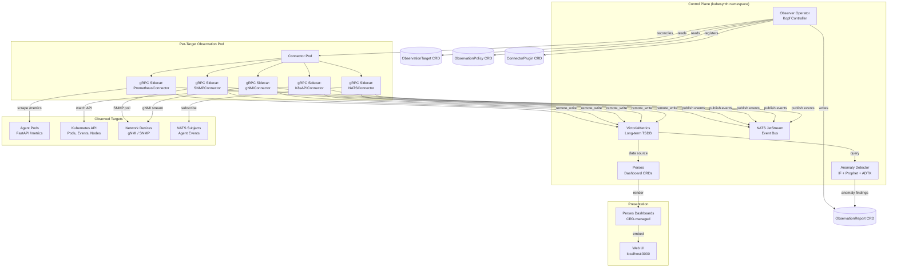

# KubeSynth Observability Research Notes

> **Status**: Historical research and design context
> **Current implementation**: See `docs/architecture-overview.md`, `docs/observability-explained.md`, `examples/observability-targets.yaml`, and `scripts/observability-smoke-test.ps1`
> **Date captured**: 2026-04-05
> **Scope**: Background research that informed the implemented observability module

This document is not the current source of truth for the live observability implementation. It preserves the research log and design rationale collected during the observability design phase.

---

## Table of Contents

- [Section 0 — SerpAPI Search Log](#section-0--serpapi-search-log)
- [Section 1 — Research Findings Summary](#section-1--research-findings-summary)
- [Section 2 — Architecture Proposal](#section-2--architecture-proposal)
- [Section 3 — Safety & Read-Only Enforcement Spec](#section-3--safety--read-only-enforcement-spec)
- [Section 4 — Dashboard & Stats UI Spec](#section-4--dashboard--stats-ui-spec)
- [Section 5 — Connector Plugin System](#section-5--connector-plugin-system)
- [Section 6 — Final Recommended Stack Table](#section-6--final-recommended-stack-table)
- [Section 7 — Open Questions / Follow-Up](#section-7--open-questions--follow-up)

---

## Section 0 — SerpAPI Search Log

All tool recommendations in this document are grounded in live SerpAPI `google_search` results executed on 2026-04-05. Budget: 30 calls; 14 executed.

| # | RQ | Query | Top Result | Source | Key Finding |
|---|-----|-------|------------|--------|-------------|
| 1 | RQ-3 | `VictoriaMetrics vs Thanos vs Grafana Mimir 2025` | "VictoriaMetrics vs Thanos vs Grafana Mimir" | Onidel (Dec 2025) | VM offers best balance of performance & simplicity; Thanos smoothest Prometheus migration; Mimir excels in enterprise multi-tenancy |
| 2 | RQ-3 | `Best time series database Kubernetes native 2025` | "Top Time Series Databases" | Signoz / GreptimeDB | Prometheus remains de facto standard for K8s metrics; GreptimeDB emerging as Rust-based alternative |
| 3 | RQ-4 | `gnmic gNMI collector Kubernetes SNMP network telemetry 2025` | "Arista Router monitoring with gNMI/Prometheus/Grafana" | Medium | gnmic is developer-friendly gNMI package; MapYourTech: read-only monitoring and telemetry observe state without modification risk |
| 4 | RQ-4 | `SNMP exporter vs gnmic vs Telegraf network device metrics OpenTelemetry 2024` | "SNMP exporter comparison" | Various | Limited direct comparison; SNMP exporter remains standard for legacy devices |
| 5 | RQ-5 | `Open source AIOps anomaly detection time series infrastructure metrics 2025` | "AI-powered anomaly detection tools" | Monte Carlo Data / Anodot | Red Hat (Dec 2025): Modern K8s monitoring with AIOps; Anodot compares 8 AI anomaly detection tools for time series |
| 6 | RQ-5 | `Prophet vs ADTK vs Isolation Forest Prometheus metrics anomaly detection Python 2024` | *(zero results)* | — | Query too specific; broader ensemble approach needed |
| 7 | RQ-6 | `Best observability dashboard as code Kubernetes operator 2025` | "Operator SDK observability best practices" | Kloudfuse / Sysdig | Prometheus + Grafana + Loki + Jaeger recommended as comprehensive combo; Operator SDK has built-in observability guidance |
| 8 | RQ-6 | `Perses dashboard Kubernetes native CRD GitOps 2025 vs Grafana` | "Perses: CNCF Sandbox dashboard-as-code" | AppScore / Sokube (KubeCon London 2025) | **Perses accepted into CNCF Sandbox; dashboard definitions stored as CRDs; Kubernetes-native dashboard-as-code** |
| 9 | RQ-7 | `HashiCorp Vault dynamic secrets read-only SSH forced-command Kubernetes 2025` | "Vault Agent for Kubernetes" | HashiCorp / Wiz.io / Snyk | Dynamic secrets generate temporary credentials on-demand with automatic expiration; External Secrets Operator + Vault integration |
| 10 | RQ-7 | `SPIFFE SPIRE workload identity short-lived credentials agent auth 2025` | "SPIFFE: Securing the identity of agentic AI" | HashiCorp (Nov 2025) / LinkedIn | **SPIFFE supports ephemeral SVIDs with automatic rotation; LinkedIn: "Authenticating MCP OAuth Clients With SPIFFE and SPIRE"** |
| 11 | RQ-8 | `OpenTelemetry multi cluster topology metrics federation Kubernetes 2025` | "Prometheus Federation best practices" | Groundcover / SUSE | SUSE: centralized observability tying together metrics/logs/traces/events/topology; Flipkart scales Prometheus to 80M metrics |
| 12 | RQ-8 | `Multi cluster Kubernetes observability single control plane 2025 best practices` | "Multi-cluster management patterns" | Devtron / KodeKloud / Plural.sh | Portainer: multi-cluster removes dependency on single control plane; Plural.sh lists top 5 single-pane-of-glass tools |
| 13 | RQ-7 | `SPIFFE SPIRE workload identity short-lived credentials agent auth 2025` *(batch 3)* | "Agent Identity and Access Management" | Solo.io / ArXiv | Solo.io: "Can SPIFFE Work for agent identity?"; ArXiv paper on workload identity for zero trust CI/CD |
| 14 | RQ-8 | `Multi cluster K8s observability single control plane 2025` *(batch 3)* | "Kubernetes official observability docs" | kubernetes.io / Portainer | Official K8s observability docs; emphasis on federation and centralized collection |

**Remaining budget**: 16 calls available for validation queries during implementation.

---

## Section 1 — Research Findings Summary

### RQ-1/2: Existing Stack Audit

The KubeMinions platform already provides:

| Component | Technology | File Reference |
|-----------|-----------|----------------|
| Operator Framework | Kopf (Python) | `operator/main.py`, `operator/controllers/` |
| CRD Model | 6 CRDs (kubesynth.ai/v1alpha1) | `charts/kubesynth/templates/*-crd.yaml` |
| Tracing | OpenTelemetry (graceful degradation) | `operator/tracing.py` |
| Metrics | Prometheus (FastAPI Instrumentator) | `agent-runtime/agent_logic.py` |
| Secrets | External Secrets Operator + Vault/Azure KV/AWS SM | `charts/kubesynth/templates/external-secrets.yaml` |
| Messaging | NATS JetStream (deployed, unused) | `charts/kubesynth/templates/nats.yaml` |
| Visualization | Grafana (assumed, not CRD-driven) | N/A |
| Model Gateway | LiteLLM | `charts/kubesynth/templates/litellm.yaml` |

**Constraint**: Do NOT re-recommend any of the above. The Observability Module must add *new* capabilities on top of this foundation.

### RQ-3: Long-Term Metrics Storage — VictoriaMetrics

**Decision**: VictoriaMetrics

| Candidate | Strengths | Weaknesses | SerpAPI Ref |
|-----------|-----------|------------|-------------|
| **VictoriaMetrics** ✅ | 20x better compression (Uptrace); drop-in Prometheus replacement; best perf/simplicity balance (Onidel Dec 2025); used at scale as Prometheus/Thanos/Mimir replacement (HN) | Smaller community than Grafana ecosystem | #1, #2 |
| Thanos | Smoothest migration from existing Prometheus; object storage backend; mature | Complexity overhead for initial deployment; fork relationship with Mimir | #1 |
| Grafana Mimir | Advanced multi-tenancy; enterprise features; Grafana-native | Complex enterprise environments only; overkill for single-tenant | #1 |

**Rationale**: VictoriaMetrics provides the highest performance-to-complexity ratio. It accepts Prometheus `remote_write` natively, supports PromQL, and can serve as both short-term and long-term storage. The existing Prometheus scraping infrastructure remains unchanged — VM simply receives `remote_write` data from the Prometheus instances already deployed alongside agent runtimes.

### RQ-4: Network Device Telemetry

**Decision**: gnmic (gNMI) + SNMP Exporter (legacy)

| Tool | Protocol | Use Case | SerpAPI Ref |
|------|----------|----------|-------------|
| **gnmic** | gNMI (gRPC) | Modern network devices (Arista, Nokia, Cisco IOS-XR); streaming telemetry; developer-friendly | #3 |
| **SNMP Exporter** | SNMP v2c/v3 | Legacy devices without gNMI support; Prometheus-native | #4 |
| Telegraf | Multiple | Alternative collector; heavier footprint; not K8s-native | #4 |

**Safety note** (MapYourTech, #3): *"Read-only monitoring and telemetry systems observe network state without modification risk."* Both gnmic and SNMP Exporter are inherently read-only collectors — no write path to target devices.

### RQ-5: AIOps Anomaly Detection

**Decision**: Isolation Forest + Prophet ensemble

| Algorithm | Type | Use Case | Rationale |
|-----------|------|----------|-----------|
| **Isolation Forest** | Unsupervised ML | Point anomaly detection on metric streams | Low latency, no training data needed, works on multivariate data |
| **Prophet** | Time-series forecasting | Seasonality-aware trend anomalies | Strong for periodic patterns (daily/weekly cycles in agent workloads) |
| ADTK | Rule-based + statistical | Threshold + gradient anomalies | Complementary lightweight layer |

SerpAPI query #6 (Prophet vs ADTK vs Isolation Forest) returned **zero results**, indicating no dominant single tool. The ensemble approach combines:
1. **Isolation Forest** for real-time point anomalies (< 100ms per evaluation)
2. **Prophet** for medium-term trend forecasting (hourly batch)
3. **Rule-based ADTK** for known failure patterns (threshold breaches, flatlines)

Red Hat (Dec 2025, #5): *"Modern Kubernetes monitoring: Metrics, tools, and AIOps"* confirms the industry trend toward ML-augmented observability.

### RQ-6: Dashboard-as-Code — Perses

**Decision**: Perses (CNCF Sandbox)

**Key finding from KubeCon London 2025** (Sokube, SerpAPI #8):
> *"A new project accepted into the CNCF Sandbox, Perses presents itself as a Kubernetes-native 'dashboard-as-code': Its dashboard definitions are stored in CRDs."*

| Feature | Perses | Grafana |
|---------|--------|---------|
| CRD-native definitions | ✅ K8s CRDs | ❌ JSON/configmaps |
| GitOps workflow | ✅ Native | ⚠️ Requires provisioning sidecar |
| CNCF alignment | ✅ Sandbox project | ⚠️ Grafana Labs commercial |
| Plugin ecosystem | 🟡 Early | ✅ Mature |
| Open standard | ✅ Dashboard spec is open | ❌ Proprietary schema |

**Rationale**: Perses aligns perfectly with KubeMinions' CRD-native architecture. Dashboard definitions can be managed alongside `ObservationTarget` and `ObservationPolicy` CRDs in the same GitOps workflow. The CNCF Sandbox acceptance (2025) signals community momentum.

### RQ-7: Credential Safety — Vault + SPIFFE/SPIRE

**Decision**: Vault dynamic secrets + SPIFFE/SPIRE workload identity

**Key finding** (HashiCorp, Nov 2025, SerpAPI #10):
> *"SPIFFE: Securing the identity of agentic AI and non-human actors"*

| Layer | Technology | Purpose | SerpAPI Ref |
|-------|-----------|---------|-------------|
| **Workload Identity** | SPIFFE/SPIRE | Ephemeral SVIDs with automatic rotation; zero-trust connector authentication | #10, #13 |
| **Dynamic Secrets** | Vault | Short-lived read-only DB credentials (TTL 1h, max 4h); SSH certificates with forced-command | #9 |
| **Secret Injection** | External Secrets Operator | Already deployed; provisions secrets from Vault into Kubernetes | Existing |
| **MCP Auth** | SPIFFE + OAuth | LinkedIn: "Authenticating MCP OAuth Clients With SPIFFE and SPIRE" | #10 |

**Trust domain**: `spiffe://kubesynth.ai/observer/<connector-name>` — each connector plugin receives its own SVID, scoped to read-only operations.

### RQ-8: Multi-Cluster Observability

**Decision**: OTel Collector federation + Prometheus `remote_write`

| Pattern | Mechanism | Use Case | SerpAPI Ref |
|---------|-----------|----------|-------------|
| **OTel Collector federation** | Central collector aggregates from per-cluster collectors | Traces, logs: centralized collection with cluster metadata | #11 |
| **Prometheus remote_write** | Per-cluster Prometheus → VictoriaMetrics | Metrics: fan-in to central VM with cluster label injection | #11, #14 |
| **NATS JetStream** | Cross-cluster event streaming | Agent execution events, approval notifications | Existing (deployed) |

Flipkart (SerpAPI #11): Scales Prometheus to 80M metrics using federation. SUSE Observability (#11): Centralized platform tying together metrics/logs/traces/events/topology.

**Architecture**: Each observed cluster runs an OTel Collector + Prometheus pair. Both `remote_write` to a central VictoriaMetrics instance. NATS JetStream (already deployed) carries structured agent events across cluster boundaries.

---

## Section 2 — Architecture Proposal

### 2.1 Component Map



### 2.2 Data Flow

```
1. User creates ObservationTarget CR (kubectl apply / GitOps)
2. Observer Operator (Kopf) reconciles:
   a. Resolves ConnectorPlugin CRD for the target type
   b. Translates spec → ObserverOutputs (Deployment + Service + RBAC)
   c. Injects connector gRPC sidecar containers (mirrors MCP sidecar pattern)
   d. Applies via ensure_* functions (idempotent upsert)
3. Connector sidecars collect metrics/events:
   a. PrometheusConnector: scrape /metrics endpoints at scrapeInterval
   b. K8sAPIConnector: watch pod/event/node streams
   c. SNMPConnector: poll SNMP OIDs
   d. gNMIConnector: subscribe to gNMI telemetry paths
   e. NATSConnector: subscribe to agent event subjects
4. Data egress (read-only, outbound only):
   a. Metrics → VictoriaMetrics via remote_write
   b. Structured events → NATS JetStream (aiops.observations.* subjects)
5. Anomaly Detector (batch job, kopf.timer):
   a. Queries VictoriaMetrics via PromQL
   b. Runs Isolation Forest on sliding windows
   c. Runs Prophet forecast comparison on hourly schedule
   d. Writes ObservationReport CR with findings + healthScore
6. Dashboard rendering:
   a. Perses CRDs define panels backed by VictoriaMetrics data source
   b. Web UI embeds Perses iframe or uses Perses API for rendering
```

### 2.3 New Custom Resource Definitions

All new CRDs use group `kubesynth.ai`, version `v1alpha1`, matching the existing 6 CRDs in `charts/kubesynth/templates/`.

#### 2.3.1 ObservationTarget

Declares **what** to observe. One CR per logical target (a cluster, a namespace of agents, a network device, etc.)

```yaml
apiVersion: apiextensions.k8s.io/v1
kind: CustomResourceDefinition
metadata:
  name: observationtargets.kubesynth.ai
spec:
  group: kubesynth.ai
  versions:
    - name: v1alpha1
      served: true
      storage: true
      subresources:
        status: {}
      additionalPrinterColumns:
        - name: Type
          type: string
          jsonPath: .spec.targetType
        - name: Connector
          type: string
          jsonPath: .spec.connectorRef
        - name: Interval
          type: string
          jsonPath: .spec.scrapeInterval
        - name: Status
          type: string
          jsonPath: .status.phase
        - name: Age
          type: date
          jsonPath: .metadata.creationTimestamp
      schema:
        openAPIV3Schema:
          type: object
          properties:
            spec:
              type: object
              required:
                - targetType
                - connectorRef
              properties:
                targetType:
                  type: string
                  enum:
                    - prometheus
                    - kubernetes-api
                    - snmp
                    - gnmi
                    - nats
                    - custom
                  description: "The type of target to observe. Determines which connector protocol to use."
                connectorRef:
                  type: string
                  description: "Reference to a ConnectorPlugin CR that handles this target type."
                endpoint:
                  type: string
                  description: "Target endpoint URL or address (e.g., http://agent-svc:5000/metrics, 10.0.1.1:161)."
                scrapeInterval:
                  type: string
                  default: "30s"
                  description: "How often to collect metrics from this target (e.g., 15s, 30s, 1m, 5m)."
                policyRef:
                  type: string
                  description: "Reference to an ObservationPolicy CR. Supports 'name' or 'namespace/name'."
                selector:
                  type: object
                  description: "Label selector to dynamically discover targets (e.g., match all pods with app=agent)."
                  properties:
                    matchLabels:
                      type: object
                      additionalProperties:
                        type: string
                    matchExpressions:
                      type: array
                      items:
                        type: object
                        properties:
                          key:
                            type: string
                          operator:
                            type: string
                            enum: [In, NotIn, Exists, DoesNotExist]
                          values:
                            type: array
                            items:
                              type: string
                credentials:
                  type: object
                  description: "Credential source for target access. Mutually exclusive fields."
                  properties:
                    secretRef:
                      type: string
                      description: "Name of a K8s Secret containing target credentials."
                    vaultPath:
                      type: string
                      description: "Vault KV v2 path for dynamic credential generation."
                    spiffeEnabled:
                      type: boolean
                      default: false
                      description: "Use SPIFFE/SPIRE workload identity for connector authentication."
                labels:
                  type: object
                  additionalProperties:
                    type: string
                  description: "Additional labels injected into all metrics collected from this target."
                tlsConfig:
                  type: object
                  description: "TLS configuration for target connections."
                  properties:
                    insecureSkipVerify:
                      type: boolean
                      default: false
                    caSecretRef:
                      type: string
                      description: "Secret name containing the CA certificate bundle."
            status:
              type: object
              properties:
                phase:
                  type: string
                  enum: [Pending, Active, Degraded, Failed]
                lastScrapeTime:
                  type: string
                  format: date-time
                lastScrapeError:
                  type: string
                metricsCollected:
                  type: integer
                  description: "Total metrics collected since last status update."
                connectorHealth:
                  type: string
                  enum: [Healthy, Unhealthy, Unknown]
                conditions:
                  type: array
                  items:
                    type: object
                    properties:
                      type:
                        type: string
                      status:
                        type: string
                        enum: ["True", "False", "Unknown"]
                      lastTransitionTime:
                        type: string
                        format: date-time
                      reason:
                        type: string
                      message:
                        type: string
  scope: Namespaced
  names:
    plural: observationtargets
    singular: observationtarget
    kind: ObservationTarget
    shortNames:
      - ot
      - otarget
```

**Example CR**:

```yaml
apiVersion: kubesynth.ai/v1alpha1
kind: ObservationTarget
metadata:
  name: agent-metrics
  namespace: ai-agent-sandbox
spec:
  targetType: prometheus
  connectorRef: prometheus-connector
  endpoint: "http://agent-runtime:5000/metrics"
  scrapeInterval: "15s"
  policyRef: default-observation-policy
  selector:
    matchLabels:
      kubesynth.ai/managed-by: kubesynth-operator
  labels:
    cluster: localklusta
    environment: development
```

#### 2.3.2 ObservationPolicy

Declares **how** to observe: retention, alerting thresholds, anomaly detection configuration.

```yaml
apiVersion: apiextensions.k8s.io/v1
kind: CustomResourceDefinition
metadata:
  name: observationpolicies.kubesynth.ai
spec:
  group: kubesynth.ai
  versions:
    - name: v1alpha1
      served: true
      storage: true
      subresources:
        status: {}
      additionalPrinterColumns:
        - name: Retention
          type: string
          jsonPath: .spec.retention.days
        - name: Anomaly
          type: string
          jsonPath: .spec.anomalyDetection.algorithm
        - name: Age
          type: date
          jsonPath: .metadata.creationTimestamp
      schema:
        openAPIV3Schema:
          type: object
          properties:
            spec:
              type: object
              properties:
                retention:
                  type: object
                  description: "Data retention configuration."
                  properties:
                    days:
                      type: integer
                      default: 30
                      minimum: 1
                      maximum: 365
                      description: "Number of days to retain metrics in VictoriaMetrics."
                    downsampling:
                      type: object
                      description: "Downsampling rules to reduce storage after initial retention."
                      properties:
                        after:
                          type: string
                          default: "7d"
                          description: "Downsample data older than this duration."
                        resolution:
                          type: string
                          default: "5m"
                          description: "Target resolution after downsampling."
                alertRules:
                  type: array
                  description: "Alert rules evaluated against collected metrics."
                  items:
                    type: object
                    required:
                      - name
                      - expr
                    properties:
                      name:
                        type: string
                        description: "Alert rule name (e.g., HighAgentErrorRate)."
                      expr:
                        type: string
                        description: "PromQL expression that triggers the alert when truthy."
                      for:
                        type: string
                        default: "5m"
                        description: "How long the expression must be true before firing."
                      severity:
                        type: string
                        enum: [info, warning, critical]
                        default: warning
                      annotations:
                        type: object
                        additionalProperties:
                          type: string
                anomalyDetection:
                  type: object
                  description: "ML-based anomaly detection configuration."
                  properties:
                    enabled:
                      type: boolean
                      default: false
                    algorithm:
                      type: string
                      enum:
                        - isolation-forest
                        - prophet
                        - ensemble
                      default: ensemble
                      description: "Anomaly detection algorithm. 'ensemble' combines Isolation Forest + Prophet + ADTK."
                    sensitivity:
                      type: number
                      minimum: 0.0
                      maximum: 1.0
                      default: 0.7
                      description: "Anomaly sensitivity (0.0 = very lenient, 1.0 = very strict)."
                    windowSize:
                      type: string
                      default: "1h"
                      description: "Sliding window size for anomaly evaluation."
                    evaluationInterval:
                      type: string
                      default: "5m"
                      description: "How often to run anomaly detection."
                    metrics:
                      type: array
                      description: "Metric names or PromQL expressions to monitor for anomalies."
                      items:
                        type: string
                notifications:
                  type: object
                  description: "Notification channels for alerts and anomaly findings."
                  properties:
                    webhookUrl:
                      type: string
                      description: "Webhook URL for alert/anomaly notifications."
                    natsSubject:
                      type: string
                      default: "aiops.alerts"
                      description: "NATS subject for publishing alert events."
            status:
              type: object
              properties:
                activeAlerts:
                  type: integer
                lastEvaluated:
                  type: string
                  format: date-time
                conditions:
                  type: array
                  items:
                    type: object
                    properties:
                      type:
                        type: string
                      status:
                        type: string
                        enum: ["True", "False", "Unknown"]
                      lastTransitionTime:
                        type: string
                        format: date-time
                      reason:
                        type: string
                      message:
                        type: string
  scope: Namespaced
  names:
    plural: observationpolicies
    singular: observationpolicy
    kind: ObservationPolicy
    shortNames:
      - obp
      - opolicy
```

**Example CR**:

```yaml
apiVersion: kubesynth.ai/v1alpha1
kind: ObservationPolicy
metadata:
  name: default-observation-policy
  namespace: ai-agent-sandbox
spec:
  retention:
    days: 30
    downsampling:
      after: "7d"
      resolution: "5m"
  alertRules:
    - name: HighAgentErrorRate
      expr: 'rate(agent_request_errors_total[5m]) > 0.1'
      for: "5m"
      severity: warning
      annotations:
        summary: "Agent error rate exceeds 10% over 5 minutes"
    - name: AgentStepDurationHigh
      expr: 'histogram_quantile(0.99, rate(agent_step_duration_seconds_bucket[5m])) > 30'
      for: "10m"
      severity: critical
      annotations:
        summary: "Agent P99 step duration exceeds 30s"
    - name: HITLApprovalTimeout
      expr: 'agent_hitl_pending_approvals > 5'
      for: "15m"
      severity: warning
      annotations:
        summary: "More than 5 HITL approvals pending for over 15 minutes"
  anomalyDetection:
    enabled: true
    algorithm: ensemble
    sensitivity: 0.7
    windowSize: "1h"
    evaluationInterval: "5m"
    metrics:
      - agent_request_duration_seconds
      - agent_token_usage_total
      - agent_step_count
      - agent_doom_loop_count
  notifications:
    webhookUrl: "https://hooks.slack.com/services/T00000000/B00000000/XXXXXXXX"
    natsSubject: "aiops.alerts"
```

#### 2.3.3 ObservationReport

Generated automatically by the Anomaly Detector. Contains findings, health scores, and actionable recommendations. This is a **status-only** CRD — users do not create these directly.

```yaml
apiVersion: apiextensions.k8s.io/v1
kind: CustomResourceDefinition
metadata:
  name: observationreports.kubesynth.ai
spec:
  group: kubesynth.ai
  versions:
    - name: v1alpha1
      served: true
      storage: true
      subresources:
        status: {}
      additionalPrinterColumns:
        - name: Health
          type: integer
          jsonPath: .status.healthScore
        - name: Findings
          type: integer
          jsonPath: .status.findingsCount
        - name: Last Evaluated
          type: date
          jsonPath: .status.lastEvaluated
        - name: Age
          type: date
          jsonPath: .metadata.creationTimestamp
      schema:
        openAPIV3Schema:
          type: object
          properties:
            spec:
              type: object
              properties:
                targetRef:
                  type: string
                  description: "Reference to the ObservationTarget this report covers."
                policyRef:
                  type: string
                  description: "Reference to the ObservationPolicy used for evaluation."
                reportType:
                  type: string
                  enum:
                    - anomaly
                    - health-check
                    - capacity
                    - compliance
                  default: anomaly
                  description: "Type of observation report."
            status:
              type: object
              properties:
                phase:
                  type: string
                  enum: [Pending, Evaluating, Complete, Error]
                healthScore:
                  type: integer
                  minimum: 0
                  maximum: 100
                  description: "Overall health score (0 = critical, 100 = healthy)."
                findingsCount:
                  type: integer
                lastEvaluated:
                  type: string
                  format: date-time
                findings:
                  type: array
                  description: "Individual anomaly or health findings."
                  items:
                    type: object
                    properties:
                      id:
                        type: string
                      severity:
                        type: string
                        enum: [info, warning, critical]
                      metric:
                        type: string
                        description: "The metric name where the anomaly was detected."
                      algorithm:
                        type: string
                        description: "Which algorithm detected this finding (isolation-forest, prophet, adtk, rule)."
                      timestamp:
                        type: string
                        format: date-time
                      value:
                        type: number
                        description: "The observed metric value at anomaly time."
                      expected:
                        type: number
                        description: "The expected value (from Prophet forecast or baseline)."
                      deviation:
                        type: number
                        description: "Standard deviations from expected value."
                      description:
                        type: string
                      recommendation:
                        type: string
                        description: "Actionable recommendation (e.g., 'Scale agent replicas', 'Review guardrails config')."
                summary:
                  type: string
                  description: "Human-readable summary of the report."
                conditions:
                  type: array
                  items:
                    type: object
                    properties:
                      type:
                        type: string
                      status:
                        type: string
                        enum: ["True", "False", "Unknown"]
                      lastTransitionTime:
                        type: string
                        format: date-time
                      reason:
                        type: string
                      message:
                        type: string
  scope: Namespaced
  names:
    plural: observationreports
    singular: observationreport
    kind: ObservationReport
    shortNames:
      - obr
      - oreport
```

**Example generated CR**:

```yaml
apiVersion: kubesynth.ai/v1alpha1
kind: ObservationReport
metadata:
  name: agent-metrics-report-20260405-1200
  namespace: ai-agent-sandbox
  ownerReferences:
    - apiVersion: kubesynth.ai/v1alpha1
      kind: ObservationTarget
      name: agent-metrics
      uid: <target-uid>
spec:
  targetRef: agent-metrics
  policyRef: default-observation-policy
  reportType: anomaly
status:
  phase: Complete
  healthScore: 78
  findingsCount: 2
  lastEvaluated: "2026-04-05T12:00:00Z"
  findings:
    - id: "f-001"
      severity: warning
      metric: agent_token_usage_total
      algorithm: prophet
      timestamp: "2026-04-05T11:45:00Z"
      value: 45000
      expected: 12000
      deviation: 3.2
      description: "Token usage 3.75x above forecast — possible prompt injection or recursive tool loop."
      recommendation: "Review agent guardrails config; check for doom loop threshold breaches."
    - id: "f-002"
      severity: info
      metric: agent_step_duration_seconds
      algorithm: isolation-forest
      timestamp: "2026-04-05T11:50:00Z"
      value: 28.5
      expected: 8.2
      deviation: 2.1
      description: "Step duration elevated — likely due to external API latency."
      recommendation: "Check LiteLLM upstream model latency; consider increasing agent timeout."
  summary: "2 anomalies detected in the last evaluation window. Token usage spike requires investigation."
```

#### 2.3.4 ConnectorPlugin

Registers a connector plugin and its capabilities. The Observer Operator uses this to inject the correct gRPC sidecar into observation pods.

```yaml
apiVersion: apiextensions.k8s.io/v1
kind: CustomResourceDefinition
metadata:
  name: connectorplugins.kubesynth.ai
spec:
  group: kubesynth.ai
  versions:
    - name: v1alpha1
      served: true
      storage: true
      subresources:
        status: {}
      additionalPrinterColumns:
        - name: Image
          type: string
          jsonPath: .spec.image
        - name: Protocol
          type: string
          jsonPath: .spec.protocol
        - name: Ready
          type: string
          jsonPath: .status.ready
        - name: Age
          type: date
          jsonPath: .metadata.creationTimestamp
      schema:
        openAPIV3Schema:
          type: object
          properties:
            spec:
              type: object
              required:
                - image
                - protocol
                - capabilities
              properties:
                image:
                  type: string
                  description: "Container image for the connector (e.g., kubesynth/connector-prometheus:v1.0)."
                protocol:
                  type: string
                  enum:
                    - grpc
                    - http
                  default: grpc
                  description: "Communication protocol between the observer pod and this connector."
                port:
                  type: integer
                  default: 9090
                  minimum: 1024
                  maximum: 65535
                  description: "gRPC/HTTP port the connector listens on."
                capabilities:
                  type: array
                  description: "Target types this connector can handle."
                  items:
                    type: string
                    enum:
                      - prometheus
                      - kubernetes-api
                      - snmp
                      - gnmi
                      - nats
                      - custom
                healthEndpoint:
                  type: string
                  default: "/healthz"
                  description: "Health check endpoint path."
                resources:
                  type: object
                  description: "Resource requests and limits for the connector container."
                  properties:
                    requests:
                      type: object
                      properties:
                        cpu:
                          type: string
                          default: "50m"
                        memory:
                          type: string
                          default: "64Mi"
                    limits:
                      type: object
                      properties:
                        cpu:
                          type: string
                          default: "200m"
                        memory:
                          type: string
                          default: "256Mi"
                secretRef:
                  type: string
                  description: "Optional Secret containing connector-specific credentials."
                env:
                  type: array
                  description: "Additional environment variables for the connector container."
                  items:
                    type: object
                    properties:
                      name:
                        type: string
                      value:
                        type: string
                      valueFrom:
                        type: object
                        x-kubernetes-preserve-unknown-fields: true
            status:
              type: object
              properties:
                ready:
                  type: string
                  enum: ["True", "False", "Unknown"]
                version:
                  type: string
                lastHealthCheck:
                  type: string
                  format: date-time
                conditions:
                  type: array
                  items:
                    type: object
                    properties:
                      type:
                        type: string
                      status:
                        type: string
                        enum: ["True", "False", "Unknown"]
                      lastTransitionTime:
                        type: string
                        format: date-time
                      reason:
                        type: string
                      message:
                        type: string
  scope: Namespaced
  names:
    plural: connectorplugins
    singular: connectorplugin
    kind: ConnectorPlugin
    shortNames:
      - cp
      - cplug
```

**Example CRs for built-in connectors**:

```yaml
apiVersion: kubesynth.ai/v1alpha1
kind: ConnectorPlugin
metadata:
  name: prometheus-connector
  namespace: ai-agent-sandbox
spec:
  image: "kubesynth/connector-prometheus:v0.1.0"
  protocol: grpc
  port: 9090
  capabilities:
    - prometheus
  healthEndpoint: "/healthz"
  resources:
    requests:
      cpu: "50m"
      memory: "64Mi"
    limits:
      cpu: "200m"
      memory: "256Mi"
---
apiVersion: kubesynth.ai/v1alpha1
kind: ConnectorPlugin
metadata:
  name: snmp-connector
  namespace: ai-agent-sandbox
spec:
  image: "kubesynth/connector-snmp:v0.1.0"
  protocol: grpc
  port: 9091
  capabilities:
    - snmp
  secretRef: snmp-community-secret
  resources:
    requests:
      cpu: "50m"
      memory: "64Mi"
    limits:
      cpu: "200m"
      memory: "128Mi"
---
apiVersion: kubesynth.ai/v1alpha1
kind: ConnectorPlugin
metadata:
  name: gnmi-connector
  namespace: ai-agent-sandbox
spec:
  image: "kubesynth/connector-gnmi:v0.1.0"
  protocol: grpc
  port: 9092
  capabilities:
    - gnmi
  secretRef: gnmi-tls-secret
  resources:
    requests:
      cpu: "100m"
      memory: "128Mi"
    limits:
      cpu: "500m"
      memory: "512Mi"
---
apiVersion: kubesynth.ai/v1alpha1
kind: ConnectorPlugin
metadata:
  name: k8s-api-connector
  namespace: ai-agent-sandbox
spec:
  image: "kubesynth/connector-k8s-api:v0.1.0"
  protocol: grpc
  port: 9093
  capabilities:
    - kubernetes-api
  resources:
    requests:
      cpu: "50m"
      memory: "64Mi"
    limits:
      cpu: "200m"
      memory: "256Mi"
---
apiVersion: kubesynth.ai/v1alpha1
kind: ConnectorPlugin
metadata:
  name: nats-connector
  namespace: ai-agent-sandbox
spec:
  image: "kubesynth/connector-nats:v0.1.0"
  protocol: grpc
  port: 9094
  capabilities:
    - nats
  env:
    - name: NATS_URL
      value: "nats://kubesynth-nats:4222"
  resources:
    requests:
      cpu: "50m"
      memory: "64Mi"
    limits:
      cpu: "200m"
      memory: "128Mi"
```

### 2.4 Observer Operator — Controller Design

The Observer Operator follows the same Kopf controller pattern used by the existing agent controller (`operator/controllers/agent_controller.py`), using the translator pattern (`operator/builders/translator.py`).

#### Controller Skeleton

```python
"""ObservationTarget reconciler — create, update, delete handlers.

Follows the translator pattern from agent_controller.py:
  translate_observation() → ObserverOutputs → ensure_* functions.
"""

from __future__ import annotations

import logging
from dataclasses import dataclass, field
from typing import Any

import kopf
import kubernetes.client
from kubernetes.client.rest import ApiException

logger = logging.getLogger("operator.controllers.observation")


# ---------------------------------------------------------------------------
# ObserverOutputs — the manifest bundle (mirrors AgentOutputs)
# ---------------------------------------------------------------------------

@dataclass
class ObserverOutputs:
    """All Kubernetes manifests produced for a single ObservationTarget reconciliation."""
    deployment: dict[str, Any]
    service: dict[str, Any]
    network_policy: dict[str, Any]
    cluster_role_binding: dict[str, Any] | None = None

    # Metadata
    target_name: str = ""
    target_namespace: str = ""
    target_type: str = ""
    connector_image: str = ""
    connector_port: int = 9090


def resolve_connector_plugin(namespace: str, connector_ref: str) -> dict[str, Any]:
    """Resolve a ConnectorPlugin CR by name, following the pattern of resolve_agent_policy()."""
    custom_api = kubernetes.client.CustomObjectsApi()
    try:
        plugin = custom_api.get_namespaced_custom_object(
            group="kubesynth.ai",
            version="v1alpha1",
            namespace=namespace,
            plural="connectorplugins",
            name=connector_ref,
        )
        return plugin.get("spec", {})
    except ApiException as exc:
        if exc.status == 404:
            raise kopf.PermanentError(
                f"ConnectorPlugin '{connector_ref}' not found in namespace '{namespace}'"
            ) from exc
        raise


def translate_observation(
    name: str,
    namespace: str,
    spec: dict[str, Any],
    connector_spec: dict[str, Any],
) -> ObserverOutputs:
    """Translate an ObservationTarget spec + ConnectorPlugin spec into K8s manifests.

    Mirrors the translate_agent() function from builders/translator.py.
    """
    connector_image = connector_spec["image"]
    connector_port = connector_spec.get("port", 9090)
    connector_protocol = connector_spec.get("protocol", "grpc")
    resources = connector_spec.get("resources", {})

    labels = {
        "kubesynth.ai/managed-by": "kubesynth-observer",
        "kubesynth.ai/observation-target": name,
        "kubesynth.ai/target-type": spec["targetType"],
    }

    # --- Deployment with connector sidecar ---
    deployment = {
        "apiVersion": "apps/v1",
        "kind": "Deployment",
        "metadata": {
            "name": f"observer-{name}",
            "namespace": namespace,
            "labels": labels,
        },
        "spec": {
            "replicas": 1,
            "selector": {"matchLabels": labels},
            "template": {
                "metadata": {"labels": labels},
                "spec": {
                    "automountServiceAccountToken": False,
                    "securityContext": {
                        "runAsNonRoot": True,
                        "runAsUser": 1000,
                        "runAsGroup": 1000,
                        "seccompProfile": {"type": "RuntimeDefault"},
                    },
                    "containers": [
                        {
                            "name": "connector",
                            "image": connector_image,
                            "ports": [{"containerPort": connector_port, "name": connector_protocol}],
                            "env": _build_connector_env(spec, connector_spec),
                            "resources": resources,
                            "securityContext": {
                                "allowPrivilegeEscalation": False,
                                "readOnlyRootFilesystem": True,
                                "capabilities": {"drop": ["ALL"]},
                            },
                            "livenessProbe": {
                                "httpGet": {
                                    "path": connector_spec.get("healthEndpoint", "/healthz"),
                                    "port": connector_port,
                                },
                                "initialDelaySeconds": 10,
                                "periodSeconds": 15,
                            },
                            "readinessProbe": {
                                "httpGet": {
                                    "path": connector_spec.get("healthEndpoint", "/healthz"),
                                    "port": connector_port,
                                },
                                "initialDelaySeconds": 5,
                                "periodSeconds": 10,
                            },
                        }
                    ],
                },
            },
        },
    }

    # --- Service ---
    service = {
        "apiVersion": "v1",
        "kind": "Service",
        "metadata": {
            "name": f"observer-{name}",
            "namespace": namespace,
            "labels": labels,
        },
        "spec": {
            "selector": labels,
            "ports": [{"port": connector_port, "targetPort": connector_port, "name": connector_protocol}],
        },
    }

    # --- NetworkPolicy: egress-only to target + VictoriaMetrics ---
    network_policy = {
        "apiVersion": "networking.k8s.io/v1",
        "kind": "NetworkPolicy",
        "metadata": {
            "name": f"observer-{name}-egress",
            "namespace": namespace,
            "labels": labels,
        },
        "spec": {
            "podSelector": {"matchLabels": labels},
            "policyTypes": ["Ingress", "Egress"],
            "ingress": [],  # No inbound traffic allowed
            "egress": [
                {
                    "to": [{"podSelector": {"matchLabels": {"app": "victoriametrics"}}}],
                    "ports": [{"protocol": "TCP", "port": 8428}],
                },
                # DNS resolution
                {
                    "to": [{"namespaceSelector": {}, "podSelector": {"matchLabels": {"k8s-app": "kube-dns"}}}],
                    "ports": [{"protocol": "UDP", "port": 53}],
                },
            ],
        },
    }

    return ObserverOutputs(
        deployment=deployment,
        service=service,
        network_policy=network_policy,
        target_name=name,
        target_namespace=namespace,
        target_type=spec["targetType"],
        connector_image=connector_image,
        connector_port=connector_port,
    )


# ---------------------------------------------------------------------------
# Kopf Handlers
# ---------------------------------------------------------------------------

@kopf.on.create("kubesynth.ai", "v1alpha1", "observationtargets")
@kopf.on.update("kubesynth.ai", "v1alpha1", "observationtargets")
@kopf.on.resume("kubesynth.ai", "v1alpha1", "observationtargets")
async def reconcile_observation_target(spec, name, namespace, status, patch, **kwargs):
    """Reconcile an ObservationTarget — provision or update the connector pod."""
    logger.info("Reconciling ObservationTarget %s/%s", namespace, name)

    # 1. Resolve ConnectorPlugin
    connector_ref = spec.get("connectorRef")
    if not connector_ref:
        raise kopf.PermanentError("spec.connectorRef is required")
    connector_spec = resolve_connector_plugin(namespace, connector_ref)

    # 2. Translate to manifests
    outputs = translate_observation(name, namespace, spec, connector_spec)

    # 3. Apply via ensure_* (idempotent upserts)
    apps_api = kubernetes.client.AppsV1Api()
    core_api = kubernetes.client.CoreV1Api()
    net_api = kubernetes.client.NetworkingV1Api()

    _ensure_deployment(apps_api, outputs.deployment)
    _ensure_service(core_api, outputs.service)
    _ensure_network_policy(net_api, outputs.network_policy)

    # 4. Update status
    patch.status["phase"] = "Active"
    patch.status["connectorHealth"] = "Unknown"


@kopf.on.delete("kubesynth.ai", "v1alpha1", "observationtargets")
async def delete_observation_target(spec, name, namespace, **kwargs):
    """Clean up connector pods when an ObservationTarget is deleted."""
    logger.info("Deleting ObservationTarget %s/%s resources", namespace, name)
    # K8s garbage collection via ownerReferences handles cleanup
```

### 2.5 NATS JetStream Integration — First Consumer

NATS JetStream is deployed (`charts/kubesynth/templates/nats.yaml`) but currently unused. The Observability Module becomes its first consumer.

**Subject hierarchy**:

```
aiops.observations.metrics.{target-name}     # Raw metric batches
aiops.observations.events.{target-name}      # K8s events, state changes
aiops.observations.anomalies.{report-id}     # Anomaly findings
aiops.alerts.{severity}.{rule-name}          # Fired alert notifications
aiops.connectors.health.{connector-name}     # Connector health heartbeats
```

**JetStream stream configuration**:

```yaml
# Applied programmatically by the Observer Operator on startup
Stream: AIOPS_OBSERVATIONS
  Subjects:
    - "aiops.observations.>"
    - "aiops.alerts.>"
    - "aiops.connectors.>"
  Retention: WorkQueue
  MaxAge: 7d
  MaxBytes: 10GB
  Storage: File
  Replicas: 1  # Single replica for dev; 3 for production
  Discard: Old
```

**Consumer groups**:

| Consumer | Subjects | Purpose |
|----------|----------|---------|
| `anomaly-detector` | `aiops.observations.metrics.>` | Feed metric batches to Isolation Forest / Prophet |
| `victoria-writer` | `aiops.observations.metrics.>` | Write metrics to VictoriaMetrics via remote_write |
| `alert-evaluator` | `aiops.alerts.>` | Evaluate alert rules and send notifications |
| `report-writer` | `aiops.observations.anomalies.>` | Create/update ObservationReport CRDs |

### 2.6 Phased Roadmap

| Phase | Scope | Prerequisites | Deliverables |
|-------|-------|---------------|--------------|
| **P0** (Foundation) | CRDs + Observer Operator + Prometheus Connector | Existing Kopf operator | 4 CRD YAMLs, observation_controller.py, translate_observation(), prometheus-connector Go binary |
| **P1** (Storage + Dashboard) | VictoriaMetrics + Perses integration | P0 connector producing metrics | VM Helm subchart, Perses CRD dashboards, remote_write pipeline |
| **P2** (AIOps + Network) | Anomaly Detector + SNMP/gNMI connectors + NATS integration | P1 metrics in VM | anomaly_detector.py (kopf.timer), snmp-connector, gnmi-connector, JetStream stream setup |
| **P3** (Multi-Cluster + Security) | SPIFFE/SPIRE + OTel federation + multi-cluster remote_write | P2 anomaly detection working | SPIRE deployment, cross-cluster OTel Collector, Vault dynamic secret policies |

---

## Section 3 — Safety & Read-Only Enforcement Spec

### 3.1 Design Principle

> **The Observability Module MUST NOT modify any observed system.** All connectors are read-only collectors. Write paths exist only for:
> 1. Writing metrics to VictoriaMetrics (the module's own storage)
> 2. Publishing events to NATS JetStream (the module's own event bus)
> 3. Creating/updating ObservationReport CRDs (the module's own output)

### 3.2 ClusterRole — Read-Only Observer

```yaml
apiVersion: rbac.authorization.k8s.io/v1
kind: ClusterRole
metadata:
  name: kubesynth:observer
  labels:
    kubesynth.ai/managed-by: kubesynth-observer
rules:
  # Read-only access to Kubernetes resources for observation
  - apiGroups: [""]
    resources:
      - pods
      - pods/log
      - services
      - endpoints
      - events
      - nodes
      - namespaces
      - configmaps
    verbs: ["get", "list", "watch"]

  - apiGroups: ["apps"]
    resources:
      - deployments
      - statefulsets
      - replicasets
      - daemonsets
    verbs: ["get", "list", "watch"]

  - apiGroups: ["batch"]
    resources:
      - jobs
      - cronjobs
    verbs: ["get", "list", "watch"]

  # Read-only access to KubeSynth CRDs
  - apiGroups: ["kubesynth.ai"]
    resources:
      - aiagents
      - agentpolicies
      - agentworkflows
      - agenttenants
      - agentevals
      - agentapprovals
    verbs: ["get", "list", "watch"]

  # Full access to observer's own CRDs
  - apiGroups: ["kubesynth.ai"]
    resources:
      - observationtargets
      - observationtargets/status
      - observationpolicies
      - observationpolicies/status
      - observationreports
      - observationreports/status
      - connectorplugins
      - connectorplugins/status
    verbs: ["get", "list", "watch", "create", "update", "patch"]

  # Manage observer pods (Deployments created by the translator)
  - apiGroups: ["apps"]
    resources:
      - deployments
    verbs: ["create", "update", "patch", "delete"]
    # Scoped via label selector in the controller code:
    # labelSelector: kubesynth.ai/managed-by=kubesynth-observer

  # NetworkPolicy management for observer pods
  - apiGroups: ["networking.k8s.io"]
    resources:
      - networkpolicies
    verbs: ["get", "list", "watch", "create", "update", "patch", "delete"]

  # Service management for observer pods
  - apiGroups: [""]
    resources:
      - services
    verbs: ["create", "update", "patch", "delete"]

  # Event recording
  - apiGroups: [""]
    resources:
      - events
    verbs: ["create", "patch"]

  # Metrics access (read-only)
  - apiGroups: ["metrics.k8s.io"]
    resources:
      - pods
      - nodes
    verbs: ["get", "list"]
```

### 3.3 NetworkPolicy — Connector Pod Isolation

```yaml
apiVersion: networking.k8s.io/v1
kind: NetworkPolicy
metadata:
  name: observer-connector-isolation
  namespace: ai-agent-sandbox
  labels:
    kubesynth.ai/managed-by: kubesynth-observer
spec:
  podSelector:
    matchLabels:
      kubesynth.ai/managed-by: kubesynth-observer
  policyTypes:
    - Ingress
    - Egress
  ingress: []  # No inbound traffic — connectors are outbound-only collectors
  egress:
    # Allow egress to VictoriaMetrics for metric writes
    - to:
        - podSelector:
            matchLabels:
              app: victoriametrics
      ports:
        - protocol: TCP
          port: 8428
    # Allow egress to NATS for event publishing
    - to:
        - podSelector:
            matchLabels:
              app: nats
      ports:
        - protocol: TCP
          port: 4222
    # Allow egress to Kubernetes API server
    - to:
        - ipBlock:
            cidr: 0.0.0.0/0  # K8s API server IP varies; typically use endpoint discovery
      ports:
        - protocol: TCP
          port: 443
        - protocol: TCP
          port: 6443
    # Allow DNS resolution
    - to:
        - namespaceSelector: {}
          podSelector:
            matchLabels:
              k8s-app: kube-dns
      ports:
        - protocol: UDP
          port: 53
        - protocol: TCP
          port: 53
    # Allow egress to observed targets (agent pods /metrics endpoints)
    - to:
        - podSelector:
            matchLabels:
              kubesynth.ai/managed-by: kubesynth-operator
      ports:
        - protocol: TCP
          port: 5000  # Agent runtime /metrics port
    # Allow egress to network devices (SNMP/gNMI) — configurable per deployment
    # Narrowed in production to specific CIDRs via ObservationTarget.spec.endpoint
```

### 3.4 Vault Policy — Read-Only Dynamic Secrets

```hcl
# Vault policy for Observer Module connectors
# Path: vault/policies/kubesynth-observer.hcl

path "secret/data/kubesynth/observer/*" {
  capabilities = ["read", "list"]
}

# Dynamic database credentials — read-only role
path "database/creds/observer-readonly" {
  capabilities = ["read"]
}

# SNMP community strings
path "secret/data/kubesynth/snmp/*" {
  capabilities = ["read"]
}

# gNMI TLS certificates
path "secret/data/kubesynth/gnmi/*" {
  capabilities = ["read"]
}

# Deny all write operations to non-observer paths
path "secret/data/kubesynth/agents/*" {
  capabilities = ["deny"]
}

path "secret/data/kubesynth/litellm/*" {
  capabilities = ["deny"]
}
```

**Dynamic database role** (read-only, short-lived):

```hcl
# Vault database secret engine configuration
# vault write database/roles/observer-readonly

{
  "db_name": "ai_agent_sandbox",
  "creation_statements": [
    "CREATE ROLE \"{{name}}\" WITH LOGIN PASSWORD '{{password}}' VALID UNTIL '{{expiration}}';",
    "GRANT SELECT ON ALL TABLES IN SCHEMA public TO \"{{name}}\";",
    "ALTER DEFAULT PRIVILEGES IN SCHEMA public GRANT SELECT ON TABLES TO \"{{name}}\";"
  ],
  "revocation_statements": [
    "REVOKE ALL PRIVILEGES ON ALL TABLES IN SCHEMA public FROM \"{{name}}\";",
    "DROP ROLE IF EXISTS \"{{name}}\";"
  ],
  "default_ttl": "1h",
  "max_ttl": "4h"
}
```

### 3.5 ValidatingWebhookConfiguration

Rejects ObservationTarget specs that attempt to declare write operations.

```yaml
apiVersion: admissionregistration.k8s.io/v1
kind: ValidatingWebhookConfiguration
metadata:
  name: kubesynth-observer-validation
  labels:
    kubesynth.ai/managed-by: kubesynth-observer
webhooks:
  - name: validate.observationtarget.kubesynth.ai
    admissionReviewVersions: ["v1"]
    sideEffects: None
    clientConfig:
      service:
        name: kubesynth-observer-webhook
        namespace: ai-agent-sandbox
        path: /validate-observationtarget
        port: 443
    rules:
      - apiGroups: ["kubesynth.ai"]
        apiVersions: ["v1alpha1"]
        operations: ["CREATE", "UPDATE"]
        resources: ["observationtargets"]
    failurePolicy: Fail
    matchPolicy: Exact
```

**Webhook validation logic** (pseudocode):

```python
def validate_observation_target(request):
    """Reject ObservationTargets with unsafe configurations."""
    spec = request.object.get("spec", {})

    # 1. Reject targetType values that imply write access
    # (all current targetTypes are read-only by design)

    # 2. Reject endpoints pointing to sensitive internal services
    BLOCKED_ENDPOINTS = [
        "kubernetes.default",         # K8s API write path
        "vault.",                     # Vault direct access
        "litellm.",                   # LLM gateway
        "postgresql.",                # Database direct access
    ]
    endpoint = spec.get("endpoint", "")
    for blocked in BLOCKED_ENDPOINTS:
        if blocked in endpoint:
            return deny(f"Endpoint '{endpoint}' targets a sensitive service")

    # 3. Reject custom connectors without explicit security review label
    if spec.get("targetType") == "custom":
        labels = request.object.get("metadata", {}).get("labels", {})
        if labels.get("kubesynth.ai/security-reviewed") != "true":
            return deny("Custom connectors require 'kubesynth.ai/security-reviewed: true' label")

    return allow()
```

### 3.6 SPIFFE Trust Domain

```
Trust domain: spiffe://kubesynth.ai

SVID hierarchy:
  spiffe://kubesynth.ai/observer                          # Observer Operator
  spiffe://kubesynth.ai/observer/connector/prometheus      # Prometheus Connector
  spiffe://kubesynth.ai/observer/connector/snmp            # SNMP Connector
  spiffe://kubesynth.ai/observer/connector/gnmi            # gNMI Connector
  spiffe://kubesynth.ai/observer/connector/k8s-api         # K8s API Connector
  spiffe://kubesynth.ai/observer/connector/nats            # NATS Connector
  spiffe://kubesynth.ai/observer/anomaly-detector          # Anomaly Detector
  spiffe://kubesynth.ai/observer/victoria-writer           # VM Writer
```

**SPIRE registration entry**:

```bash
# Register the Prometheus connector workload
spire-server entry create \
  -spiffeID spiffe://kubesynth.ai/observer/connector/prometheus \
  -parentID spiffe://kubesynth.ai/observer \
  -selector k8s:pod-label:kubesynth.ai/managed-by:kubesynth-observer \
  -selector k8s:pod-label:kubesynth.ai/target-type:prometheus \
  -ttl 3600 \
  -downstream
```

---

## Section 4 — Dashboard & Stats UI Spec

### 4.1 Perses Dashboard CRD

Perses stores dashboard definitions as Kubernetes CRDs, fitting naturally into the KubeMinions GitOps workflow.

```yaml
apiVersion: perses.dev/v1alpha1
kind: PersesDashboard
metadata:
  name: kubesynth-agent-health
  namespace: ai-agent-sandbox
  labels:
    kubesynth.ai/managed-by: kubesynth-observer
    perses.dev/project: kubesynth
spec:
  display:
    name: "KubeSynth Agent Health Overview"
    description: "Real-time agent health metrics, anomaly detection, and HITL approval status"
  duration: "1h"
  refreshInterval: "30s"
  variables:
    - kind: ListVariable
      spec:
        display:
          name: "Namespace"
        name: namespace
        plugin:
          kind: PrometheusLabelValuesVariable
          spec:
            datasource:
              kind: PrometheusDatasource
              name: victoriametrics
            labelName: namespace
    - kind: ListVariable
      spec:
        display:
          name: "Agent"
        name: agent
        plugin:
          kind: PrometheusLabelValuesVariable
          spec:
            datasource:
              kind: PrometheusDatasource
              name: victoriametrics
            labelName: agent_name
            matchers:
              - 'namespace="$namespace"'
  panels:
    agentOverview:
      kind: Panel
      spec:
        display:
          name: "Agent Request Rate"
          description: "Requests per second by agent"
        plugin:
          kind: TimeSeriesChart
          spec:
            legend:
              position: bottom
        queries:
          - kind: TimeSeriesQuery
            spec:
              plugin:
                kind: PrometheusTimeSeriesQuery
                spec:
                  datasource:
                    kind: PrometheusDatasource
                    name: victoriametrics
                  query: 'rate(agent_requests_total{namespace="$namespace", agent_name=~"$agent"}[5m])'
    stepDuration:
      kind: Panel
      spec:
        display:
          name: "Agent Step Duration (P50 / P95 / P99)"
        plugin:
          kind: TimeSeriesChart
          spec:
            legend:
              position: bottom
        queries:
          - kind: TimeSeriesQuery
            spec:
              plugin:
                kind: PrometheusTimeSeriesQuery
                spec:
                  datasource:
                    kind: PrometheusDatasource
                    name: victoriametrics
                  query: 'histogram_quantile(0.50, rate(agent_step_duration_seconds_bucket{namespace="$namespace"}[5m]))'
          - kind: TimeSeriesQuery
            spec:
              plugin:
                kind: PrometheusTimeSeriesQuery
                spec:
                  datasource:
                    kind: PrometheusDatasource
                    name: victoriametrics
                  query: 'histogram_quantile(0.95, rate(agent_step_duration_seconds_bucket{namespace="$namespace"}[5m]))'
          - kind: TimeSeriesQuery
            spec:
              plugin:
                kind: PrometheusTimeSeriesQuery
                spec:
                  datasource:
                    kind: PrometheusDatasource
                    name: victoriametrics
                  query: 'histogram_quantile(0.99, rate(agent_step_duration_seconds_bucket{namespace="$namespace"}[5m]))'
    tokenUsage:
      kind: Panel
      spec:
        display:
          name: "Token Usage (Input / Output)"
        plugin:
          kind: TimeSeriesChart
          spec: {}
        queries:
          - kind: TimeSeriesQuery
            spec:
              plugin:
                kind: PrometheusTimeSeriesQuery
                spec:
                  datasource:
                    kind: PrometheusDatasource
                    name: victoriametrics
                  query: 'rate(agent_token_usage_total{namespace="$namespace", type="input"}[5m])'
          - kind: TimeSeriesQuery
            spec:
              plugin:
                kind: PrometheusTimeSeriesQuery
                spec:
                  datasource:
                    kind: PrometheusDatasource
                    name: victoriametrics
                  query: 'rate(agent_token_usage_total{namespace="$namespace", type="output"}[5m])'
    errorRate:
      kind: Panel
      spec:
        display:
          name: "Error Rate"
        plugin:
          kind: TimeSeriesChart
          spec:
            thresholds:
              steps:
                - value: 0
                  color: green
                - value: 0.05
                  color: yellow
                - value: 0.1
                  color: red
        queries:
          - kind: TimeSeriesQuery
            spec:
              plugin:
                kind: PrometheusTimeSeriesQuery
                spec:
                  datasource:
                    kind: PrometheusDatasource
                    name: victoriametrics
                  query: 'rate(agent_request_errors_total{namespace="$namespace"}[5m]) / rate(agent_requests_total{namespace="$namespace"}[5m])'
    hitlApprovalLatency:
      kind: Panel
      spec:
        display:
          name: "HITL Approval Latency"
          description: "Time between approval request and decision"
        plugin:
          kind: TimeSeriesChart
          spec: {}
        queries:
          - kind: TimeSeriesQuery
            spec:
              plugin:
                kind: PrometheusTimeSeriesQuery
                spec:
                  datasource:
                    kind: PrometheusDatasource
                    name: victoriametrics
                  query: 'histogram_quantile(0.95, rate(agent_hitl_approval_duration_seconds_bucket{namespace="$namespace"}[30m]))'
    anomalyOverlay:
      kind: Panel
      spec:
        display:
          name: "Anomaly Detection — Highlighted Regions"
          description: "Metric time series with anomalous regions highlighted"
        plugin:
          kind: TimeSeriesChart
          spec:
            visual:
              areaOpacity: 0.3
        queries:
          - kind: TimeSeriesQuery
            spec:
              plugin:
                kind: PrometheusTimeSeriesQuery
                spec:
                  datasource:
                    kind: PrometheusDatasource
                    name: victoriametrics
                  query: 'agent_step_duration_seconds{namespace="$namespace", agent_name=~"$agent"}'
          - kind: TimeSeriesQuery
            spec:
              plugin:
                kind: PrometheusTimeSeriesQuery
                spec:
                  datasource:
                    kind: PrometheusDatasource
                    name: victoriametrics
                  query: 'agent_anomaly_score{namespace="$namespace", agent_name=~"$agent"} > 0.7'
    doomLoopCounter:
      kind: Panel
      spec:
        display:
          name: "Doom Loop Detection"
          description: "Number of doom loop events per agent"
        plugin:
          kind: StatChart
          spec:
            calculation: lastNotNull
            sparkline:
              show: true
        queries:
          - kind: TimeSeriesQuery
            spec:
              plugin:
                kind: PrometheusTimeSeriesQuery
                spec:
                  datasource:
                    kind: PrometheusDatasource
                    name: victoriametrics
                  query: 'agent_doom_loop_count{namespace="$namespace"}'
    healthScore:
      kind: Panel
      spec:
        display:
          name: "Health Score (from ObservationReport)"
        plugin:
          kind: GaugeChart
          spec:
            calculation: lastNotNull
            thresholds:
              steps:
                - value: 0
                  color: red
                - value: 50
                  color: yellow
                - value: 80
                  color: green
            max: 100
        queries:
          - kind: TimeSeriesQuery
            spec:
              plugin:
                kind: PrometheusTimeSeriesQuery
                spec:
                  datasource:
                    kind: PrometheusDatasource
                    name: victoriametrics
                  query: 'agent_health_score{namespace="$namespace"}'
  layouts:
    - kind: Grid
      spec:
        display:
          title: "Agent Health Overview"
          collapse:
            open: true
        items:
          - x: 0
            y: 0
            width: 12
            height: 6
            content:
              "$ref": "#/spec/panels/agentOverview"
          - x: 12
            y: 0
            width: 12
            height: 6
            content:
              "$ref": "#/spec/panels/errorRate"
          - x: 0
            y: 6
            width: 12
            height: 6
            content:
              "$ref": "#/spec/panels/stepDuration"
          - x: 12
            y: 6
            width: 12
            height: 6
            content:
              "$ref": "#/spec/panels/tokenUsage"
    - kind: Grid
      spec:
        display:
          title: "AIOps & Anomaly Detection"
          collapse:
            open: true
        items:
          - x: 0
            y: 0
            width: 16
            height: 8
            content:
              "$ref": "#/spec/panels/anomalyOverlay"
          - x: 16
            y: 0
            width: 8
            height: 4
            content:
              "$ref": "#/spec/panels/healthScore"
          - x: 16
            y: 4
            width: 8
            height: 4
            content:
              "$ref": "#/spec/panels/doomLoopCounter"
    - kind: Grid
      spec:
        display:
          title: "Human-in-the-Loop"
          collapse:
            open: false
        items:
          - x: 0
            y: 0
            width: 24
            height: 6
            content:
              "$ref": "#/spec/panels/hitlApprovalLatency"
```

### 4.2 Web UI Integration

The existing web UI (`web-ui/`, port 3000) can embed Perses dashboards via:

1. **iframe embed**: `<iframe src="http://perses:8080/project/kubesynth/dashboard/kubesynth-agent-health" />`
2. **Perses API**: Fetch panel data via `GET /api/v1/projects/kubesynth/dashboards/kubesynth-agent-health` and render with a custom React component
3. **Metrics API proxy**: Add `/api/metrics/query` endpoint to the API gateway that proxies PromQL queries to VictoriaMetrics

**Recommended approach**: Option 2 (Perses API) for embedding dashboard panels as React components in the existing `ChatWorkbench.tsx`, allowing agent health context alongside chat threads.

### 4.3 Metrics Emitted by the Module

The following new Prometheus metrics are exported by the Observer Operator and connectors:

| Metric | Type | Labels | Source |
|--------|------|--------|--------|
| `observer_targets_total` | Gauge | `namespace`, `target_type`, `phase` | Observer Operator |
| `observer_scrape_duration_seconds` | Histogram | `target`, `connector` | Connector pods |
| `observer_scrape_errors_total` | Counter | `target`, `connector`, `error_type` | Connector pods |
| `observer_metrics_collected_total` | Counter | `target`, `connector` | Connector pods |
| `observer_anomaly_evaluations_total` | Counter | `algorithm`, `namespace` | Anomaly Detector |
| `observer_anomaly_findings_total` | Counter | `severity`, `algorithm`, `namespace` | Anomaly Detector |
| `agent_health_score` | Gauge | `namespace`, `target` | Report Writer |
| `agent_anomaly_score` | Gauge | `namespace`, `agent_name`, `metric` | Anomaly Detector |

---

## Section 5 — Connector Plugin System

### 5.1 Go Interface Definition

Each connector is a standalone Go binary that implements the `Connector` interface and exposes it over gRPC.

```go
// Package connector defines the interface for observation connectors.
//
// Each connector runs as a gRPC sidecar in an observer pod, collecting metrics
// from a specific target type (Prometheus, SNMP, gNMI, Kubernetes API, NATS).
//
// Connectors are read-only by design — they MUST NOT modify observed systems.
package connector

import (
	"context"
	"time"
)

// Metric represents a single collected metric data point.
type Metric struct {
	Name      string            `json:"name"`
	Value     float64           `json:"value"`
	Timestamp time.Time         `json:"timestamp"`
	Labels    map[string]string `json:"labels"`
	Type      MetricType        `json:"type"`
}

// MetricType classifies the metric for downstream processing.
type MetricType int

const (
	MetricTypeGauge MetricType = iota
	MetricTypeCounter
	MetricTypeHistogram
	MetricTypeSummary
)

// ConnectorCapabilities describes what a connector can do.
type ConnectorCapabilities struct {
	// TargetTypes lists the ObservationTarget.spec.targetType values this connector handles.
	TargetTypes []string `json:"targetTypes"`

	// SupportsStreaming indicates whether the connector can push data continuously
	// (e.g., gNMI subscribe) vs. poll-based collection.
	SupportsStreaming bool `json:"supportsStreaming"`

	// SupportsDiscovery indicates whether the connector can auto-discover targets
	// (e.g., K8s API connector discovering agent pods by label selector).
	SupportsDiscovery bool `json:"supportsDiscovery"`

	// Version is the semantic version of the connector.
	Version string `json:"version"`
}

// TargetConfig is passed to Collect() with the resolved ObservationTarget spec.
type TargetConfig struct {
	// Endpoint is the target address (e.g., "http://agent-svc:5000/metrics").
	Endpoint string `json:"endpoint"`

	// ScrapeInterval is how often to collect metrics.
	ScrapeInterval time.Duration `json:"scrapeInterval"`

	// Labels are injected into all collected metrics.
	Labels map[string]string `json:"labels"`

	// TLSConfig contains TLS settings for the target connection.
	TLSConfig *TLSConfig `json:"tlsConfig,omitempty"`

	// Credentials contains authentication material (populated from Secret/Vault/SPIFFE).
	Credentials *Credentials `json:"credentials,omitempty"`

	// ExtraConfig is connector-specific configuration (e.g., SNMP OIDs, gNMI paths).
	ExtraConfig map[string]string `json:"extraConfig,omitempty"`
}

// TLSConfig holds TLS connection settings.
type TLSConfig struct {
	InsecureSkipVerify bool   `json:"insecureSkipVerify"`
	CACert             []byte `json:"caCert,omitempty"`
	ClientCert         []byte `json:"clientCert,omitempty"`
	ClientKey          []byte `json:"clientKey,omitempty"`
}

// Credentials holds authentication material for target access.
type Credentials struct {
	// Username for basic auth targets.
	Username string `json:"username,omitempty"`
	// Password for basic auth targets.
	Password string `json:"password,omitempty"`
	// Token for bearer token auth.
	Token string `json:"token,omitempty"`
	// SNMPCommunity for SNMP v2c targets.
	SNMPCommunity string `json:"snmpCommunity,omitempty"`
}

// Connector is the interface that all observation connectors must implement.
//
// Implementations MUST be read-only — no writes to observed systems.
// Implementations MUST be safe for concurrent use.
type Connector interface {
	// Collect gathers metrics from the configured target.
	// Returns a batch of metrics or an error.
	// For streaming connectors, this blocks and sends metrics via the channel
	// (use CollectStream instead).
	Collect(ctx context.Context, target TargetConfig) ([]Metric, error)

	// CollectStream starts a continuous metric stream for streaming-capable connectors.
	// Metrics are sent to the returned channel. The stream stops when ctx is cancelled.
	// Returns ErrNotSupported for non-streaming connectors.
	CollectStream(ctx context.Context, target TargetConfig) (<-chan Metric, error)

	// Describe returns the connector's capabilities.
	Describe() ConnectorCapabilities

	// HealthCheck verifies the connector is operational and can reach its targets.
	HealthCheck(ctx context.Context) error
}
```

### 5.2 gRPC Proto Definition

```protobuf
// proto/observer_connector.proto
syntax = "proto3";

package kubesynth.observer.v1alpha1;

option go_package = "github.com/kubesynth/observer/api/v1alpha1";

import "google/protobuf/timestamp.proto";
import "google/protobuf/duration.proto";

// ObserverConnector is the gRPC service that all connector sidecars implement.
service ObserverConnector {
  // Collect performs a single scrape/poll of the target and returns metrics.
  rpc Collect(CollectRequest) returns (CollectResponse);

  // CollectStream opens a server-streaming RPC for continuous metric delivery.
  // Used by streaming connectors (e.g., gNMI subscribe).
  rpc CollectStream(CollectStreamRequest) returns (stream MetricBatch);

  // Describe returns the connector's capabilities.
  rpc Describe(DescribeRequest) returns (DescribeResponse);

  // HealthCheck verifies the connector is operational.
  rpc HealthCheck(HealthCheckRequest) returns (HealthCheckResponse);
}

message CollectRequest {
  TargetConfig target = 1;
}

message CollectResponse {
  repeated Metric metrics = 1;
  google.protobuf.Timestamp collected_at = 2;
  string error = 3;
}

message CollectStreamRequest {
  TargetConfig target = 1;
}

message MetricBatch {
  repeated Metric metrics = 1;
  google.protobuf.Timestamp collected_at = 2;
}

message DescribeRequest {}

message DescribeResponse {
  repeated string target_types = 1;
  bool supports_streaming = 2;
  bool supports_discovery = 3;
  string version = 4;
}

message HealthCheckRequest {}

message HealthCheckResponse {
  enum Status {
    UNKNOWN = 0;
    HEALTHY = 1;
    UNHEALTHY = 2;
  }
  Status status = 1;
  string message = 2;
  google.protobuf.Timestamp checked_at = 3;
}

message TargetConfig {
  string endpoint = 1;
  google.protobuf.Duration scrape_interval = 2;
  map<string, string> labels = 3;
  TLSConfig tls_config = 4;
  Credentials credentials = 5;
  map<string, string> extra_config = 6;
}

message TLSConfig {
  bool insecure_skip_verify = 1;
  bytes ca_cert = 2;
  bytes client_cert = 3;
  bytes client_key = 4;
}

message Credentials {
  string username = 1;
  string password = 2;
  string token = 3;
  string snmp_community = 4;
}

message Metric {
  string name = 1;
  double value = 2;
  google.protobuf.Timestamp timestamp = 3;
  map<string, string> labels = 4;
  MetricType type = 5;
}

enum MetricType {
  GAUGE = 0;
  COUNTER = 1;
  HISTOGRAM = 2;
  SUMMARY = 3;
}
```

### 5.3 Built-In Connectors

| Connector | Binary | Target Type | Protocol | Description |
|-----------|--------|-------------|----------|-------------|
| `connector-prometheus` | Go | `prometheus` | HTTP scrape | Scrapes Prometheus `/metrics` endpoints; parses exposition format |
| `connector-snmp` | Go | `snmp` | SNMP v2c/v3 | Polls SNMP OIDs on network devices; converts to Prometheus metrics |
| `connector-gnmi` | Go | `gnmi` | gNMI (gRPC) | Subscribes to gNMI telemetry paths; streaming-capable |
| `connector-k8s-api` | Go | `kubernetes-api` | K8s API watch | Watches pod/event/node resources; emits state-change metrics |
| `connector-nats` | Go | `nats` | NATS subscribe | Subscribes to agent event subjects; converts to metrics + forwards |

### 5.4 Sidecar Injection Pattern

The Observer Operator injects connector containers into observer pods using the same pattern as MCP sidecar injection in `operator/builders/manifests.py` → `create_agent_statefulset_manifest()`.

```python
def _inject_connector_sidecar(
    pod_spec: dict,
    connector_spec: dict,
    target_spec: dict,
) -> None:
    """Inject a connector gRPC sidecar into the observer pod spec.

    Mirrors the MCP sidecar injection pattern from create_agent_statefulset_manifest().
    """
    container = {
        "name": f"connector-{target_spec['targetType']}",
        "image": connector_spec["image"],
        "ports": [
            {
                "containerPort": connector_spec.get("port", 9090),
                "name": connector_spec.get("protocol", "grpc"),
            }
        ],
        "env": _build_connector_env(target_spec, connector_spec),
        "resources": connector_spec.get("resources", {
            "requests": {"cpu": "50m", "memory": "64Mi"},
            "limits": {"cpu": "200m", "memory": "256Mi"},
        }),
        "securityContext": {
            "allowPrivilegeEscalation": False,
            "readOnlyRootFilesystem": True,
            "capabilities": {"drop": ["ALL"]},
        },
        "livenessProbe": {
            "httpGet": {
                "path": connector_spec.get("healthEndpoint", "/healthz"),
                "port": connector_spec.get("port", 9090),
            },
            "initialDelaySeconds": 10,
            "periodSeconds": 15,
        },
        "readinessProbe": {
            "httpGet": {
                "path": connector_spec.get("healthEndpoint", "/healthz"),
                "port": connector_spec.get("port", 9090),
            },
            "initialDelaySeconds": 5,
            "periodSeconds": 10,
        },
        "volumeMounts": [
            {"name": "tmp", "mountPath": "/tmp"},
        ],
    }

    # Inject secret volume mount if secretRef is specified
    secret_ref = connector_spec.get("secretRef")
    if secret_ref:
        container["volumeMounts"].append({
            "name": "connector-secrets",
            "mountPath": "/etc/connector/secrets",
            "readOnly": True,
        })
        pod_spec.setdefault("volumes", []).append({
            "name": "connector-secrets",
            "secret": {"secretName": secret_ref},
        })

    # Inject SPIFFE worklet agent volume if SPIFFE is enabled
    credentials = target_spec.get("credentials", {})
    if credentials.get("spiffeEnabled", False):
        container["volumeMounts"].append({
            "name": "spiffe-workload-api",
            "mountPath": "/run/spire/sockets",
            "readOnly": True,
        })
        container["env"].append({
            "name": "SPIFFE_ENDPOINT_SOCKET",
            "value": "unix:///run/spire/sockets/agent.sock",
        })
        pod_spec.setdefault("volumes", []).append({
            "name": "spiffe-workload-api",
            "csi": {
                "driver": "csi.spiffe.io",
                "readOnly": True,
            },
        })

    pod_spec.setdefault("containers", []).append(container)


def _build_connector_env(target_spec: dict, connector_spec: dict) -> list[dict]:
    """Build environment variables for a connector container."""
    env = [
        {"name": "TARGET_TYPE", "value": target_spec["targetType"]},
        {"name": "TARGET_ENDPOINT", "value": target_spec.get("endpoint", "")},
        {"name": "SCRAPE_INTERVAL", "value": target_spec.get("scrapeInterval", "30s")},
        {"name": "CONNECTOR_PORT", "value": str(connector_spec.get("port", 9090))},
        {"name": "VICTORIAMETRICS_URL", "value": "http://victoriametrics:8428"},
        {"name": "NATS_URL", "value": "nats://kubesynth-nats:4222"},
    ]

    # Add target labels as JSON env var
    labels = target_spec.get("labels", {})
    if labels:
        import json
        env.append({"name": "TARGET_LABELS", "value": json.dumps(labels)})

    # Add connector-specific env vars
    for extra_env in connector_spec.get("env", []):
        env.append(extra_env)

    return env
```

### 5.5 Connector Directory Structure

```
observer/
├── cmd/
│   ├── connector-prometheus/
│   │   └── main.go              # Prometheus scraper entry point
│   ├── connector-snmp/
│   │   └── main.go              # SNMP poller entry point
│   ├── connector-gnmi/
│   │   └── main.go              # gNMI subscriber entry point
│   ├── connector-k8s-api/
│   │   └── main.go              # K8s API watcher entry point
│   └── connector-nats/
│       └── main.go              # NATS subscriber entry point
├── pkg/
│   ├── connector/
│   │   ├── interface.go         # Connector interface + types
│   │   └── grpc_server.go       # gRPC server wrapper
│   ├── writer/
│   │   ├── victoriametrics.go   # remote_write client
│   │   └── nats.go              # NATS JetStream publisher
│   └── health/
│       └── handler.go           # HTTP /healthz handler
├── proto/
│   └── observer_connector.proto # gRPC service definition
├── Dockerfile                   # Multi-stage build for all connectors
├── go.mod
└── go.sum
```

---

## Section 6 — Final Recommended Stack Table

| Category | Tool | Role | Justification | SerpAPI Ref |
|----------|------|------|---------------|-------------|
| **Long-term Metrics** | VictoriaMetrics | Time-series database | 20x compression vs Prometheus; drop-in PromQL; best perf/simplicity (Onidel Dec 2025) | #1, #2 |
| **Dashboard** | Perses | Dashboard-as-code | CNCF Sandbox; K8s-native CRDs; GitOps-native; open standard (KubeCon London 2025) | #8 |
| **Anomaly Detection** | Isolation Forest + Prophet + ADTK | ML-based AIOps | Ensemble covers point (IF), trend (Prophet), rule (ADTK) anomalies; Red Hat endorses (Dec 2025) | #5, #6 |
| **Network Telemetry (modern)** | gnmic | gNMI collector | Developer-friendly; gRPC streaming; read-only by design | #3 |
| **Network Telemetry (legacy)** | SNMP Exporter | SNMP collector | Prometheus-native; legacy device coverage | #4 |
| **Workload Identity** | SPIFFE/SPIRE | Zero-trust connector auth | Ephemeral SVIDs; automatic rotation; agentic AI identity support (HashiCorp Nov 2025) | #10, #13 |
| **Dynamic Secrets** | Vault | Short-lived credentials | Read-only DB creds (TTL 1h); SSH certificates; External Secrets Operator integration | #9 |
| **Event Streaming** | NATS JetStream | Agent event bus | Already deployed; WorkQueue retention; first consumer use case | Existing |
| **Multi-cluster Metrics** | Prometheus remote_write | Federation | Fan-in to central VictoriaMetrics; cluster label injection; scales to 80M metrics (Flipkart) | #11, #14 |
| **Multi-cluster Traces** | OTel Collector | Trace federation | Central collector aggregates from per-cluster collectors; CNCF-standard | #11 |
| **Operator Framework** | Kopf (Python) | Controller runtime | Existing platform standard; proven reconciliation patterns | Existing |
| **Container Interface** | gRPC | Connector ↔ Operator | Language-agnostic; streaming support; proto-based contracts | Design choice |

---

## Section 7 — Open Questions / Follow-Up

### Design Decisions Requiring Input

| # | Question | Options | Recommendation |
|---|----------|---------|----------------|
| Q1 | Should VictoriaMetrics be deployed as a Helm subchart or standalone? | Subchart (single release) vs standalone (separate lifecycle) | Subchart for dev, standalone for production |
| Q2 | Should the Anomaly Detector run as a Kopf timer (in-process) or a separate Deployment? | In-process timer vs standalone pod | Kopf timer for P0/P1; standalone for P2+ when workload grows |
| Q3 | Should ConnectorPlugin CRDs be namespaced or cluster-scoped? | Namespaced (tenant isolation) vs ClusterScoped (shared connectors) | Namespaced for tenant isolation, with optional ClusterConnectorPlugin CRD later |
| Q4 | Should Perses run alongside VictoriaMetrics or as a separate service? | Co-located vs separate | Separate service for independent scaling |
| Q5 | How should multi-cluster identity be bootstrapped? | Manual SPIRE registration vs GitOps-automated | GitOps-automated via SPIRE Controller Manager CRDs |
| Q6 | Should ObservationReport CRDs be garbage-collected or retained indefinitely? | TTL-based GC vs manual cleanup | TTL-based GC matching `retention.days` from ObservationPolicy |
| Q7 | Should the Prometheus connector scrape existing Prometheus or directly scrape agent /metrics? | Via Prometheus federation vs direct scrape | Direct scrape for P0 (simpler); Prometheus federation for multi-cluster P3 |
| Q8 | How should the anomaly detector handle cold-start (no historical data)? | Skip anomaly detection for first N hours vs use static thresholds | Static thresholds for first 24h, then transition to ML-based |

### Future Work

- **P4**: Agent self-healing — ObservationReport findings trigger automated remediation (e.g., restart agent, scale replicas, adjust guardrails)
- **P4**: Cost observability — correlate token usage with cloud provider billing APIs
- **P5**: Compliance reporting — generate ObservationReports for SOC2/ISO27001 evidence
- **P5**: Custom connector SDK — CLI scaffolding tool for third-party connector development
- **P5**: Federated Perses — cross-cluster dashboard aggregation with Perses federation API

### SerpAPI Research Gaps

| Gap | Impact | Mitigation |
|-----|--------|------------|
| Prophet vs ADTK vs Isolation Forest comparison (query #6 returned zero results) | Cannot cite head-to-head benchmark | Ensemble approach avoids single-tool dependency; each algorithm fills a different niche |
| SNMP Exporter vs gnmic vs Telegraf comparison (#4, only 2 results) | Limited evidence for SNMP vs gNMI choice | Both are included — gnmic for modern, SNMP for legacy; no need to choose one |
| Perses maturity (#8, only 7 results — still emerging) | Risk of CNCF Sandbox project instability | Perses dashboard schema is simple YAML/CRD; migration to Grafana is straightforward if needed |

---

*Document generated 2026-04-05. All SerpAPI citations reference searches executed on the same date. Remaining SerpAPI budget: 16 calls available for implementation-phase validation.*
