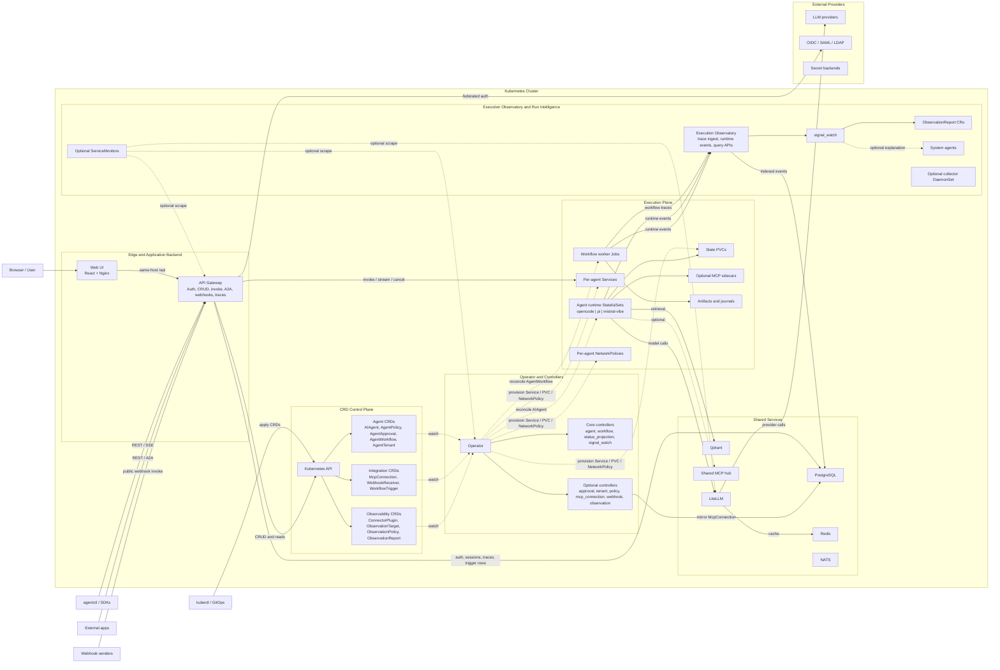

# Architecture Diagram Redesign Spec

This document captures the repo-grounded requirements for replacing `docs/kubesynth-architectureold.drawio` and refreshing the top-level architecture visual.

## Purpose

The new diagram should communicate one clear thesis:

`Ship AI agents as Kubernetes resources.`

The visual needs to show that:

- Kubernetes CRDs are the control-plane source of truth.
- The API gateway is both the public edge and a substantive application backend.
- The operator is the active reconciliation engine.
- Each agent runs as an isolated singleton runtime `StatefulSet`.
- Workflows run as worker `Job`s.
- Observability and security are first-class platform layers.

## Why the legacy diagram is stale

The current `docs/kubesynth-architectureold.drawio` is not faithful to the shipped platform:

- It lists only 5 CRDs, while the chart installs 12 CRDs under `charts/kubesynapse/crds/*.yaml`.
- It shows an OpenCode-only runtime plane, while the repo ships `opencode`, `pi`, and `mistral-vibe` runtimes.
- It treats the gateway mainly as ingress and routing, while current code also owns auth, CRUD, invoke routing, A2A, webhook intake, traces, and UI-facing metadata.
- It omits `McpConnection`, `WebhookReceiver`, `WorkflowTrigger`, and the observability CRDs.
- It omits PostgreSQL even though PostgreSQL backs auth/session state, trace storage, trigger history, and `McpConnection` mirroring.
- It omits the Execution Observatory and runtime event pipeline.
- It hides meaningful security boundaries such as tightened RBAC, restricted pod security contexts, per-agent `NetworkPolicy`, and webhook validation controls.

## Copy-Ready Prompt

Use this as the implementation prompt for a designer, diagramming tool, or follow-up model:

```text
Redesign the KubeSynapse architecture diagram as a wide, modern, repo-faithful platform diagram that can replace docs/kubesynth-architectureold.drawio. The main message should be: "Ship AI agents as Kubernetes resources." Use a Kubernetes cluster boundary as the main visual frame. Put external actors on the left, external providers on the right, and use clear horizontal lanes inside the cluster.

Show Kubernetes CRDs as the control-plane source of truth, not PostgreSQL. Group the 12 CRDs into three families: agent CRDs (AIAgent, AgentPolicy, AgentApproval, AgentWorkflow, AgentTenant), integration CRDs (McpConnection, WebhookReceiver, WorkflowTrigger), and observability CRDs (ConnectorPlugin, ObservationTarget, ObservationPolicy, ObservationReport).

Show the API gateway as both the public edge and a major backend boundary. Its label should visibly cover auth, CRUD, invoke and stream routing, A2A, webhooks, and Execution Observatory APIs. Show the web UI adjacent to this edge layer, with browser traffic entering the UI and the UI forwarding same-host /api traffic to the gateway.

Show the operator as a controller-per-CRD reconciliation engine. Visually distinguish core controllers (agent_controller, workflow_controller, status_projection, signal_watch) from optional controllers that load when CRDs exist (approval, tenant, policy, mcp_connection, webhook, observation).

Show agents running as isolated singleton runtime StatefulSets, not generic deployments. The runtime label must include the in-tree runtime kinds: opencode, pi, and mistral-vibe. Show per-agent Services, PVC-backed state, optional MCP sidecars, and per-agent NetworkPolicies. Show the shared MCP hub as a separate optional shared-service path rather than collapsing everything into sidecars.

Show workflows as worker Jobs with artifact and journal storage. Make it visually clear that AIAgent reconciles to runtime StatefulSets while AgentWorkflow reconciles to worker Jobs.

Show shared services with PostgreSQL, LiteLLM, Redis, Qdrant, and NATS. PostgreSQL should be shown as the backing store for auth, sessions, trace data, trigger records, and MCP connection metadata. LiteLLM should connect to external LLM providers. Redis should appear as a cache behind LiteLLM. Qdrant should appear as retrieval infrastructure used by runtimes.

Show the observability and run-intelligence flow explicitly. Worker trace batches go to the gateway trace ingestion path. Runtime semantic events from runtimes and worker jobs go to the gateway runtime-event ingestion path. The gateway stores and serves this data as the Execution Observatory. signal_watch scans indexed events and produces ObservationReport CRs. System agents should appear as an optional explanation or escalation path, not as the primary anomaly detector.

Show the webhook path conservatively and accurately: external webhook senders hit a public gateway endpoint, the gateway validates HMAC, timestamp, IP allowlist, rate limits, and payload limits, matched triggers are recorded, and the webhook controller timer launches workflow jobs from dispatched trigger rows. Do not depict the gateway as directly creating workflow jobs.

Add visible security callouts for hybrid auth and local auth, tightened RBAC, runtime restricted security contexts, per-agent network isolation, and webhook hardening. Treat security as a first-class overlay, not a footnote.

Do not depict PostgreSQL as the control-plane source of truth. Do not show the gateway provisioning runtimes directly. Do not collapse workers into runtimes. Do not show the platform as OpenCode-only. Do not overclaim fully general event-bus automation beyond the current webhook and trigger flow.
```

## Recommended Layout

Use a landscape diagram with these regions:

| Region | Required Content | Visual Notes |
| --- | --- | --- |
| External actors | Browser, `agentctl` and SDKs, external apps, webhook senders, `kubectl` / GitOps | Place on the left. Keep `kubectl` / GitOps visually separate from request clients because it uses the Kubernetes API directly. |
| External providers | LLM providers, enterprise IdP, secret backends | Place on the right. Use dashed or lighter edges for optional integrations such as IdP or secret backends. |
| Kubernetes cluster boundary | All platform components | This should be the main frame of the diagram. |
| Edge and application backend lane | Web UI and API Gateway | Show browser traffic entering the Web UI and same-host `/api` flowing to the gateway. Show CLI, SDK, external app, and webhook traffic entering the gateway. |
| CRD control-plane lane | Kubernetes API and grouped CRD families | This lane should make the CRDs feel authoritative and central. |
| Operator and controller lane | Operator plus controller groups | Make it clear that this layer watches CRDs and reconciles cluster resources. |
| Execution lane | Runtime `StatefulSet`s, Services, state PVCs, worker `Job`s, artifact/journal storage, optional MCP sidecars | This is the isolated runtime plane. Keep agent runtime and workflow job visuals distinct. |
| Shared services lane | PostgreSQL, LiteLLM, Redis, Qdrant, NATS, shared MCP hub | If space is tight, de-emphasize NATS relative to PostgreSQL, LiteLLM, Redis, and Qdrant. |
| Observability and run-intelligence lane | Execution Observatory, trace ingestion, runtime-event ingestion, `signal_watch`, `ObservationReport`, optional system agents, optional telemetry surfaces | Make this an explicit lane, not a tiny appendix. |

## Required Components

| Area | Must Show |
| --- | --- |
| Web UI | Browser-facing UI surface that proxies same-host `/api` traffic to the gateway |
| API Gateway | Auth, CRUD, invoke, invoke-stream, A2A, webhooks, traces, UI metadata |
| Kubernetes API | The control-plane API used by `kubectl`, GitOps, the gateway, and the operator |
| Agent CRDs | `AIAgent`, `AgentPolicy`, `AgentApproval`, `AgentWorkflow`, `AgentTenant` |
| Integration CRDs | `McpConnection`, `WebhookReceiver`, `WorkflowTrigger` |
| Observability CRDs | `ConnectorPlugin`, `ObservationTarget`, `ObservationPolicy`, `ObservationReport` |
| Operator core controllers | `agent_controller`, `workflow_controller`, `status_projection`, `signal_watch` |
| Operator optional controllers | `approval_controller`, `tenant_controller`, `policy_controller`, `mcp_connection_controller`, `webhook_controller`, `observation_controller` |
| Runtime plane | Per-agent singleton runtime `StatefulSet`s for `opencode`, `pi`, and `mistral-vibe` |
| Runtime adjacencies | Per-agent Service, PVC-backed state, optional MCP sidecars, per-agent `NetworkPolicy` |
| Workflow execution | Worker `Job`s plus artifact/journal storage |
| Shared services | PostgreSQL, LiteLLM, Redis, Qdrant, NATS |
| MCP shared path | Shared MCP hub as a separate optional path from per-agent sidecars |
| Observatory | Trace ingestion, runtime-event ingestion, trace/query surface, `signal_watch`, `ObservationReport` |
| Optional telemetry | `ServiceMonitor` and collector `DaemonSet` as optional or secondary elements |

## Required Flows

Use solid arrows for request or execution paths, dashed arrows for watch or reconcile paths, and lighter dotted arrows for optional integrations.

| From | To | Label |
| --- | --- | --- |
| Browser | Web UI | HTTPS |
| Web UI | API Gateway | same-host `/api` |
| `agentctl` / SDKs | API Gateway | REST / SSE |
| External apps | API Gateway | REST / A2A |
| Webhook senders | API Gateway | public webhook invoke |
| `kubectl` / GitOps | Kubernetes API | apply CRDs |
| API Gateway | Kubernetes API | CRUD, reads, status updates |
| Kubernetes API / CRDs | Operator | watch events |
| Operator | Runtime `StatefulSet`s | reconcile `AIAgent` |
| Operator | Services, PVCs, `NetworkPolicy` | provision runtime access and isolation |
| Operator | Worker `Job`s | reconcile `AgentWorkflow` |
| Worker `Job`s | Artifact and journal storage | write workflow evidence |
| API Gateway | Runtime Services | `invoke`, `invoke/stream`, `cancel` |
| Runtime `StatefulSet`s | LiteLLM | model calls |
| LiteLLM | Redis | cache |
| Runtime `StatefulSet`s | Qdrant | retrieval |
| Runtime `StatefulSet`s | MCP sidecars | localhost tools |
| Runtime `StatefulSet`s | Shared MCP hub | optional shared MCP path |
| API Gateway | PostgreSQL | auth, sessions, traces, trigger history |
| `mcp_connection_controller` | PostgreSQL | mirror `McpConnection` metadata |
| Worker `Job`s | Execution Observatory | batched workflow traces |
| Runtime `StatefulSet`s | Execution Observatory | semantic runtime events |
| Worker `Job`s | Execution Observatory | semantic runtime events |
| Execution Observatory | PostgreSQL | indexed events and execution state |
| Execution Observatory | `signal_watch` | query / scan pipeline |
| `signal_watch` | `ObservationReport` CRD | deterministic anomaly reports |
| `signal_watch` | System agents | optional explanation / escalation |
| API Gateway | PostgreSQL | record matched trigger executions |
| `webhook_controller` timer | PostgreSQL | scan dispatched trigger rows |
| `webhook_controller` | Worker `Job`s | launch workflow jobs |
| API Gateway | IdP | OIDC / SAML / LDAP federation |
| LiteLLM | External LLM providers | provider calls |

## Security Overlays

Do not make security a tiny legend. Add visible shields, side annotations, or boundary callouts for these controls:

- Gateway auth boundary: `apiGateway.auth.mode: hybrid`, `localAuthEnabled: true`, plus optional OIDC, SAML, and LDAP federation.
- Control-plane RBAC boundary: dedicated service accounts and tightened roles in `charts/kubesynapse/templates/operator-rbac.yaml`.
- Runtime hardening: `allowPrivilegeEscalation: false`, `seccompProfile: RuntimeDefault`, non-root execution, and restricted container security contexts.
- Agent network isolation: per-agent `NetworkPolicy` for MCP and A2A flows plus chart-level network policies.
- Webhook hardening: HMAC signature verification, replay timestamp, IP allowlist, rate limit, and payload-size limits.
- Tenant and namespace boundaries: show or imply namespace-aware authz and tenant isolation without overcomplicating the main flow.

## Claims To Avoid

The redesigned diagram should not imply any of the following:

- PostgreSQL is the desired-state source of truth.
- The API gateway directly provisions runtimes or worker jobs.
- Every runtime is OpenCode.
- Workflow jobs are the same thing as long-lived agent runtimes.
- An LLM is required for first-pass anomaly detection.
- Webhook intake directly launches Kubernetes jobs from the gateway process.
- Prometheus, Grafana, or OpenTelemetry are always-on core in-cluster services unless they are explicitly marked optional or external.
- `pods/exec` shell access is part of the normal runtime access model.

## Evidence Anchors

Use these files as the authoritative grounding for the diagram:

| Area | Files |
| --- | --- |
| CRD surface | `charts/kubesynapse/crds/*.yaml` |
| Controller registration | `operator/controllers/__init__.py` |
| Agent runtime reconciliation | `operator/controllers/agent_controller.py`, `operator/builders/manifests.py`, `operator/services/k8s.py` |
| Workflow job reconciliation | `operator/controllers/workflow_controller.py`, `operator/services/k8s.py` |
| Webhook and trigger validation/dispatch | `api-gateway/routers/webhooks.py`, `operator/controllers/webhook_controller.py`, `charts/kubesynapse/crds/webhookreceiver-crd.yaml`, `charts/kubesynapse/crds/workflowtrigger-crd.yaml` |
| Gateway surface | `api-gateway/main.py`, `api-gateway/routers/agents.py`, `api-gateway/routers/webhooks.py`, `api-gateway/traces_router.py` |
| Trace and observability storage | `api-gateway/trace_store.py`, `api-gateway/_core.py` |
| Worker trace emission | `operator/trace_client.py` |
| Runtime semantic event emission | `operator/runtime_events.py`, `opencode-runtime/runtime_events.py`, `pi-runtime/runtime_events.py`, `vibe-runtime/runtime_events.py` |
| Run intelligence | `operator/controllers/signal_watch.py` |
| MCP metadata mirroring | `operator/controllers/mcp_connection_controller.py` |
| Security and RBAC | `charts/kubesynapse/templates/operator-rbac.yaml`, `operator/builders/manifests.py`, `charts/kubesynapse/values.yaml` |
| Optional telemetry surfaces | `charts/kubesynapse/templates/servicemonitor.yaml`, `charts/kubesynapse/templates/collector-daemonset.yaml` |

## Visual Direction

The replacement should feel more like a polished platform map than a generic box-and-arrow export.

- Use distinct colors for external actors, control plane, operator layer, execution plane, shared services, observability, and security.
- Keep the CRD lane central and visually authoritative.
- Make the gateway and operator visibly different roles.
- Make runtime `StatefulSet`s and workflow `Job`s visually different shapes.
- Use callouts or badges for optional elements such as the shared MCP hub, collector, `ServiceMonitor`, and enterprise IdP.
- If a small runtime callout fits, annotate the runtime contract endpoints: `/health`, `/ready`, `/info`, `/capabilities`, `/invoke`, `/invoke/stream`, `/cancel`.

## Mermaid-Ready Scaffold

This is a structural scaffold, not the final polished diagram.



## Recommended Outcome

The old draw.io asset should either be rebuilt to match this spec or retired in favor of a new source file that is easier to keep in sync with the repo.
