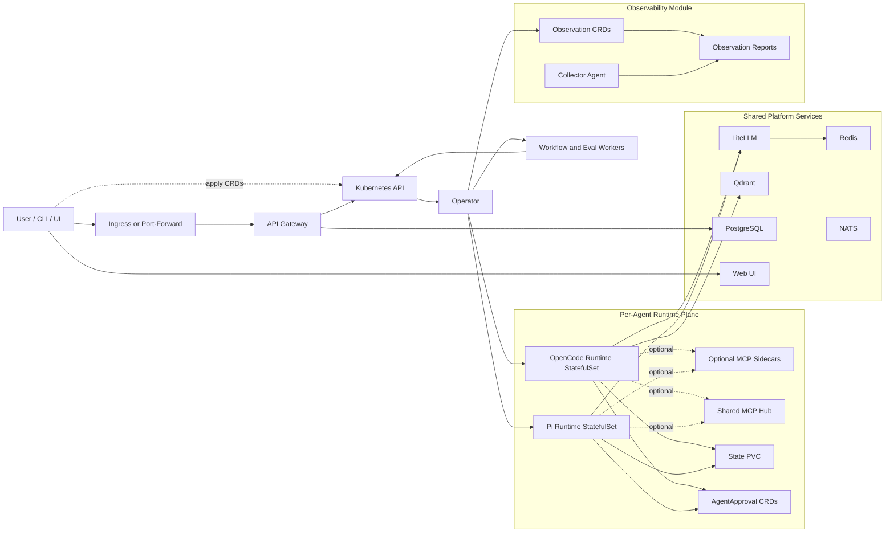

# KubeSynapse Architecture Overview

This document describes the architecture that the repository currently implements. It focuses on the active runtime path, the current control-plane model, and the observability capabilities that now exist in code.

## 1. System Summary

KubeSynapse is a Kubernetes-native AI agent platform built around these ideas:

- represent agents, workflows, policies, approvals, evals, tenants, and observability resources as Kubernetes custom resources
- reconcile desired state with a Python operator and background worker Jobs
- run each agent as an isolated singleton StatefulSet backed by the OpenCode runtime
- route model calls through LiteLLM and optional retrieval through Qdrant
- expose the platform through a FastAPI gateway, a React web UI, and the `agentctl` CLI

The platform supports dual runtimes: OpenCode (`runtime.kind: opencode`) and Pi (`runtime.kind: pi`).

## 2. Top-Level Architecture

### What the diagram shows

- external clients enter through the ingress and API gateway
- the operator provisions singleton runtime StatefulSets from `AIAgent` resources
- workflow and evaluation execution is delegated to background worker Jobs
- runtime StatefulSets call LiteLLM for model access and Qdrant for retrieval
- the gateway persists application state beyond simple request routing, especially for auth and connection metadata
- observability now exists as a first-class module with its own CRDs, controller logic, UI surfaces, and collector path

## 3. Control Plane

### Kubernetes API and CRDs

The Kubernetes API remains the control-plane source of truth. The chart installs CRDs for:

| CRD | Scope | Purpose |
| --- | --- | --- |
| `AIAgent` | Namespaced | Defines an agent model, system prompt, policy reference, MCP integrations, and storage |
| `AgentPolicy` | Namespaced | Defines input guardrails, output guardrails, per-request token caps, and allowed models |
| `AgentApproval` | Namespaced | Represents human approval requests for high-risk actions |
| `AgentWorkflow` | Namespaced | Defines multi-step agent DAGs with dependencies and optional approval gates |
| `AgentEval` | Namespaced | Defines evaluation suites and thresholds for an agent |
| `AgentTenant` | Cluster | Defines namespace isolation, quotas, allowed models, and tenant admins |
| `ConnectorPlugin` | Namespaced | Declares how observability data is collected |
| `ObservationTarget` | Namespaced | Declares what is being observed |
| `ObservationPolicy` | Namespaced | Declares how collected telemetry is evaluated |
| `ObservationReport` | Namespaced | Stores the resulting health or anomaly output |

### Operator responsibilities

The Python operator is the reconciliation core.

Current responsibilities include:

- reconciling agents into runtime StatefulSets, Services, PVCs, ConfigMaps, and policies
- reconciling workflows and evals into worker Jobs
- tracking workflow and eval status from artifacts and logs
- managing approval-state transitions
- reconciling observability resources when the observability CRDs are present

The operator is not just a bootstrap layer. It is the active control-plane engine for the product.

## 4. Data Plane

### API Gateway

The API gateway is now a substantial backend service, not just a thin router.

Current responsibilities include:

- authentication and session handling
- namespace-aware authorization
- CRUD endpoints for agents, workflows, evals, policies, approvals, MCP connections, and observability resources
- invoke routing to runtime sandboxes
- workflow trigger endpoints
- runtime metadata and validation endpoints used by the UI
- managed sign-in and local-auth flows in current deployments

### Runtime sandboxes

Each agent runs in an isolated sandbox. The supported runtime paths are OpenCode and Pi.

An OpenCode agent sandbox typically contains:

- the OpenCode runtime process
- runtime-generated config and context files
- optional MCP sidecars
- a persistent state volume
- policy and approval enforcement hooks

The Pi runtime runs as a separate StatefulSet using a Node.js HTTP bridge (`pi-runtime/pi_bridge.js`) that wraps Pi's RPC mode. It exposes artifact APIs (`/artifacts/list`, `/artifacts/download`, `/artifacts/zip`) backed by a pod-local filesystem and enforces a 120-second model timeout (`MODEL_TIMEOUT_MS`) with auto-abort and retry to prevent runaway sessions.

### Worker Jobs

Workflows and evaluations rely on short-lived worker Jobs plus artifact persistence rather than trying to project every execution detail directly into CRD status.

That means:

- CRD status carries summary state
- detailed execution evidence lives in worker artifacts and logs
- the gateway and UI read from both Kubernetes state and artifact-derived state

## 5. Shared Services

The default chart values currently wire these shared platform services:

- API Gateway
- Operator
- OpenCode runtime image for agents
- LiteLLM
- Redis
- Qdrant
- NATS
- PostgreSQL
- Web UI
- MCP hub namespace and selected hub services
- collector DaemonSet path when enabled

## 6. MCP Architecture

The current platform uses two MCP access patterns:

- per-agent sidecars for tools that should stay tightly scoped to one runtime
- shared MCP hub services plus structured connection records managed through the gateway

The `AIAgent` contract now includes connection-oriented MCP metadata, and the UI uses gateway-provided validation and runtime preview information to present attachable MCP connections.

## 7. Workflow and Eval Execution

### AgentWorkflow

`AgentWorkflow` still defines DAG-style execution, but the current operational model is:

1. the workflow exists as a CRD object and user-facing definition
2. the operator or gateway triggers execution
3. a worker Job performs the orchestration work
4. step-level detail is persisted as artifacts and logs
5. summary state is projected back into workflow status and the UI

### AgentEval

Evals follow a similar pattern:

- the CRD declares the suite
- execution runs in a worker context
- results and summaries are persisted and surfaced through the API and UI

## 8. Observability Architecture

The observability module is implemented in the current repository.

Current behavior includes:

- the chart installs observability CRDs
- the operator registers `observation_controller` when those CRDs are present
- the controller synthesizes target, policy, connector, and report status
- the web UI presents observability dashboards and editors for connectors, targets, and policies
- the repository includes a collector agent image and an MCP collector sidecar for cluster intelligence workflows

The current implementation uses demo-friendly report generation so operators can make the observability flow visible without wiring a full external telemetry backend first.

## 9. Security Model

Security is enforced across several layers:

- gateway authentication and namespace-aware authorization
- dedicated service accounts and RBAC for operator and runtimes
- network isolation for runtime pods and MCP access
- non-root runtime pods with restricted security contexts
- optional gVisor support through `enableGVisor`
- policy-driven input and output guardrails, tool controls, and A2A restrictions
- secret handling through native chart secrets or External Secrets integration

## 10. Most Important Current Truths

If you need the shortest possible architectural summary, these are the points that matter most:

1. The supported runtime path is OpenCode.
2. The gateway is now a substantive application backend, not just a thin router.
3. Workflow and eval detail lives in worker artifacts more than CRD status.
4. MCP is both sidecar-based and connection-driven.
5. Observability is implemented through CRDs, controller logic, UI views, and collector support.
6. Explicit A2A delegation exists today, while NATS remains an extension point for deeper async coordination later.
