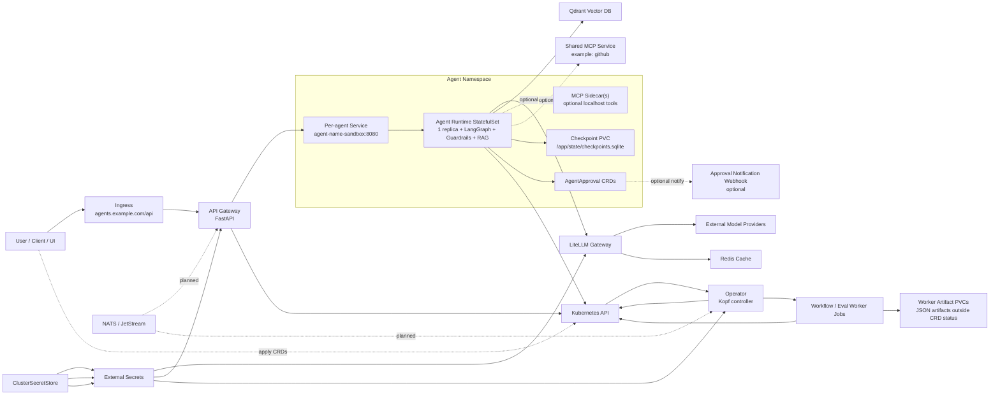
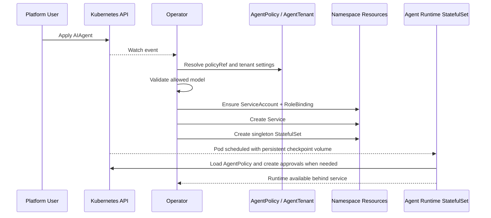
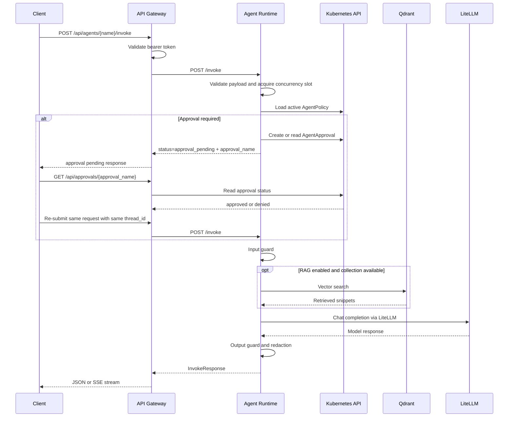
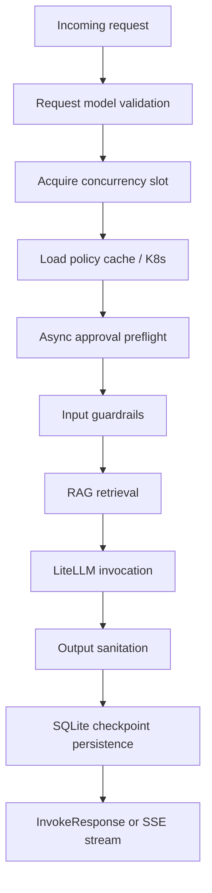
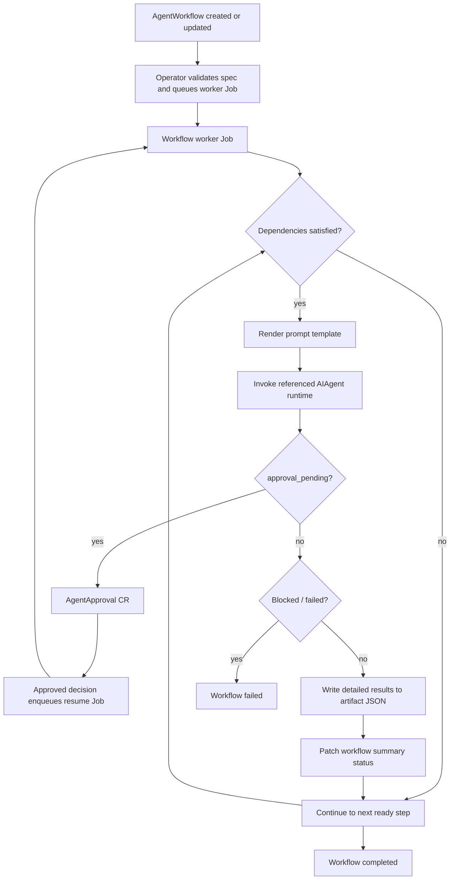
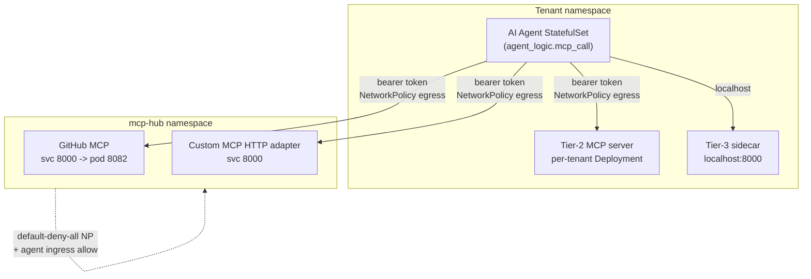
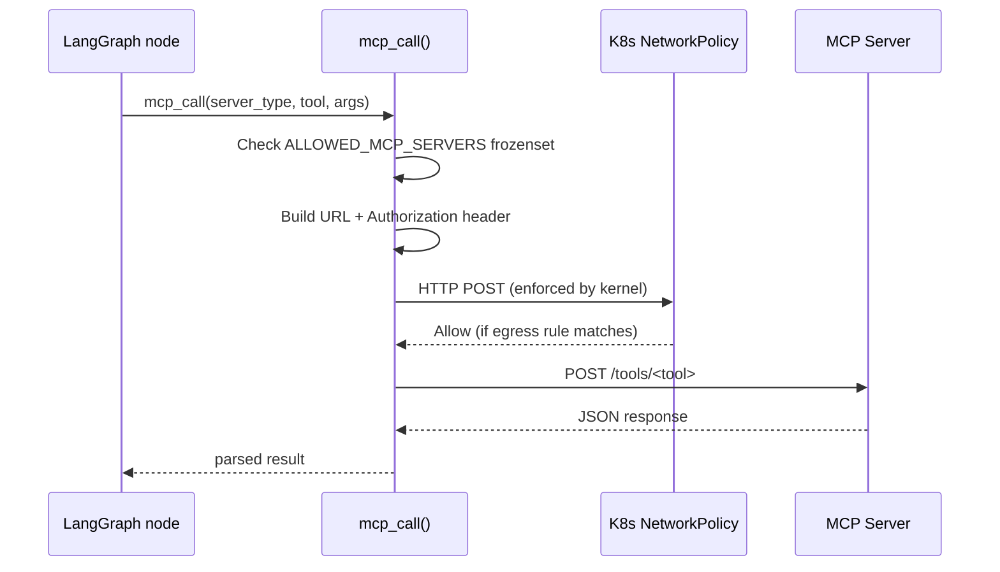

# Kubeminionagents Architecture and Design Overview

## 1. Purpose

This document describes the current architecture, control flows, design choices, and operational model of the Kubeminionagents platform.

The system is a Kubernetes-native AI agent sandbox built around these ideas:

- define agents and workflows as Kubernetes custom resources
- reconcile infrastructure through a Kubernetes operator
- run each agent as a singleton stateful runtime selected by spec.runtime.kind, with durable local checkpoints
- route model traffic through LiteLLM
- expose agent access through a secured API gateway
- support guardrails, asynchronous human approval, evaluation, and tenant isolation

This overview reflects the implementation in:

- [api-gateway/main.py](api-gateway/main.py)
- [agent-runtime/agent_logic.py](agent-runtime/agent_logic.py)
- [agent-runtime/guardrails.py](agent-runtime/guardrails.py)
- [agent-runtime/hitl.py](agent-runtime/hitl.py)
- [operator/main.py](operator/main.py)
- [charts/ai-agent-sandbox](charts/ai-agent-sandbox)

---

## 2. System Summary

At a high level, the platform is split into a control plane and a data plane.

### Control plane

The control plane is responsible for provisioning, governance, and orchestration:

- Kubernetes CRDs define agents, policies, tenants, workflows, approvals, and evaluations
- the Kopf-based operator watches those CRDs, creates singleton runtime StatefulSets, and queues worker Jobs
- workflow and evaluation worker Jobs execute long-running orchestration outside the controller hot path
- Helm installs the shared platform services and CRDs

### Data plane

The data plane is responsible for serving requests and executing agent logic:

- the API gateway authenticates users and routes requests to the correct agent runtime
- each agent runtime executes one of four runtime adapters (LangGraph, Goose, Codex, or OpenCode) behind the same invoke contract
- LiteLLM brokers model access to external model providers
- Qdrant stores vector data for retrieval
- Redis backs LiteLLM response caching

---

## 3. Architecture Principles

The implementation follows these design principles:

1. **Kubernetes-native declarative model**  
   Agents and workflows are managed as CRDs instead of bespoke control APIs.

2. **Isolation by default**  
   Each agent gets its own singleton StatefulSet, service, persistent checkpoint volume, and security context.

3. **Separation of concerns**  
   Gateway, operator, runtime, model proxy, and vector store are separate deployable units.

4. **Policy-driven governance**  
   Guardrails and model allow-lists are externalized into `AgentPolicy` and tenant settings.

5. **Operational visibility**  
   Runtime tracing, health checks, and evaluation resources are part of the platform design.

6. **Progressive extensibility**  
    Explicit A2A delegation and specialist-team orchestration are available today, while NATS and the broader message-bus model remain extension points for deeper async coordination.

---

## 4. Top-Level Deployment Architecture

### What the diagram shows

- external clients enter through the ingress and API gateway
- the operator provisions singleton runtime StatefulSets from `AIAgent` resources
- workflow and evaluation execution is delegated to background worker Jobs
- runtime StatefulSets call LiteLLM for model access and Qdrant for retrieval
- approvals and policies are resolved through the Kubernetes API and surfaced through the gateway
- detailed workflow and evaluation artifacts are persisted to PVC-backed JSON files instead of CRD status blobs
- secrets are injected through External Secrets and a cluster secret store
- NATS exists as a platform capability, but the current request path is still primarily HTTP-based

---

## 5. Major Components

| Component | Responsibility | Current implementation |
|---|---|---|
| API Gateway | Authenticates callers, lists agents, invokes runtimes, streams responses, fetches logs | [api-gateway/main.py](../api-gateway/main.py) |
| Operator | Watches CRDs and reconciles namespaces, StatefulSets, services, PVCs, RBAC, and worker jobs | [operator/](../operator/) — modularized into `controllers/`, `builders/`, `services/`, with `config.py`, `errors.py`, `reconcile.py`, `tracing.py` |
| Operator Worker Jobs | Execute workflows and evaluations outside the controller hot path and persist artifacts | [operator/worker.py](../operator/worker.py) |
| Agent Runtime (LangGraph) | Executes the LangGraph state machine behind a shared HTTP invoke contract | [agent-runtime/agent_logic.py](../agent-runtime/agent_logic.py) |
| Goose Runtime | Alternative runtime adapter for Goose-based agents | [goose-runtime/main.py](../goose-runtime/main.py) |
| Codex Runtime | Runtime adapter for OpenAI Codex-based agents | [codex-runtime/main.py](../codex-runtime/main.py) |
| OpenCode Runtime | Runtime adapter for OpenCode-based agents | [opencode-runtime/main.py](../opencode-runtime/main.py) |
| Guardrails Engine | Regex-based prompt injection detection and output redaction / truncation | [agent-runtime/guardrails.py](../agent-runtime/guardrails.py) |
| HITL Module | Creates or reuses `AgentApproval` resources asynchronously and emits optional notifications | [agent-runtime/hitl.py](../agent-runtime/hitl.py) |
| LiteLLM | Central model gateway and auth boundary for model calls | [charts/ai-agent-sandbox/templates/litellm-deployment.yaml](../charts/ai-agent-sandbox/templates/litellm-deployment.yaml) |
| Redis | Backs LiteLLM cache | [charts/ai-agent-sandbox/templates/redis.yaml](../charts/ai-agent-sandbox/templates/redis.yaml) |
| Qdrant | Vector retrieval backend for RAG | [charts/ai-agent-sandbox/templates/qdrant.yaml](../charts/ai-agent-sandbox/templates/qdrant.yaml) |
| NATS | Message bus foundation for future A2A and orchestration scenarios | [charts/ai-agent-sandbox/templates/nats.yaml](../charts/ai-agent-sandbox/templates/nats.yaml) |
| External Secrets | Supplies LLM keys and gateway tokens from a secret backend | [charts/ai-agent-sandbox/templates/external-secrets.yaml](../charts/ai-agent-sandbox/templates/external-secrets.yaml) |
| MCP Sidecars | 10 bundled tool sidecar images (code-exec, web-search, documents, browser, database, git, github-adapter, kubernetes, messaging, rag) | [mcp-sidecars/](../mcp-sidecars/) |

---

## 6. CRD Model

The platform uses custom resources as its primary declarative interface.

| CRD | Scope | Purpose |
|---|---|---|
| `AIAgent` | Namespaced | Defines an agent model, system prompt, policy reference, MCP integrations, and storage |
| `AgentPolicy` | Namespaced | Defines input guardrails, output guardrails, per-request token caps, and allowed models |
| `AgentApproval` | Namespaced | Represents human approval requests for high-risk actions |
| `AgentWorkflow` | Namespaced | Defines multi-step agent DAGs with dependencies and optional approval gates |
| `AgentEval` | Namespaced | Defines evaluation suites and thresholds for an agent |
| `AgentTenant` | Cluster | Defines namespace isolation, quotas, allowed models, and tenant admins |

### AIAgent fields

The `AIAgent` CRD supports:

- `model`
- `systemPrompt`
- `policyRef`
- `runtime.kind`
- `runtime.goose.configFiles`
- `mcpServers`
- `mcpSidecars`
- `a2a.allowedCallers`
- `skills.files`
- `enableGVisor`
- `storage.size`
- `storage.storageClassName`

Reference: [charts/ai-agent-sandbox/templates/aiagent-crd.yaml](charts/ai-agent-sandbox/templates/aiagent-crd.yaml)

### AgentPolicy fields

The `AgentPolicy` CRD governs:

- prompt injection blocking
- blocked input regex patterns
- output masking and output regex redaction
- token limits for input and output
- model allow-lists
- budget fields reserved for future distributed enforcement

Reference: [charts/ai-agent-sandbox/templates/agentpolicy-crd.yaml](charts/ai-agent-sandbox/templates/agentpolicy-crd.yaml)

### AgentWorkflow fields

The `AgentWorkflow` CRD supports:

- DAG-style `steps`
- prompt templating with previous outputs
- dependency ordering via `dependsOn`
- optional `requireApproval`
- `messageBus` as an architectural extension point

Reference: [charts/ai-agent-sandbox/templates/agentworkflow-crd.yaml](charts/ai-agent-sandbox/templates/agentworkflow-crd.yaml)

### AgentApproval fields

The `AgentApproval` CRD records:

- agent name
- requested action
- tool name and serialized tool args
- request correlation id for replay/resume
- decision state: pending, approved, denied
- who decided and when

Reference: [charts/ai-agent-sandbox/templates/agentapproval-crd.yaml](charts/ai-agent-sandbox/templates/agentapproval-crd.yaml)

### AgentEval fields

The `AgentEval` CRD supports:

- test suites with input and expected output
- metric selection per test case
- failure thresholds
- scheduled evaluations

Reference: [charts/ai-agent-sandbox/templates/agenteval-crd.yaml](charts/ai-agent-sandbox/templates/agenteval-crd.yaml)

### AgentTenant fields

The `AgentTenant` CRD manages:

- dedicated namespace mapping
- quota and limit range settings
- tenant-level allowed model lists
- admin identities

Reference: [charts/ai-agent-sandbox/templates/agenttenant-crd.yaml](charts/ai-agent-sandbox/templates/agenttenant-crd.yaml)

---

## 7. Control Plane Design

The operator is the core control-plane service.

### Operator responsibilities

The operator:

- watches `AIAgent`, `AgentTenant`, `AgentWorkflow`, `AgentEval`, and `AgentApproval`
- provisions per-agent StatefulSets, services, service accounts, and role bindings
- enforces model policy and tenant model restrictions before pod creation
- creates tenant namespaces, quotas, limit ranges, roles, and tenant bindings
- provisions PVC-backed artifact storage for workflow and evaluation runs
- queues worker Jobs for workflow and evaluation execution
- resumes waiting workflows when an `AgentApproval` moves to `approved`

### Provisioning sequence

### Why the operator exists

Using an operator keeps the platform aligned with Kubernetes-native operations:

- desired state is expressed through CRDs
- reconciliation is repeatable and recoverable
- status is pushed back onto resources rather than hidden in app state
- long-running orchestration is moved into jobs instead of blocking reconciliation workers
- tenancy and policy logic are centralized in one controller

---

## 8. Data Plane Design

The data plane begins at the API gateway and ends when the runtime returns a response.

### API gateway responsibilities

The gateway currently provides:

- `/api/health`
- `/api/agents`
- `/api/agents/{agent}/discover`
- `/api/approvals/{approval_name}`
- `/api/agents/{agent}/invoke`
- `/api/agents/{agent}/invoke/stream`
- `/api/agents/{agent}/logs`

Authentication modes:

- `shared_token`
- `oidc`
- `auto`

In `auto`, the gateway first tries OIDC if the bearer token looks like a JWT and falls back to shared-token validation.

Reference: [api-gateway/main.py](api-gateway/main.py)

### Runtime request pipeline

### Runtime pipeline stages

The runtime graph is assembled in [agent-runtime/agent_logic.py](agent-runtime/agent_logic.py) and follows this sequence:

1. `input_guard`
2. `rag_retrieve`
3. `chatbot`
4. `output_guard`

Approval handling now happens before the LangGraph execution starts. This keeps pending approvals out of the checkpoint path and makes resume behavior explicit and idempotent.

---

## 9. Runtime Internal Design

The runtime is intentionally a small service with a focused responsibility: execute one agent safely and consistently.

### Key design choices

#### 9.1 Bounded concurrency

The runtime now limits concurrent in-flight requests with a bounded semaphore. This prevents one pod from accepting unlimited work and failing unpredictably under burst load.

#### 9.2 Structured startup and shutdown

The FastAPI lifespan hook initializes the runtime once and closes the SQLite checkpoint database on shutdown.

#### 9.3 Durable checkpoints

LangGraph uses `SqliteSaver` with a SQLite database under `/app/state/checkpoints.sqlite`.

This provides:

- resumable thread state
- per-agent local persistence backed by a PVC
- predictable checkpoint behavior without an external workflow DB

Each agent runtime is intentionally deployed as a singleton StatefulSet replica, so the checkpoint model is clear: one durable runtime per agent revision rather than active-active sharing of SQLite state.

#### 9.4 RAG context retrieval

When enabled, the runtime:

- discovers or uses a configured Qdrant collection
- requests embeddings through LiteLLM
- queries Qdrant
- deduplicates and clips context before passing it to the model

#### 9.5 Guardrails and approvals

The runtime performs governance checks around generation:

- asynchronous approval preflight through `AgentApproval`
- input validation through `GuardrailsEngine`
- output sanitation through `GuardrailsEngine`

#### 9.6 Skill materialization and capability enforcement

Both runtimes load skill files from the agent spec, materialize them into runtime-local state, and derive a parsed summary that is returned through the gateway. Skill frontmatter can grant sandbox tools, MCP servers, A2A targets, subagent usage, and Goose extensions.

This produces two important behaviors:

- agent behavior can be versioned alongside the rest of the agent manifest instead of being hidden in container images
- the runtime has a concrete capability envelope to enforce at invoke time rather than relying on prompt text alone

For Goose agents, `runtime.goose.configFiles` uses the same pattern for config-root files such as `config.yaml` and prompt fragments.

#### 9.7 Peer delegation and specialist teams

The LangGraph runtime can either route a single request to an explicit A2A target or orchestrate a specialist team in sequential or parallel mode.

Key properties:

- explicit A2A routing and specialist-team orchestration are mutually exclusive within one invoke request
- A2A targets are validated against caller policy and agent reachability through the gateway
- specialist tasks can share sandbox session context and emit result files back into the workspace
- the gateway returns structured A2A and subagent metadata so the CLI and UI can inspect the full delegation path

#### 9.8 Readiness endpoints

The runtime exposes:

- `/health` for status and metadata
- `/ready` for strict readiness
- `/invoke`
- `/invoke/stream`

### Runtime state model

---

## 10. Workflow and Evaluation Design

### Workflows

`AgentWorkflow` allows the operator to orchestrate multi-step DAGs across multiple agents.

Characteristics:

- step names must be unique
- dependencies are validated
- prompt templates can interpolate workflow input and previous outputs
- runtime steps can require approval
- long-running execution is offloaded into worker Jobs
- CRD status stores compact progress fields such as `phase`, `currentStep`, `summary`, `artifactRef`, `workerJob`, and `pendingApproval`

### Evaluations

`AgentEval` allows the operator to invoke an agent against a test suite in a background worker and write compact summaries to status.

Current metrics include:

- relevance
- faithfulness
- toxicity
- latency

Detailed workflow step outputs and eval case results are written to JSON artifact files on worker-mounted PVCs instead of being embedded directly in CRD status.

### Workflow and HITL diagram

Note: NATS is defined in the platform and `messageBus` exists on the CRD, but the current workflow implementation primarily uses Kubernetes Jobs plus direct runtime HTTP invocation rather than a broker-driven execution fabric.

---

## 11. Security Model

Security controls exist at several layers.

### 11.1 Identity and access

- API gateway requires bearer authentication
- gateway supports shared-token and OIDC validation
- operator and gateway run under dedicated service accounts
- runtime StatefulSet pods receive a dedicated service account and a narrow runtime cluster role

References:

- [charts/ai-agent-sandbox/templates/operator-rbac.yaml](charts/ai-agent-sandbox/templates/operator-rbac.yaml)
- [charts/ai-agent-sandbox/templates/api-gateway.yaml](charts/ai-agent-sandbox/templates/api-gateway.yaml)

### 11.2 Network isolation

The network policy for agent runtime pods allows only:

- ingress from the API gateway and operator
- egress to DNS
- egress to LiteLLM
- egress to Qdrant
- egress to OTLP collectors
- egress to the Kubernetes API
- egress to explicitly allowed shared MCP services

Reference: [charts/ai-agent-sandbox/templates/agent-network-policy.yaml](charts/ai-agent-sandbox/templates/agent-network-policy.yaml)

### 11.3 Pod hardening

Agent runtime StatefulSet pods are created with:

- `runAsNonRoot`
- dropped Linux capabilities
- `readOnlyRootFilesystem`
- `allowPrivilegeEscalation: false`
- optional `runtimeClassName: runsc` when `enableGVisor` is set

### 11.4 Secret handling

Secrets are sourced through External Secrets and a cluster secret store abstraction.

The chart includes placeholders for:

- Vault
- Azure Key Vault
- AWS Secrets Manager

Reference: [charts/ai-agent-sandbox/templates/external-secrets.yaml](charts/ai-agent-sandbox/templates/external-secrets.yaml)

### 11.5 Content governance

The runtime enforces:

- prompt injection checks
- regex-based input blocking
- regex-based output redaction
- PII masking
- HITL approval for risky actions

### 11.6 MCP server security

MCP tool-calling is secured with three independent, co-operating enforcement layers:

| Layer | Mechanism | Where enforced |
|---|---|---|
| Network | `NetworkPolicy` default-deny + per-agent egress allow-list | Kubernetes data plane |
| Authentication | Bearer token in `Authorization` header sourced from a K8s Secret | Agent runtime → MCP server |
| Runtime | `ALLOWED_MCP_SERVERS` frozenset checked before every outbound call | `agent_logic.mcp_call()` |

Key properties:

- The `mcp-hub` namespace receives a default-deny-all NetworkPolicy on Helm install; that namespace is created by `mcp-hub-namespace.yaml` with the label `sandbox.enterprise.ai/mcp-hub: "true"` which is required for cross-namespace NetworkPolicy matching.
- Each agent pod's egress is restricted to only the MCP server types listed in its `AgentPolicy.spec.allowedMcpServers`; the operator generates a per-agent `NetworkPolicy` at creation time.
- Tenant namespaces are labelled `sandbox.enterprise.ai/tenant: "true"` by the operator so the mcp-hub ingress NetworkPolicy can allow inbound connections from agent pods without opening the namespace to arbitrary traffic.
- MCP server Deployments run as non-root UID 1000 with `readOnlyRootFilesystem`, `allowPrivilegeEscalation: false`, and all Linux capabilities dropped.
- The bearer token is stored in a K8s `Secret` and injected into agent StatefulSet pods via `secretKeyRef` (optional=true so the pod still starts if MCP is disabled).

References:

- [charts/ai-agent-sandbox/templates/mcp-hub-namespace.yaml](charts/ai-agent-sandbox/templates/mcp-hub-namespace.yaml)
- [charts/ai-agent-sandbox/templates/mcp-hub-network-policy.yaml](charts/ai-agent-sandbox/templates/mcp-hub-network-policy.yaml)
- [charts/ai-agent-sandbox/templates/mcp-server-deployment.yaml](charts/ai-agent-sandbox/templates/mcp-server-deployment.yaml)
- [charts/ai-agent-sandbox/templates/agent-network-policy.yaml](charts/ai-agent-sandbox/templates/agent-network-policy.yaml)
- [agent-runtime/agent_logic.py](agent-runtime/agent_logic.py)

---

## 12. Data, State, and Persistence

| Data type | Storage | Notes |
|---|---|---|
| LangGraph checkpoints | SQLite on per-agent PVC | durable within the singleton runtime pod lifecycle and PVC lifecycle |
| Policy cache | In-memory in runtime | short TTL cache to reduce Kubernetes API chatter |
| JWKS cache | In-memory in API gateway | reduces repeated OIDC JWKS fetches |
| LLM cache | Redis behind LiteLLM | configured in LiteLLM config map |
| Vector data | Qdrant | currently deployed as a single instance |
| Workflow summaries | Kubernetes CRD status | compact progress and references persisted on `AgentWorkflow` |
| Workflow artifacts | JSON files on worker artifact PVCs | detailed step inputs and outputs |
| Evaluation summaries | Kubernetes CRD status | compact metrics and references persisted on `AgentEval` |
| Evaluation artifacts | JSON files on worker artifact PVCs | detailed per-case outputs and scores |
| Approval state | Kubernetes CRD status | persisted on `AgentApproval` |

### Important implementation detail

The runtime checkpoint store is local to a singleton agent StatefulSet replica and its PVC, not a shared multi-pod workflow database. That is simple and durable, but it also means one agent instance is intentionally modeled as one durable runtime rather than active-active replicas sharing thread state.

---

## 13. Scalability and Resilience

### Already present

- HPA definitions for the API gateway and LiteLLM
- LiteLLM Redis caching
- runtime request throttling
- workflow and eval execution offloaded to worker Jobs
- workflow step resumption via approval-aware worker requeue
- checkpoint persistence for agent runtime state
- artifact references kept out of large CRD status payloads

References:

- [charts/ai-agent-sandbox/templates/hpa.yaml](charts/ai-agent-sandbox/templates/hpa.yaml)
- [charts/ai-agent-sandbox/templates/litellm-configmap.yaml](charts/ai-agent-sandbox/templates/litellm-configmap.yaml)

### Current operational limitations

1. **Qdrant uses `emptyDir` in the chart**  
   This is acceptable for local or demo environments, but production should use a PVC.

2. **NATS is deployed but not yet central to request execution**  
   Workflow orchestration now uses Kubernetes Jobs, but runtime invocation is still mostly direct HTTP rather than a broker-driven data plane.

3. **Per-agent runtime scale-out is intentionally singleton**  
   A single agent instance is currently optimized for one stateful runtime replica with one checkpoint store.

4. **Gateway CORS is fully open**  
   This is convenient for demos but should be restricted in production.

5. **Single-replica shared services are still the default**  
   Redis, Qdrant, NATS, and the operator are single-instance by default in the chart.

6. **Artifact storage is PVC-based, not yet object-store based**  
   Worker artifact PVCs are a good improvement over CRD status bloat, but larger-scale retention and analytics may still want blob or object storage.

---

## 14. Production Readiness Recommendations

The platform is already structured like a real control-plane/data-plane system, but these are the next practical improvements.

### Priority 1

- move Qdrant to persistent storage
- define ingress TLS and production hostnames
- restrict gateway CORS origins
- add metrics endpoints and dashboards
- make Redis, NATS, and Qdrant highly available where needed

### Priority 2

- consider moving worker artifacts to object storage for retention and analytics
- externalize runtime checkpoint storage if one agent must scale beyond a single stateful pod
- add distributed budget enforcement from `AgentPolicy`
- add approval notifications to Slack or email

### Priority 3

- add canary rollout support for agent revisions
- add admission policies for CRD validation beyond schema shape
- add per-tenant chargeback and usage accounting
- add a dedicated admin UI for approvals, workflows, and evaluations

---

## 15. Directory-to-Architecture Map

| Path | Role |
|---|---|
| [api-gateway/](../api-gateway/) | External API surface |
| [agent-runtime/](../agent-runtime/) | LangGraph-based per-agent execution runtime |
| [goose-runtime/](../goose-runtime/) | Goose HTTP adapter runtime |
| [codex-runtime/](../codex-runtime/) | Codex HTTP adapter runtime |
| [opencode-runtime/](../opencode-runtime/) | OpenCode HTTP adapter runtime |
| [operator/](../operator/) | Kubernetes reconciliation and orchestration (modularized: controllers/, builders/, services/, migrations/) |
| [mcp-sidecars/](../mcp-sidecars/) | 10 bundled MCP tool sidecar images |
| [charts/ai-agent-sandbox/](../charts/ai-agent-sandbox/) | Platform Helm chart and cluster resources |
| [charts/agents/](../charts/agents/) | Agent-specific Helm sub-charts (devops-agent, code-reviewer, k8s-agent) |
| [web-ui/](../web-ui/) | React + TypeScript web console |
| [cli/](../cli/) | `agentctl` CLI tool (Typer + Rich) |
| [examples/](../examples/) | Sample CR instances |
| [docs/](../docs/) | Architecture, deployment, and design documentation |
| [tests/](../tests/) | Cross-cutting integration tests |
| [scripts/](../scripts/) | Build, packaging, and lint scripts |
| [catalog/](../catalog/) | Agent templates and skills catalog |
| [deploy/](../deploy/) | Helm values overrides per environment |
| [docs/walkthrough.md](walkthrough.md) | Implementation narrative |
| [docs/upstream-reference-repos.md](upstream-reference-repos.md) | Optional upstream reference checkouts |

---

## 16. MCP Execution Architecture

### 3-Tier execution model

MCP servers are deployed in one of three tiers depending on their scope and cost:

| Tier | Namespace | Usage | Examples |
|---|---|---|---|
| Tier 1 — shared hub | `mcp-hub` | Enterprise-wide re-use, high-value integrations | GitHub, tenant-approved HTTP adapters |
| Tier 2 — per-tenant | tenant namespace | Tenant-specific integrations | private Gitlab, internal data APIs |
| Tier 3 — sidecar | `localhost` within pod | Ultra-low-latency, no cross-pod network hop | lightweight calculations, in-memory tools |

Any enabled tier-1 servers are deployed by the `mcp-server-deployment.yaml` Helm template into the `mcp-hub` namespace (configurable via `values.mcpHub.namespace`).

### Network topology

### Call flow through `mcp_call()`

### Operator-managed per-agent NetworkPolicy

When the operator reconciles an `AIAgent` CR it calls `ensure_mcp_network_policy()` which creates a `NetworkPolicy` named `ai-agent-<name>-mcp-egress` in the tenant namespace. One egress rule is generated per entry in `AgentPolicy.spec.allowedMcpServers`, using the fine-grained label `mcp.sandbox.enterprise.ai/type: <server-type>` so each agent is locked to only its declared MCP types even if additional MCP servers exist in the hub namespace.

### Enterprise MCP catalog

The shared repository does not track a local MCP catalog clone. If you want the same optional research setup, recreate it using the commands in [docs/upstream-reference-repos.md](docs/upstream-reference-repos.md).

The platform evaluation criteria still center on the same nine categories:

- Monitoring & Observability (Prometheus, Grafana)
- Version Control (GitHub, GitLab)
- Databases & Vector Stores (PostgreSQL, Qdrant)
- Cloud & Infrastructure-as-Code (Kubernetes MCP, Terraform)
- Data Platforms (Snowflake, BigQuery)
- Security & Secrets (HashiCorp Vault)
- CI/CD (Jenkins, GitHub Actions)
- Collaboration (Slack, Jira)
- AI Agent Governance (OpenTelemetry, OPA)

---

## 17. Final Assessment

Kubeminionagents is best understood as a **Kubernetes-native agent platform** with:

- declarative agent definitions
- operator-managed singleton StatefulSet runtime provisioning
- secure model brokering through LiteLLM
- policy-aware and approval-aware agent execution
- workflow and evaluation CRDs backed by worker Jobs and artifact storage for higher-level orchestration

The strongest aspect of the design is the clear separation between governance, orchestration, and execution.

The main architectural trade-off is that the runtime favors **simple, singleton durable state** over **shared distributed execution state**. That is a reasonable choice for an early production platform because it keeps the agent runtime understandable, recoverable, and easy to operate while moving longer-running orchestration into disposable worker Jobs.
