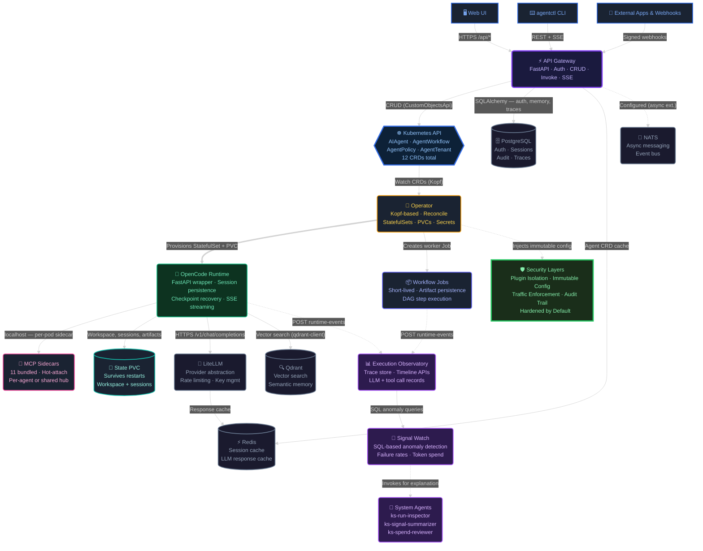

# KubeSynapse Architecture Overview

This document describes the architecture that the repository currently implements. It focuses on the active runtime path, the current control-plane model, and the observability capabilities that now exist in code.

For the diagram sources, see [`docs/kubesynapse-architecture.mmd`](kubesynapse-architecture.mmd) and the refreshed [`docs/kubesynth-architectureold.drawio`](kubesynth-architectureold.drawio).

## 1. System Summary

KubeSynapse is a Kubernetes-native AI agent platform built around these ideas:

- represent agents, workflows, policies, approvals, tenants, and observability resources as Kubernetes custom resources
- reconcile desired state with a Python operator and background worker Jobs
- run each agent as an isolated singleton StatefulSet backed by one of the supported runtime adapters
- route model calls through LiteLLM and optional retrieval through Qdrant
- expose the platform through a FastAPI gateway, a React web UI, and the `agentctl` CLI

The platform uses OpenCode as its production runtime (`runtime.kind: opencode`). Two additional runtimes — Pi (`runtime.kind: pi`) and Mistral Vibe (`runtime.kind: mistral-vibe`) — are available in alpha but not recommended for production workloads.

## 2. Top-Level Architecture

### What the diagram shows

- **Clients** (blue) — Web UI, CLI, and external apps all hit the gateway via HTTPS
- **Control Plane** (blue/purple/amber) — Gateway handles auth + CRUD (reads/writes CRDs via the Kubernetes API), persists app state to Postgres and caches in Redis; Operator watches CRDs and reconciles them into real resources
- **Security** (green) — Defense-in-depth enforced at the operator level: plugin isolation, immutable config, traffic enforcement, audit trail. Hardened baseline injected into every runtime pod.
- **Execution Plane** (green/pink/teal) — The OpenCode runtime runs as an isolated StatefulSet with optional MCP sidecars on localhost and persistent state (Pi and Mistral Vibe are available in alpha)
- **Shared Services** (gray) — LiteLLM proxies all LLM calls with Redis-backed response caching; PostgreSQL stores durable state (auth, sessions, memory, audit, traces); Qdrant handles semantic memory; NATS provides async messaging (extension point for A2A)
- **Run Intelligence** (purple) — Runtime events flow into the Execution Observatory (Postgres-backed trace store), signal watch runs periodic SQL anomaly detection queries, system agents are invoked for AI-powered analysis of detected anomalies

## 3. Control Plane

### Kubernetes API and CRDs

The Kubernetes API remains the control-plane source of truth. The chart installs 12 CRDs. Core resources include:

| CRD | Scope | Purpose |
| --- | --- | --- |
| `AIAgent` | Namespaced | Defines an agent model, system prompt, policy reference, MCP integrations, and storage |
| `AgentPolicy` | Namespaced | Defines input guardrails, output guardrails, per-request token caps, and allowed models |
| `AgentApproval` | Namespaced | Represents human approval requests for high-risk actions |
| `AgentWorkflow` | Namespaced | Defines multi-step agent DAGs with dependencies and optional approval gates |
| `AgentTenant` | Cluster | Defines namespace isolation, quotas, allowed models, and tenant admins |
| `McpConnection` | Namespaced | Declares reusable MCP connection records for remote, hub, or sidecar transport |
| `WebhookReceiver` | Namespaced | Declares signed inbound webhook receivers |
| `WorkflowTrigger` | Namespaced | Declares event-driven workflow triggers |
| `ConnectorPlugin` | Namespaced | Declares how observability data is collected |
| `ObservationTarget` | Namespaced | Declares what is being observed |
| `ObservationPolicy` | Namespaced | Declares how collected telemetry is evaluated |
| `ObservationReport` | Namespaced | Stores the resulting health or anomaly output |

### Operator responsibilities

The Python operator is the reconciliation core.

Current responsibilities include:

- reconciling agents into runtime StatefulSets, Services, PVCs, ConfigMaps, and policies
- reconciling workflows into worker Jobs
- tracking workflow status from artifacts and logs
- managing approval-state transitions
- reconciling observability resources when the observability CRDs are present

The operator is not just a bootstrap layer. It is the active control-plane engine for the product.

## 4. Application And Execution Plane

### API Gateway

The API gateway is now a substantial backend service, not just a thin router.

Current responsibilities include:

- authentication and session handling
- namespace-aware authorization
- CRUD endpoints for agents, workflows, policies, approvals, MCP connections, and observability resources
- invoke routing to runtime sandboxes
- workflow trigger endpoints
- runtime metadata and validation endpoints used by the UI
- managed sign-in and local-auth flows in current deployments

### Runtime sandboxes

Each agent runs in an isolated sandbox. The production runtime is OpenCode.

An OpenCode agent sandbox typically contains:

- the OpenCode runtime process
- runtime-generated config and context files
- optional MCP sidecars
- a persistent state volume
- policy and approval enforcement hooks

> **Alpha runtimes:** Pi (`pi-runtime/`) and Mistral Vibe (`vibe-runtime/`) are available as alpha runtimes but are not recommended for production use. They follow the same runtime API contract but have limited hardening and test coverage.

### Worker Jobs

Workflows rely on short-lived worker Jobs plus artifact persistence rather than trying to project every execution detail directly into CRD status.

That means:

- CRD status carries summary state
- detailed execution evidence lives in worker artifacts and logs
- the gateway and UI read from both Kubernetes state and artifact-derived state

## 5. Run Intelligence Layer

The Run Intelligence Layer extends the Execution Observatory with semantic event indexing, deterministic anomaly detection, and AI-powered analysis.

### Components

| Component | Location | Purpose |
|---|---|---|
| `runtime_events.py` | Each runtime + worker | Emits structured events to the API gateway |
| `trace_store.py` | API gateway | Stores events in `runtime_run_events` table |
| `signal_watch.py` | Operator controller | Periodic SQL-based anomaly detection |
| `traces_router.py` | API gateway | Timeline, query, and summary APIs |
| `system-agents.yaml` | Helm chart | Predefined AIAgent CRs for analysis |

### Event Flow

1. **Emission**: The OpenCode runtime and the operator worker emit events via their `runtime_events` module (alpha runtimes also emit events when used)
2. **Ingestion**: Events are batched and POSTed to `POST /api/v1/traces/runtime-events`
3. **Storage**: The API gateway upserts events into the `runtime_run_events` table (idempotent on `event_id`)
4. **Detection**: The signal watch controller runs SQL checks every 60 seconds
5. **Reporting**: Anomalies create `ObservationReport` CRs with severity classification
6. **Analysis**: System agents can be invoked for AI-powered explanations

### System Agents

Three predefined agents provide AI-powered analysis:

- **ks-run-inspector** — investigates failed runs and produces root-cause summaries
- **ks-signal-summarizer** — converts raw anomaly signals to human-readable incident briefs
- **ks-spend-reviewer** — reviews cost/token anomalies and recommends optimizations

These agents are invoked on triggers (failures, thresholds) rather than running continuously. Deterministic SQL/rule checks fire first; LLM agents are only invoked for explanation/escalation.

## 6. Shared Services

The default chart values currently wire these shared platform services:

- API Gateway
- Operator
- OpenCode runtime image for agents
- LiteLLM
- Redis
- Qdrant
- NATS
- PostgreSQL
- Web UI
- MCP hub namespace and selected hub services
- collector DaemonSet path when enabled

## 7. MCP Architecture

The current platform uses two MCP access patterns:

- per-agent sidecars for tools that should stay tightly scoped to one runtime
- shared MCP hub services plus structured connection records managed through the gateway

The `AIAgent` contract now includes connection-oriented MCP metadata, and the UI uses gateway-provided validation and runtime preview information to present attachable MCP connections.

## 8. Workflow Execution

### AgentWorkflow

`AgentWorkflow` still defines DAG-style execution, but the current operational model is:

1. the workflow exists as a CRD object and user-facing definition
2. the operator or gateway triggers execution
3. a worker Job performs the orchestration work
4. step-level detail is persisted as artifacts and logs
5. summary state is projected back into workflow status and the UI

## 9. Observability Architecture

The observability module is implemented in the current repository.

Current behavior includes:

- the chart installs observability CRDs
- the operator registers `observation_controller` when those CRDs are present
- the controller synthesizes target, policy, connector, and report status
- the web UI presents observability dashboards and editors for connectors, targets, and policies
- the repository includes a collector agent image and an MCP collector sidecar for cluster intelligence workflows

The current implementation uses demo-friendly report generation so operators can make the observability flow visible without wiring a full external telemetry backend first.

## 10. Security Model

Security is enforced across several layers:

- **Runtime Isolation** — Plugin auto-discovery disabled by default (`OPENCODE_DISABLE_DEFAULT_PLUGINS=true`). No dynamic code execution from config files.
- **Immutable Security Baseline** — Hardened ConfigMap mounted at `/etc/kubesynapse/opencode.json` enforces `plugin: []`, restrictive permissions, and blocked external skills. Admin overrides apply at runtime.
- **Traffic Enforcement** — Admin-controlled provider routing forces all LLM traffic through audited proxy. Provider redirect attacks blocked via `OPENCODE_ADMIN_PROVIDER_OVERRIDE_JSON`.
- **Model Governance** — Global model allowlist via `OPENCODE_ADMIN_MODEL_OVERRIDE_JSON`. Complements `AgentPolicy.allowedModels` with runtime-level enforcement.
- **Request Tracing** — `x-request-id` propagated through gateway → operator → runtime → OpenCode subprocess. Structured JSON logging across all services.
- gateway authentication and namespace-aware authorization with structured error responses
- dedicated service accounts and RBAC for operator and runtimes
- network isolation for runtime pods and MCP access
- non-root runtime pods with restricted security contexts
- optional gVisor support through `enableGVisor`
- policy-driven input and output guardrails, tool controls, and A2A restrictions
- secret handling through native chart secrets or External Secrets integration
- daily garbage collection CronJob for audit log retention and session cleanup
- PostgreSQL backup CronJob (enable with `backup.enabled: true`)

## 11. Most Important Current Truths

If you need the shortest possible architectural summary, these are the points that matter most:

1. The production in-tree runtime is OpenCode. Pi and Mistral Vibe are available in alpha.
2. The gateway is now a substantive application backend, not just a thin router.
3. Workflow detail lives in worker artifacts more than CRD status.
4. MCP is both sidecar-based and connection-driven.
5. Observability is implemented through CRDs, controller logic, UI views, and collector support.
6. The Run Intelligence Layer provides semantic event indexing, deterministic anomaly detection, and AI-powered analysis across all runtimes.
7. Explicit A2A delegation exists today, while NATS remains an extension point for deeper async coordination later.
8. Agent runtimes are hardened by default with plugin isolation, immutable config, traffic enforcement, and model governance.
