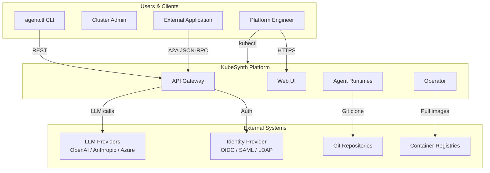
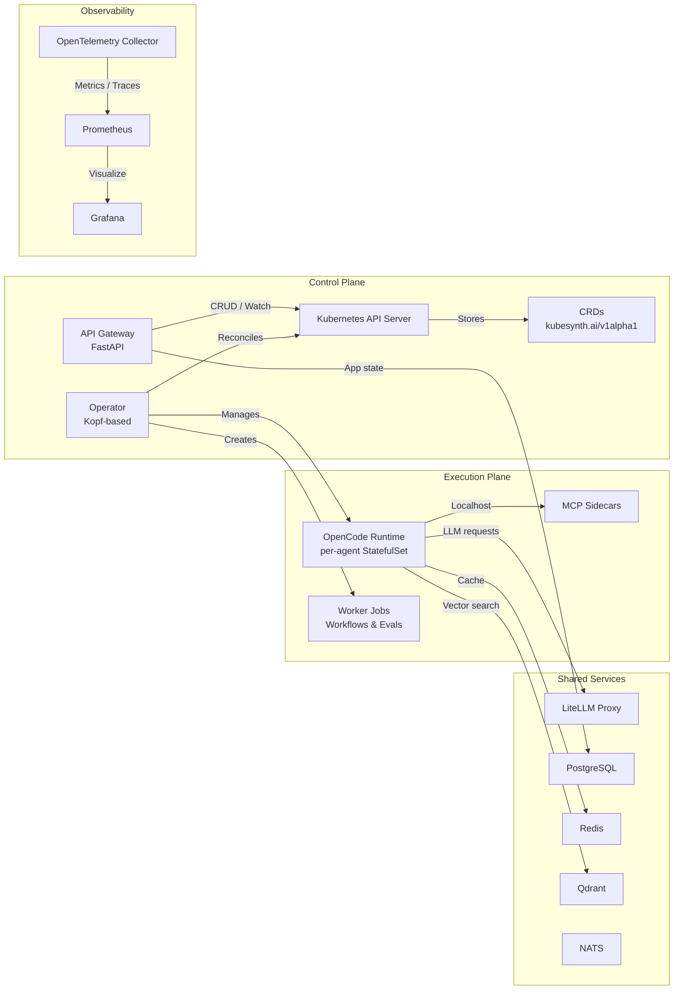
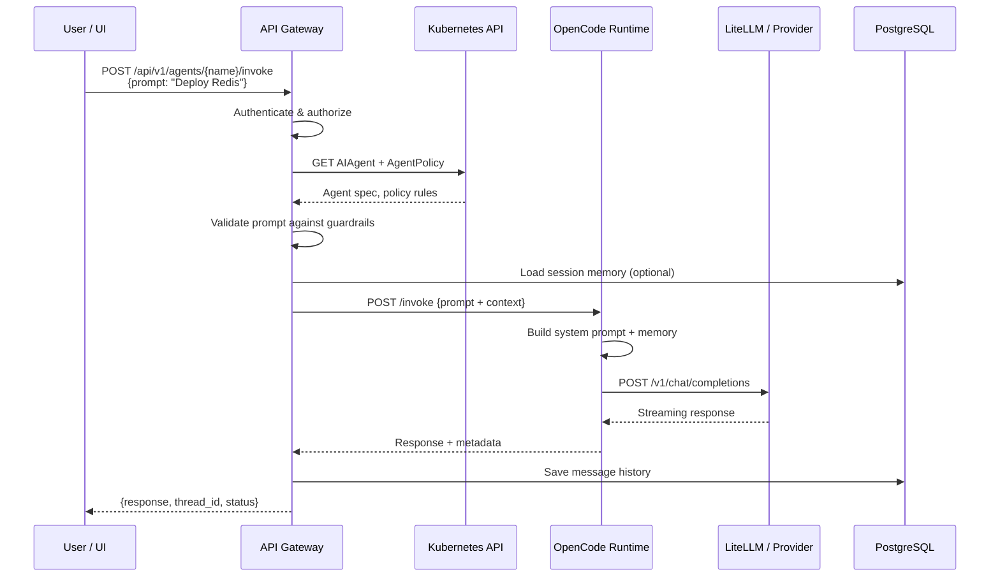
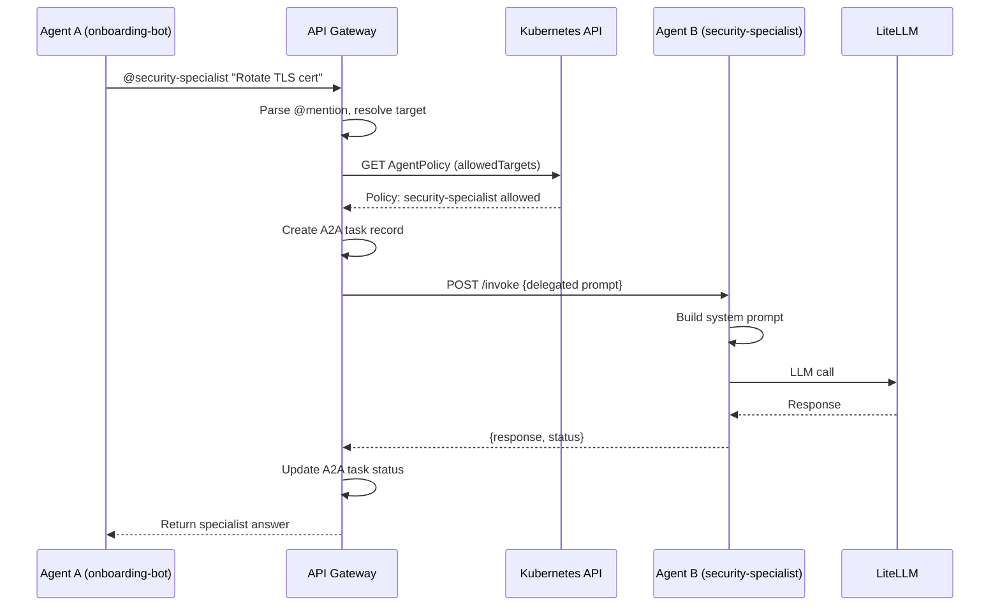
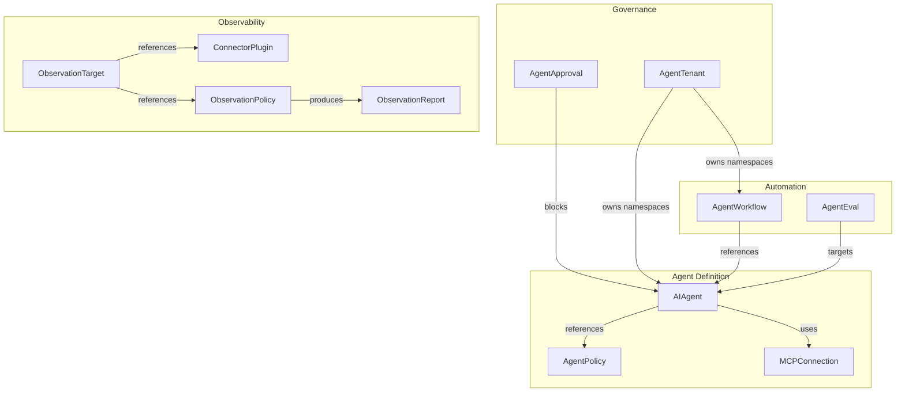

# KubeSynth Architecture

This document is the canonical reference for how KubeSynth is built, how data flows through the system, and how components interact.

**Who is this for:** Platform engineers, SREs, security auditors, and contributors who need to understand the system end-to-end.

---

## Table of Contents

- [System Context](#system-context)
- [Component Overview](#component-overview)
- [Control Plane](#control-plane)
- [Execution Plane](#execution-plane)
- [Data Flow: Chat Request](#data-flow-chat-request)
- [Data Flow: A2A Delegation](#data-flow-a2a-delegation)
- [CRD Relationships](#crd-relationships)
- [Shared Services](#shared-services)
- [Security Layers](#security-layers)

---

## System Context

**Key interactions:**
- Users manage agents via `kubectl`, Web UI, or REST API
- External apps integrate via A2A JSON-RPC or SSE streams
- LLM calls are routed through LiteLLM for provider abstraction
- Auth is delegated to enterprise IdPs via OIDC, SAML, or LDAP

---

## Component Overview

**Design principle:** The control plane never runs user code. Every agent executes in an isolated sandbox in the execution plane.

---

## Control Plane

### Kubernetes API and CRDs

The Kubernetes API is the source of truth. The platform installs 11 CRDs:

| CRD | Scope | Purpose |
|-----|-------|---------|
| `AIAgent` | Namespaced | Agent definition: model, prompt, policy, MCP, storage |
| `AgentPolicy` | Namespaced | Guardrails, token caps, allowed models, A2A rules |
| `AgentApproval` | Namespaced | Human-in-the-loop approval requests |
| `AgentWorkflow` | Namespaced | DAG-based multi-agent pipelines |
| `AgentEval` | Namespaced | Evaluation suites and thresholds |
| `AgentTenant` | Cluster | Namespace isolation, quotas, RBAC |
| `MCPConnection` | Namespaced | Connection-driven tool integrations |
| `ConnectorPlugin` | Namespaced | Observability data collection |
| `ObservationTarget` | Namespaced | What is being observed |
| `ObservationPolicy` | Namespaced | How telemetry is evaluated |
| `ObservationReport` | Namespaced | Resulting health or anomaly output |

### Operator

The Kopf-based Python operator is the active reconciliation engine:

- Reconciles `AIAgent` into StatefulSets, Services, PVCs, ConfigMaps
- Reconciles `AgentWorkflow` and `AgentEval` into worker Jobs
- Tracks workflow and eval status from artifacts and logs
- Manages approval-state transitions
- Reconciles observability resources when CRDs are present

### API Gateway

The FastAPI gateway is a substantive backend service:

- Authentication and session handling (OIDC, SAML, LDAP, JWT, shared token)
- Namespace-aware authorization
- CRUD endpoints for all CRD types
- Invoke routing to runtime sandboxes
- Workflow trigger and streaming endpoints
- A2A JSON-RPC and SSE handling

---

## Execution Plane

### Runtime Sandboxes

Each agent runs as an isolated singleton StatefulSet:

- **OpenCode runtime**: FastAPI wrapper around `opencode serve`
- **Persistent state volume**: Survives pod restarts
- **Optional MCP sidecars**: Bundled tool containers on localhost
- **Policy hooks**: Input/output guardrails enforced at runtime
- **Security context**: Non-root, restricted, optional gVisor

### Worker Jobs

Workflows and evaluations run as short-lived Jobs:

- CRD status carries summary state only
- Detailed execution evidence lives in worker artifacts and logs
- Gateway and UI read from both Kubernetes state and artifacts

---

## Data Flow: Chat Request

**Latency targets:**
- Gateway auth + validation: < 50ms
- Runtime prompt construction: < 100ms
- LLM time-to-first-token: provider-dependent
- End-to-end non-streaming: < 5s for typical prompts

---

## Data Flow: A2A Delegation

**Key enforcement points:**
- `allowedTargets` in `AgentPolicy` controls which agents can be called
- Namespace boundaries are respected unless explicitly crossed
- A2A tasks are tracked with unique IDs for auditability

---

## CRD Relationships

**Cardinality rules:**
- One `AIAgent` references zero or one `AgentPolicy`
- One `AgentWorkflow` references one or more `AIAgent`
- One `AgentTenant` owns one or more namespaces
- One `ObservationTarget` references one `ConnectorPlugin` and one `ObservationPolicy`

---

## Shared Services

| Service | Role | Persistence | Scaling |
|---------|------|-------------|---------|
| **LiteLLM** | LLM routing, rate limiting, key management | Config in PostgreSQL | HPA enabled |
| **PostgreSQL** | Gateway auth, sessions, usage, traces | PVC | Single replica or external |
| **Redis** | Session cache, LiteLLM caching | PVC | Single replica or external |
| **Qdrant** | Vector search for semantic memory | PVC | Single replica or external |
| **NATS** | Async messaging, event bus | JetStream | Cluster mode available |

---

## Security Layers

Security is enforced at multiple levels:

1. **Gateway**: Authentication, namespace-aware RBAC, rate limiting
2. **Control Plane**: Dedicated ServiceAccounts, least-privilege RBAC
3. **Network**: Default-deny NetworkPolicies, per-component egress rules
4. **Runtime**: Non-root containers, restricted seccomp, optional gVisor
5. **Policy**: Input/output guardrails, PII masking, prompt-injection detection
6. **Secrets**: External Secrets Operator, Vault CSI, or Sealed Secrets

See [RBAC Matrix](rbac-matrix.md) and [Secrets Management](secrets-management.md) for deep dives.

---

**Last Updated:** April 27, 2026  
**Platform Version:** 1.0.0
