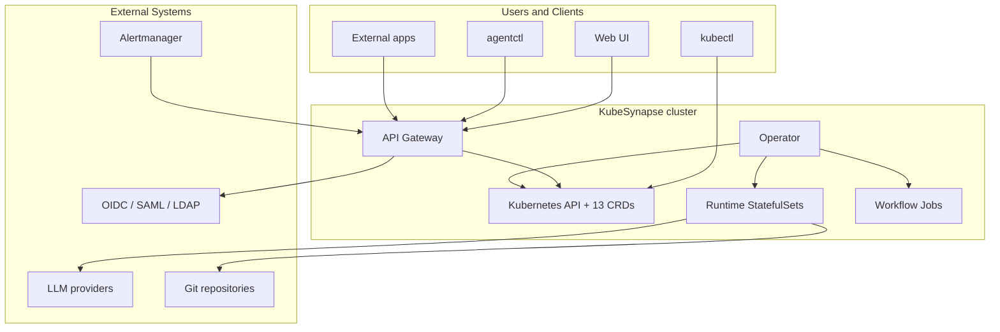
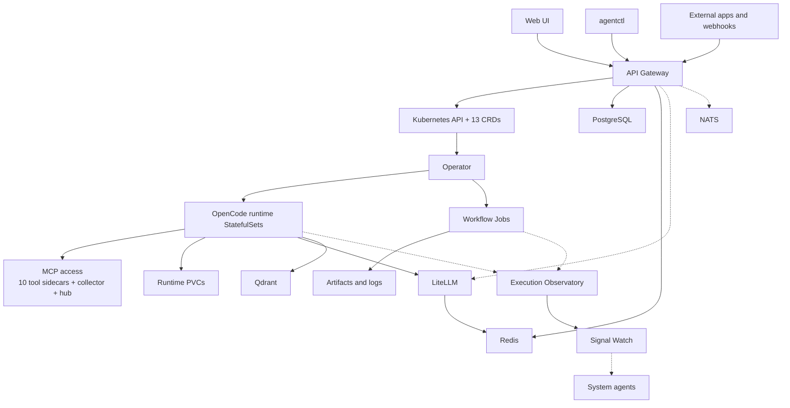
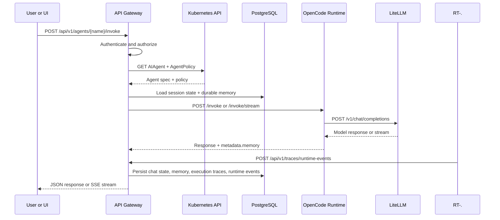
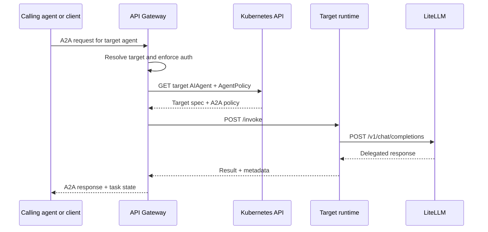
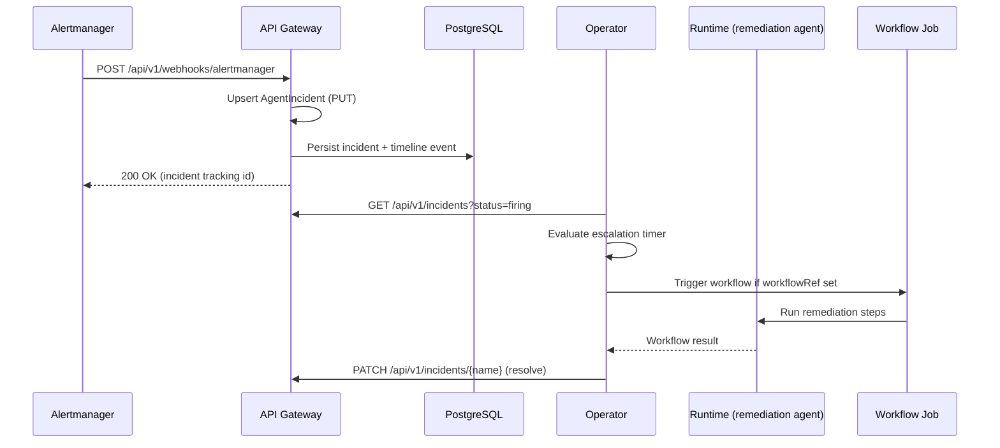
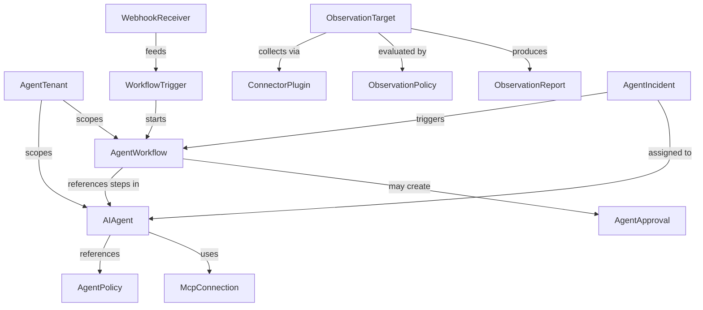

# KubeSynapse Architecture

This document is the canonical reference for how the current repository is built and how requests move through the platform.

For the canonical diagram source, see [`docs/kubesynapse-architecture.mmd`](kubesynapse-architecture.mmd).

**Who is this for:** Platform engineers, SREs, security reviewers, and contributors who need an end-to-end view of the current implementation.

---

## Table of Contents

- [System Context](#system-context)
- [Top-Level Topology](#top-level-topology)
- [Control Plane](#control-plane)
- [Execution Plane](#execution-plane)
- [Run Intelligence](#run-intelligence)
- [Data Flow: Chat Request](#data-flow-chat-request)
- [Data Flow: A2A Delegation](#data-flow-a2a-delegation)
- [CRD Relationships](#crd-relationships)
- [Shared Services](#shared-services)
- [Security Layers](#security-layers)

---

## System Context

**Key interactions:**

- The Kubernetes API plus the installed CRDs are the control-plane source of truth.
- The API gateway is a substantive backend service, not just a thin ingress proxy.
- The operator translates desired state into runtime `StatefulSet`s, worker `Job`s, Services, PVCs, ConfigMaps, and related policy objects.
- The primary model-call path is runtime -> LiteLLM -> provider.
- `opencode` is the production runtime. `pi` and `mistral-vibe` remain available as alpha runtime kinds.

---

## Top-Level Topology

**What matters most in this topology:**

- The gateway owns auth, CRUD, invoke routing, durable memory, traces, and UI-facing metadata.
- The operator is the active control-plane engine.
- Detailed workflow evidence lives in artifacts and logs, while CRD status remains summary-level.
- MCP is both sidecar-based and connection-driven.
- Durable Observatory tool payloads come from runtime-extracted final `tool_calls` forwarded by the operator, not from transient runtime status events.
- NATS is configured, but it is not on the primary invoke or workflow execution path.

---

## Control Plane

### Kubernetes API and CRDs

The chart installs 13 CRDs and the Kubernetes API remains the source of truth for desired state.

| CRD | Scope | Purpose |
| --- | --- | --- |
| `AIAgent` | Namespaced | Agent model, prompt, runtime, policy, MCP, and storage configuration |
| `AgentPolicy` | Namespaced | Guardrails, model rules, token caps, memory policy, and A2A restrictions |
| `AgentApproval` | Namespaced | Human approval state for gated actions |
| `AgentWorkflow` | Namespaced | Multi-step workflow DAG definitions |
| `AgentTenant` | Cluster | Tenant isolation, namespace ownership, quotas, and admins |
| `McpConnection` | Namespaced | Saved MCP connection records for hub, sidecar, or remote transport |
| `WebhookReceiver` | Namespaced | Signed inbound webhook configuration |
| `WorkflowTrigger` | Namespaced | Workflow trigger metadata and execution hooks |
| `ConnectorPlugin` | Namespaced | Observability connector definition |
| `ObservationTarget` | Namespaced | Observability target definition |
| `ObservationPolicy` | Namespaced | Observability evaluation rules |
| `ObservationReport` | Namespaced | Stored observability output and anomaly reports |

### API Gateway

The FastAPI gateway is the public application backend for the platform.

Current responsibilities include:

- authentication and session handling
- namespace-aware authorization
- CRUD endpoints for agents, workflows, policies, approvals, tenants, MCP connections, and observability resources
- invoke routing to runtime sandboxes
- A2A JSON-RPC and SSE streaming surfaces
- workflow triggers, approval endpoints, and webhook handling
- durable chat sessions, durable memory recall, and trace APIs
- provider and admin APIs used by the UI

The gateway does talk to LiteLLM for provider discovery and administrative model management, but normal prompt execution still happens after the gateway routes requests to the runtime.

### Operator

The Python operator is the reconciliation core of the product.

Current responsibilities include:

- reconciling `AIAgent` resources into runtime `StatefulSet`s, Services, PVCs, ConfigMaps, and policies
- reconciling `AgentWorkflow` resources into worker `Job`s
- tracking workflow progress from artifacts, logs, and status projections
- managing approval-state transitions
- reconciling observability resources when the observability CRDs are installed
- running signal-watch style anomaly detection over trace-backed execution data

The operator is not a bootstrap-only installer. It is a long-running control-plane service.

---

## Execution Plane

### Runtime Sandboxes

Each agent runs in an isolated singleton `StatefulSet`.

A typical OpenCode pod contains:

- the OpenCode runtime process
- a credential proxy sidecar for secret isolation
- runtime-generated config and context files
- optional MCP tool sidecars
- the optional collector sidecar for intelligence workflows
- a runtime PVC for workspace state, sessions, and checkpoints

OpenCode is the production runtime path. `pi` and `mistral-vibe` implement the same runtime contract but remain alpha and are not recommended for production workloads.

### Worker Jobs

Workflows execute in short-lived worker `Job`s.

That means:

- CRD status carries summary state rather than every execution detail
- detailed step evidence lives in job artifacts and logs
- the gateway and UI combine Kubernetes state with artifact-derived data
- retry, approval, and branching behavior is enforced by the worker engine rather than by CRD status alone

### MCP Access Patterns

The current implementation exposes MCP in three forms:

1. per-agent tool sidecars for tightly scoped localhost tools
2. a separate per-agent `collector` sidecar used for intelligence and observability workflows
3. shared MCP hub services referenced through `McpConnection` records

The 10 bundled tool sidecars shipped in the chart are `code-exec`, `web-search`, `documents`, `browser`, `database`, `git`, `github-adapter`, `kubernetes`, `messaging`, and `rag`.

---

## Run Intelligence

The run-intelligence path is implemented directly in the current repository.

### Components

| Component | Location | Purpose |
| --- | --- | --- |
| `runtime_events.py` | Runtimes and worker paths | Emits structured runtime and workflow events |
| `trace_store.py` | API gateway | Persists execution traces and runtime events in PostgreSQL |
| `traces_router.py` | API gateway | Timeline, trace, summary, and live activity APIs |
| `signal_watch.py` | Operator | Periodic SQL-based anomaly detection |
| `system-agents.yaml` | Helm chart | Predefined agents for AI-assisted explanations |

### Event Flow

1. Worker flows emit batched execution traces to `POST /api/v1/traces/batch`.
2. Runtimes and worker flows also emit structured semantic events to `POST /api/v1/traces/runtime-events`.
3. The gateway stores execution detail and runtime events in the trace store.
4. Signal Watch runs SQL checks over recent executions.
5. Detected anomalies become `ObservationReport` resources.
6. System agents can be invoked to explain failures, spend spikes, or unusual run behavior.

### Observability Boundaries

Observability CRDs, trace storage, Signal Watch, collector support, and the related UI surfaces are in-tree today.

Metrics endpoints, Prometheus scraping, OTLP export, or Grafana dashboards can exist as integrations, but they are not the canonical always-on architecture shown in the current control-plane and execution-plane diagrams.

---

## Data Flow: Chat Request

**Important implementation detail:** both invoke surfaces use the same durable-memory recall path. When streamed requests require memory injection, the gateway can fall back to a non-stream runtime invoke and synthesize SSE output to preserve behavior parity.

---

## Data Flow: A2A Delegation

**Current truth:** explicit gateway-mediated A2A exists today. NATS is an extension point for deeper async coordination, not the primary A2A execution path.

---

## Data Flow: Incident Management

Incidents can also be created manually via `POST /api/v1/incidents` or `PUT /api/v1/incidents/{name}`.
The operator reconciles the `AgentIncident` CRD status against the gateway incident state and
drives the lifecycle (acknowledge, escalate, resolve, trigger workflows).

---

## CRD Relationships

---

## Shared Services

| Service | Current role | Notes |
| --- | --- | --- |
| `LiteLLM` | Model proxy and provider abstraction | Primary runtime model-call path; gateway also uses provider/admin APIs |
| `PostgreSQL` | Auth, chat sessions, durable memory, audit, traces | Core durable store for platform state |
| `Redis` | Gateway caches and LiteLLM response caching | Persistence is disabled by default in the chart |
| `Qdrant` | Optional semantic retrieval for runtime memory and search | Enabled by default in values, but the shipped deployment uses `emptyDir` unless you customize it |
| `NATS` | Async extension point | Enabled by default, but not on the primary invoke path |
| MCP hub | Shared MCP service pool | Complements per-agent sidecars and `McpConnection` records |
| Alertmanager | External alert source | POSTs to `/api/v1/webhooks/alertmanager`; gateway upserts AgentIncident records |

---

## Security Layers

Security is enforced across multiple layers:

1. **Gateway** — Hybrid auth, namespace-aware authorization, structured errors, rate limiting, constant-time token comparison, and argon2id password hashing.
2. **Control Plane** — Dedicated service accounts, least-privilege RBAC, and controller-owned reconciliation.
3. **Runtime Baseline** — Immutable runtime config, credential proxy isolation, non-root containers, and restricted security contexts.
4. **Network** — Default-deny style NetworkPolicies plus explicit egress for runtimes, sidecars, and shared services.
5. **Policy and Governance** — Guardrails, model controls, A2A restrictions, approval gates, and memory policy.
6. **Secrets and Operations** — Native chart secrets or external secret backends, retention jobs, and documented backup flows.

See [`docs/architecture-overview.md`](architecture-overview.md), [`docs/observability-explained.md`](observability-explained.md), and [`docs/memory-architecture.md`](memory-architecture.md) for focused deep dives.

---

**Last Updated:** 2026-06-05
