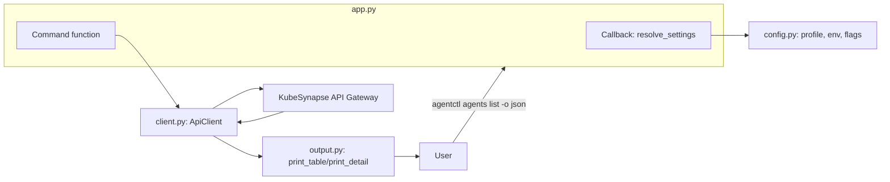

# CLI Architecture

The `cli/` directory houses `agentctl` — a modern terminal client for KubeSynapse. This doc describes its architecture for contributors and maintainers.

## Overview

`agentctl` is a Python 3.11+ CLI that wraps the KubeSynapse API gateway. It provides full coverage of agents, workflows, observability, auth, admin, credentials, skills, chat, webhooks, artifacts, and providers.

**Key design goals:**
- Modular package, no monoliths
- Beautiful Rich output with multiple formats
- Persistent configuration with profile support
- Retry, pagination, and SSE streaming built into the client layer
- 1:1 mapping with gateway API endpoints

## Package Layout

```
cli/src/agentctl/
  __init__.py          Package version
  __main__.py          Entry point (`python -m agentctl`)
  app.py               Typer app, global options, settings resolver
  config.py            Profile persistence, token store, settings resolution
  client.py            HTTP client with retry, pagination, SSE
  output.py            Rich formatters (table/json/yaml/wide/name)
  commands/
    __init__.py        Registration hub + top-level shortcuts
    _parsers.py        Shared CRD/flat payload normalization
    agents.py          Agent CRUD, invoke, logs, live-events
    workflows.py       Workflow CRUD, trigger, cancel, status, logs
    runs.py            Approvals, policies, apply
    auth.py            Login, register, sessions, password, config
    admin.py           User management (admin role)
    credentials.py     Git/GitHub credentials per agent
    skills.py          Skills catalog, MCP tools, MCP hub
    profile.py         Profile CRUD, token login/logout
    observatory.py     Metrics, traces, alerts, signals, health, export
    webhooks.py        Webhook CRUD, triggers, dispatch
    chat.py            Send, threads, history, interactive REPL
    artifacts.py       Artifact list, show, download
    providers.py       Provider list, show, models, health
```

## Data Flow



**Resolution order** (lowest to highest priority):
1. Active profile (`~/.config/agentctl/config.yaml`)
2. Environment variable (`AGENT_GATEWAY_URL`, `AGENT_GATEWAY_TOKEN`, etc.)
3. CLI flag (`--gateway`, `--token`, etc.)

## Key Modules

### `app.py`
Defines the `typer.Typer` instance with a global callback. The callback resolves settings once per invocation and stores them as a module-level variable. All command functions access settings via `get_settings()`.

### `config.py`
Three core functions:
- `load_config()` / `save_config()` — reads/writes `~/.config/agentctl/config.yaml` with multiple named profiles
- `load_token()` / `save_token()` / `clear_token()` — per-profile token storage at `~/.local/share/agentctl/credentials.yaml`
- `resolve_settings()` — merges CLI flags, env vars, and profile values using precedence rules

### `client.py`
Wraps `httpx.Client` with:
- Automatic `Authorization: Bearer` header when token is set
- `tenacity` retry with exponential backoff on timeouts (3 attempts)
- `paginate()` — fetches all pages from list endpoints
- `iter_sse()` — parses Server-Sent Events from streaming endpoints
- `_raise_for_status()` — extracts structured error messages from gateway responses (including Pydantic validation errors)

### `output.py`
Unified rendering layer:
- `print_table()` — auto-detects format; renders Rich tables, JSON, YAML, names, or wide tables
- `print_detail()` — renders single-resource views
- Status-aware styling: completed/healthy = green, pending/waiting = yellow, failed/error = red

### `commands/_parsers.py`
Payload normalization shared by create/update commands:
- `coerce_agent_payload()` — accepts both CRD-style (`kind: AIAgent + spec`) and flat API payloads (snake_case or camelCase)
- `coerce_workflow_payload()` — same dual-format support for workflows
- Step normalization (depends_on, require_approval, execution blocks)
- A2A peer config deduplication

## Command Patterns

Every command follows this template:

```python
@group.command("list")
def my_list() -> None:
    settings = get_settings()
    try:
        with console.status("[bold cyan]Loading..."):
            with ApiClient(settings) as client:
                data = client.get("/api/resource", params={"namespace": settings.namespace})
    except ApiError as exc:
        fatal(str(exc))

    print_table(
        data,
        columns=[("NAME", "name"), ("STATUS", "status")],
        output_format=settings.output_format,
    )
```

**Key conventions:**
- `console.status()` for spinners during network calls
- `fatal(str(exc))` for error propagation (prints Red error + exits)
- `settings.output_format` governs table vs json vs yaml rendering
- All imports inside `commands/` are absolute from `agentctl.*`

## Testing

```
cli/tests/
  conftest.py          Fixtures: test_settings, temp_config_dir
  test_config.py       23 tests — config roundtrip, token store, settings resolution
  test_client.py       18 tests — requests, error handling, pagination, SSE
  test_parsers.py      37 tests — agent/workflow coercion, normalization helpers
```

Test patterns:
- `monkeypatch` to override `CONFIG_DIR` / `DATA_DIR` to temp paths
- `pytest_httpx` for mocking HTTP in client tests
- `tmp_path` for filesystem operations
- `SystemExit` assertions for `fatal()` paths

## Output Formats

All list and detail commands support `--output` / `-o`:

| Format | Description |
|--------|-------------|
| `table` | Rich-formatted table (default) |
| `json` | Pretty-printed JSON via `rich.syntax.Syntax` |
| `yaml` | YAML dump via `rich.syntax.Syntax` |
| `wide` | Table with extra columns |
| `name` | One resource name per line (pipe-friendly) |

## Completion

Shell completion is built in via Typer. Generate completion for your shell:

```bash
agentctl --install-completion  # Interactive
# Or manually:
agentctl --show-completion bash  # > ~/.bashrc
agentctl --show-completion zsh   # > ~/.zshrc
agentctl --show-completion powershell  # > $PROFILE
```
