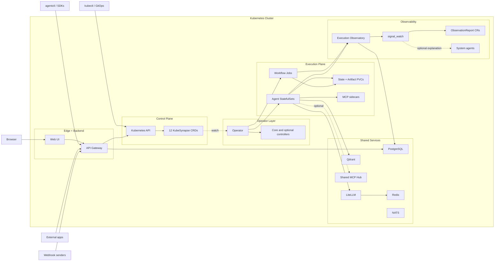
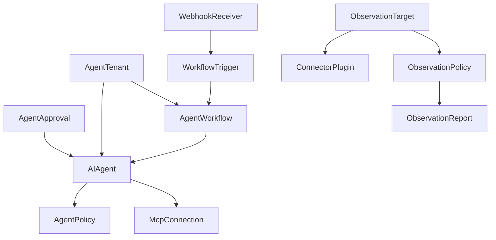
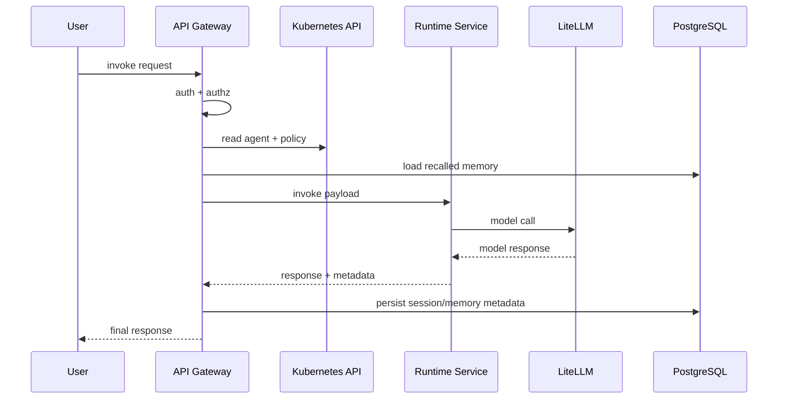
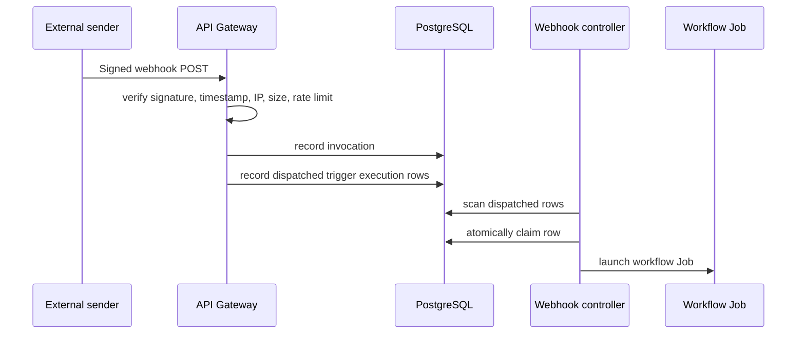

# KubeSynapse Sourcebook

This document is a repo-grounded master sourcebook for KubeSynapse.

Its job is not to be a short marketing page. Its job is to be a deep factual source that AI tools, slide generators, architecture diagram generators, video-script generators, landing-page generators, blog-writing tools, and design assistants can use without drifting into fantasy.

Use this file when you need:

- a faithful description of what KubeSynapse is
- a dense source document for AI slide generation
- a detailed architecture input for diagram tools
- safe product copy for explainers, landing pages, and LinkedIn posts
- grounded prompts for promo assets that should match the codebase

This sourcebook is intentionally repetitive in some places. That is useful for generator workflows, because different tools latch onto different sections, tables, and phrasing patterns.

---

## 1. How To Use This Document

### 1.1 Primary use cases

Use this document as source material for:

- slide decks
- architecture diagrams
- demo scripts
- explainer videos
- founder narrative
- enterprise technical overviews
- LinkedIn carousels
- blog posts
- product one-pagers
- press-kit style summaries

### 1.2 What this document optimizes for

This document optimizes for:

- factual accuracy over hype
- architecture clarity over abstraction
- generator-friendly formatting
- multiple narrative depths: one sentence, one paragraph, one page, full deep dive
- explicit statement of what the platform does today
- explicit statement of what should not be claimed

### 1.3 What this document does not do

This document does not:

- invent customer names
- invent compliance certifications
- invent scale numbers
- invent benchmark numbers
- invent revenue or adoption claims
- assume SaaS-only behavior when the repo is self-hosted and Kubernetes-native

### 1.4 Truth policy

When this sourcebook and a shorter marketing artifact disagree, trust the code-backed sections here first.

The most important current truths are:

1. KubeSynapse is Kubernetes-native.
2. CRDs are the control-plane source of truth.
3. The API gateway is a substantive backend, not a thin proxy.
4. The operator is the active reconciliation engine.
5. Agents reconcile to isolated singleton StatefulSets.
6. Workflows reconcile to worker Jobs.
7. The supported in-tree runtimes are `opencode`, `pi`, and `mistral-vibe`.
8. Observability is implemented as a real trace and runtime-event pipeline.
9. Webhooks and workflow triggers are implemented, with the operator claiming dispatched trigger rows and launching workflow jobs.
10. Detailed workflow evidence lives largely in artifacts and logs, while CRD status is summary-oriented.

---

## 2. Canonical Product Definition

### 2.1 One-sentence definition

KubeSynapse is an open-source, self-hosted, Kubernetes-native platform for running AI agents, workflows, tools, and execution observability as cluster resources.

### 2.2 Short definition

KubeSynapse turns AI agents into first-class Kubernetes workloads. Agents are defined as CRDs, reconciled into isolated runtime sandboxes, connected to tools and models, orchestrated through workflows, and inspected through built-in observability surfaces.

### 2.3 Medium definition

KubeSynapse is a Kubernetes-native AI operations platform built around control-plane resources, runtime isolation, workflow orchestration, and execution observability. Instead of treating agents as ad hoc processes or a hosted black box, KubeSynapse models agents, workflows, policies, approvals, webhook receivers, workflow triggers, MCP connections, and observability resources as Kubernetes objects. A Python operator reconciles those resources into runtime StatefulSets and worker Jobs, while a FastAPI gateway provides auth, CRUD, invoke routing, chat sessions, memory, traces, webhook intake, provider discovery, and UI-facing metadata.

### 2.4 Long definition

KubeSynapse is designed for teams that want AI agents to live inside the same operational model as the rest of their infrastructure. It uses Kubernetes custom resources as the source of truth, a controller/operator as the reconciliation engine, isolated per-agent runtime sandboxes as the execution unit, and a substantial API gateway as the application backend. It includes support for agent policies, human approval records, multi-step workflows, reusable MCP integrations, webhook-driven automation, execution traces, runtime semantic events, anomaly detection, and a web UI for day-to-day operator workflows.

### 2.5 Product category statements

These are safe category descriptions:

- Kubernetes-native AI agent platform
- AI agent operations platform
- self-hosted agent control plane
- Kubernetes control plane for agents and workflows
- platform for running AI agents as cluster resources
- infrastructure layer for enterprise AI agents

These are acceptable but should usually be accompanied by explanation:

- Kubernetes for AI agents
- control plane for AI agents
- production infrastructure for agentic workflows

These should be used cautiously because they can imply more than the repo proves today:

- universal enterprise agent operating system
- full autonomous enterprise workforce platform
- complete event-bus-native multi-agent fabric

---

## 3. Product Thesis

### 3.1 Core thesis

AI agents are easy to demo.

Running them with control, isolation, repeatability, and operational visibility is the hard part.

KubeSynapse exists to make agent systems feel like infrastructure, not like fragile experiments.

### 3.2 Why this thesis matters

Most teams can produce a prompt demo.

The hard questions start after the demo:

- Where does the agent run?
- How is it isolated?
- Who can call it?
- What tools can it use?
- How do workflows coordinate multiple agents?
- How do you inspect failures?
- How do you persist useful memory without turning the system into a black box?
- How do webhooks, approvals, and human intervention fit in?
- How do platform teams operate agents with the same rigor as other workloads?

KubeSynapse answers those questions with Kubernetes-native control-plane patterns.

### 3.3 The product promise

The strongest accurate promise KubeSynapse makes is:

`Ship AI agents the same way you ship everything else: as Kubernetes resources with observable runtime behavior.`

### 3.4 What KubeSynapse is not

KubeSynapse is not best described as:

- a prompt toy
- a hosted-only black box
- a single-agent chat wrapper
- an OpenCode-only system
- just a UI for LLM providers
- just a workflow builder with no real runtime plane

### 3.5 Mental models that fit the product

Useful mental models:

- Kubernetes control plane for AI agents
- operator-driven agent infrastructure
- runtime isolation layer for agents
- workflow orchestration plus execution observability
- platform engineering surface for AI operations

Less accurate mental models:

- pure chatbot product
- hosted agent marketplace
- thin proxy over model APIs
- only a low-code automation tool

---

## 4. Fast Facts

### 4.1 Repo-grounded snapshot

| Topic | Current repo-grounded answer |
| --- | --- |
| Product name | KubeSynapse |
| License posture in README | Apache 2.0 badge present |
| Deployment style | Open-source, self-hosted, Kubernetes-native |
| Control plane | Kubernetes CRDs + operator |
| API/backend | FastAPI gateway |
| Frontend | React 18 + TypeScript + Vite, served via Nginx in-cluster |
| Operator framework | Python + Kopf |
| Supported in-tree runtimes | `opencode`, `pi`, `mistral-vibe` |
| Agent execution unit | Singleton runtime StatefulSet per agent |
| Workflow execution unit | Worker Job per workflow run |
| Shared services | LiteLLM, PostgreSQL, Redis, Qdrant, NATS, Web UI |
| Observability | Execution traces + runtime semantic events + Observatory UI |
| Tool integration model | MCP sidecars and shared MCP hub / saved MCP connections |
| CLI | `agentctl` |
| Event-driven path | WebhookReceiver + WorkflowTrigger + operator webhook dispatch loop |
| Built-in memory model | Runtime-local memory plus gateway durable memory |
| Local install path | Kind + Helm, recommended via `scripts/deploy-kind.ps1` |

### 4.2 The 12 CRDs installed by the main chart

| CRD | Purpose |
| --- | --- |
| `AIAgent` | Agent definition and runtime configuration |
| `AgentPolicy` | Guardrails, memory policy, MCP policy, A2A policy |
| `AgentApproval` | Human approval records |
| `AgentWorkflow` | Multi-step workflow DAG definition |
| `AgentTenant` | Tenant and namespace metadata |
| `McpConnection` | Saved MCP integration record |
| `WebhookReceiver` | Signed inbound webhook configuration |
| `WorkflowTrigger` | Workflow trigger configuration and history linkage |
| `ConnectorPlugin` | Observability connector definition |
| `ObservationTarget` | Observability target definition |
| `ObservationPolicy` | Observability evaluation policy |
| `ObservationReport` | Observability result artifact |

### 4.3 Supported in-tree runtimes

| Runtime kind | Summary |
| --- | --- |
| `opencode` | Default runtime path used by checked-in examples and richest config-file workflow |
| `pi` | Supported alternative runtime with the same platform CRUD/invoke/artifact surfaces |
| `mistral-vibe` | Supported Mistral-backed runtime bridge using the shared runtime contract |

### 4.4 Bundled MCP sidecars

| Sidecar | Purpose |
| --- | --- |
| `code-exec` | Sandboxed code execution |
| `web-search` | Search and summarization |
| `browser-automation` / browser | Headless browser automation |
| `database` | SQL and database access |
| `git` | Repository operations |
| `github` / github-adapter | GitHub API and PR workflows |
| `kubernetes-ops` / kubernetes | Cluster operations |
| `messaging` | Messaging integrations |
| `rag` | Retrieval workflows |
| `documents` | Document parsing and extraction |
| `collector` | MCP collector sidecar path for intelligence workflows |

### 4.5 Core shared services

| Service | Role |
| --- | --- |
| LiteLLM | LLM proxy and provider abstraction |
| PostgreSQL | Auth/session state, traces, trigger history, metadata |
| Redis | Cache and LiteLLM adjacencies |
| Qdrant | Retrieval and semantic memory adjacencies |
| NATS | Shared messaging service and extension point |
| Web UI | User-facing console |

---

## 5. The Product In Different Lengths

### 5.1 Ten-word version

Kubernetes-native control plane for AI agents, workflows, tools, and observability.

### 5.2 Elevator pitch version

KubeSynapse lets teams define and operate AI agents as Kubernetes resources. It reconciles agents into isolated runtime sandboxes, executes workflows as Jobs, connects agents to tools through MCP, and exposes everything through a real gateway, CLI, and observability surfaces.

### 5.3 Founder-style version

The problem with most agent demos is not that they fail to answer a prompt. The problem is that they have no real operational model. KubeSynapse gives agents a Kubernetes-native control plane, isolated runtime sandboxes, workflow execution, policy surfaces, webhook triggers, and execution observability, so platform teams can treat agents like infrastructure instead of side experiments.

### 5.4 Technical buyer version

KubeSynapse is an operator-driven AI platform that turns agent specs into live runtime StatefulSets, workflow specs into worker Jobs, and execution activity into traces and runtime events. It provides gateway-managed auth, CRUD, invoke routing, A2A, durable memory, webhook intake, provider discovery, and a UI for operations and inspection.

### 5.5 Enterprise-safe version

KubeSynapse is a self-hosted Kubernetes-native platform for running AI agents with isolation, policy controls, workflow orchestration, and execution visibility. It is designed to fit platform engineering and DevOps operating models rather than bypass them.

---

## 6. Primary Audiences

### 6.1 Platform engineering teams

Why they care:

- they want AI workloads to fit existing cluster controls
- they care about RBAC, service accounts, namespaces, PVCs, and NetworkPolicies
- they need a repeatable deployment model
- they want a control plane, not just a chat UI

### 6.2 DevOps and SRE teams

Why they care:

- they need workflows, logs, artifacts, traces, and failure visibility
- they care about rollout behavior, health checks, scaling, and incident response
- they need clear boundaries between long-lived runtimes and short-lived jobs

### 6.3 Enterprise AI infrastructure teams

Why they care:

- they need model abstraction, governance surfaces, and operational ownership
- they want agents integrated with existing infrastructure and secret flows
- they need observability and auditable behavior, not just outputs

### 6.4 Security-conscious engineering leaders

Why they care:

- they need restricted runtimes, non-root execution, and network isolation
- they need gateway auth, webhook hardening, and approval controls
- they want clear statements about what is and is not enforced

### 6.5 Builders and founders

Why they care:

- they need a credible way to move from demo agents to operational systems
- they want reusable workflows, tools, and integrations
- they want a platform story that sounds serious to enterprise buyers

---

## 7. Audience-Specific Value Propositions

### 7.1 For platform engineers

KubeSynapse makes agents look like managed Kubernetes workloads instead of hidden processes.

### 7.2 For DevOps and SRE

KubeSynapse separates long-lived agent runtimes from short-lived workflow workers and gives you execution traces, runtime events, artifacts, and logs to inspect what actually happened.

### 7.3 For enterprise AI teams

KubeSynapse gives you a self-hosted control plane for agents, workflows, tools, and policies with real backend surfaces for auth, governance, and observability.

### 7.4 For engineering leaders

KubeSynapse gives you a more operational answer to AI agents: isolate them, govern them, route them through known services, and make them inspectable.

### 7.5 For developers

KubeSynapse lets you define agents with CRDs, call them through REST or CLI, wire them into workflows, attach tools, and inspect runs through a web console.

---

## 8. What Problem KubeSynapse Solves

### 8.1 The operational problem

AI agents often begin as:

- notebook experiments
- local scripts
- hosted chat wrappers
- tool demos with no clear deployment model

Those approaches usually fail to answer operational questions:

- how agent identity is represented
- how agent configuration is versioned
- how runtime state survives restarts
- how tools are connected safely
- how workflows coordinate multiple steps
- how failures are investigated
- how webhooks or external triggers enter the system
- how memory is persisted and recalled
- how teams operate the platform as infrastructure

### 8.2 The platform answer

KubeSynapse answers those questions by providing:

- CRDs for desired state
- an operator for reconciliation
- isolated runtimes as StatefulSets
- workflows as Jobs
- a real gateway for auth, CRUD, invoke routing, A2A, memory, and traces
- a UI for management and inspection
- an observability pipeline for execution and runtime events

### 8.3 The practical outcome

The outcome is not simply “agents that can answer prompts.”

The outcome is “agents that can be deployed, controlled, orchestrated, and inspected using a familiar platform-engineering model.”

---

## 9. High-Confidence Architecture Summary

### 9.1 Top-level summary

KubeSynapse is organized into these major layers:

1. external users and integrations
2. edge and application backend
3. Kubernetes CRD control plane
4. operator/controller layer
5. execution plane
6. shared services
7. observability and run intelligence
8. security and governance overlays

### 9.2 Simple architecture narrative

Users interact with KubeSynapse through the web UI, CLI, REST APIs, A2A endpoints, or public webhook endpoints. The API gateway authenticates and authorizes those requests, reads or writes Kubernetes resources, and routes invoke traffic to agent runtimes. The Kubernetes API stores the desired-state CRDs. The operator watches those CRDs and reconciles agents into singleton StatefulSets and workflows into Jobs. Runtime sandboxes call LiteLLM for model access, use Qdrant for retrieval-related paths, and optionally talk to MCP sidecars or a shared MCP hub. The gateway stores auth, traces, sessions, trigger records, and other metadata in PostgreSQL. Execution traces and semantic runtime events feed the Observatory and Run Intelligence layer.

### 9.3 Mermaid summary



### 9.4 Key architecture truths to preserve in every diagram

Every serious architecture depiction should preserve these truths:

1. CRDs are the source of truth.
2. The gateway does not replace the control plane.
3. The operator actively reconciles resources.
4. Agents are long-lived singleton StatefulSets.
5. Workflows are short-lived worker Jobs.
6. PostgreSQL is important, but it is not the desired-state authority.
7. Observability is a first-class part of the platform, not an afterthought.
8. The webhook path records trigger executions and the operator dispatches them later.

---

## 10. Architectural Layers In Plain Language

### 10.1 External actor layer

This includes:

- browsers using the web UI
- CLI users via `agentctl`
- SDKs or scripts calling REST APIs
- external applications using A2A or standard invoke APIs
- webhook senders posting signed webhook events
- cluster operators using `kubectl` or GitOps workflows

### 10.2 Edge and application backend layer

This includes:

- web UI
- API gateway

This layer is how people experience the platform operationally.

### 10.3 Control-plane layer

This includes:

- Kubernetes API
- KubeSynapse CRDs

This layer is the desired-state system.

### 10.4 Reconciliation layer

This includes:

- operator
- controller modules

This layer watches desired state and makes cluster resources match it.

### 10.5 Execution layer

This includes:

- per-agent runtime StatefulSets
- per-agent Services
- state PVCs
- optional MCP sidecars
- workflow worker Jobs
- artifact/journal storage

This layer is where actual agent and workflow work happens.

### 10.6 Shared services layer

This includes:

- LiteLLM
- PostgreSQL
- Redis
- Qdrant
- NATS
- shared MCP hub

### 10.7 Observability layer

This includes:

- execution trace ingestion
- runtime event ingestion
- Execution Observatory APIs and UI
- signal_watch controller
- ObservationReport generation
- optional system-agent explanation path

### 10.8 Security overlay

Security spans all layers through:

- auth at the gateway
- RBAC in the cluster
- runtime hardening
- namespace boundaries
- NetworkPolicies
- webhook verification controls
- policy-driven guardrails and approvals

---

## 11. Component Deep Dive: API Gateway

### 11.1 What the gateway is

The API gateway is the public-facing and UI-facing backend service for the platform.

It is not just a proxy to runtime pods.

### 11.2 What the gateway owns

Current repo-grounded responsibilities include:

- authentication and session handling
- namespace-aware authorization
- CRUD for agents, workflows, policies, approvals, tenants, MCP connections, webhooks, triggers, and observability resources
- direct agent invoke and streaming invoke routing
- A2A routing
- chat-session persistence
- durable memory persistence and recall injection
- admin and audit APIs
- provider registry and model discovery APIs
- trace querying and runtime-event ingestion APIs
- webhook intake and trigger record creation
- UI-facing metadata shaping

### 11.3 Why this matters in messaging

If a slide or diagram shows the gateway as just “ingress,” it under-describes the platform.

Better phrasing:

- public edge and application backend
- gateway plus platform API layer
- auth, CRUD, invoke, A2A, webhook, and observability backend

### 11.4 Auth modes and auth behavior

The gateway supports multiple auth surfaces, including:

- shared token
- local auth
- OIDC PKCE
- JWT issuance and rotation
- LDAP integration points
- SAML integration points

Important operator-facing framing:

- auth is not one hardcoded dev token path
- browser auth and enterprise federation are part of the design surface
- shared token still matters for dev/test and service-to-service patterns

### 11.5 Durable memory role

The gateway owns the durable, user-visible memory layer.

Current behavior includes:

- storing recalled memory in PostgreSQL
- persisting promoted memory candidates emitted by runtimes
- ranking promoted memory for later injection
- injecting memory into sync and streamed invoke paths
- making memory records user-visible and editable through APIs/UI

### 11.6 Provider registry role

The gateway also backs provider-oriented settings and model discovery.

Important live provider behaviors already documented include:

- OpenRouter live suggestions when credentials exist
- OpenCode Zen live suggestions when credentials exist
- OpenCode Go live suggestions when credentials exist
- GitHub Copilot live model suggestions via stored token

### 11.7 Webhook role

The gateway exposes public webhook invocation endpoints and applies these controls:

- HMAC signature verification
- timestamp verification for replay defense
- IP allowlist enforcement
- payload size limits
- rate limiting
- payload sanitization
- invocation history recording
- trigger matching and trigger execution recording

Important nuance:

The gateway records matched triggers and trigger execution rows. The operator later claims dispatched rows and launches workflow Jobs. The gateway itself should not be depicted as directly creating the Job.

### 11.8 Gateway endpoint families

Safe high-level endpoint categories:

| Category | Examples |
| --- | --- |
| Health | `/api/v1/health`, `/api/v1/ready` |
| Agents | CRUD + invoke + streaming invoke |
| Workflows | CRUD + trigger + run inspection |
| Chat and memory | `chat-sessions`, memory record endpoints |
| A2A | `/api/v1/a2a` |
| Admin | users, audit, usage |
| Providers | provider registry and live suggestions |
| Artifacts | list, download, zip |
| Traces | query, execution detail, timeline, live activity |
| Webhooks | webhook receiver CRUD, public invoke, history |
| Workflow triggers | trigger CRUD and execution history |
| Observability | connectors, targets, policies, reports, intelligence APIs |

---

## 12. Component Deep Dive: Operator

### 12.1 What the operator is

The operator is the active control-plane engine for KubeSynapse.

It is a Kopf-based Python operator that watches CRDs and materializes cluster resources.

### 12.2 Core operator responsibilities

Current responsibilities include:

- reconciling `AIAgent` into StatefulSets, Services, PVCs, and related resources
- reconciling `AgentWorkflow` into worker Jobs
- projecting workflow summary status back into CRD state
- managing approval-state transitions
- reconciling observability resources when observability CRDs exist
- running signal watch anomaly detection
- reconciling webhook and workflow trigger status

### 12.3 Controller loading model

The controller package loads:

- core controllers unconditionally
- optional controllers only when the relevant CRDs exist

Core controllers:

- `agent_controller`
- `workflow_controller`
- `status_projection`
- `signal_watch`

Optional controllers loaded when CRDs exist:

- `approval_controller`
- `tenant_controller`
- `policy_controller`
- `observation_controller`
- `mcp_connection_controller`
- `webhook_controller`

### 12.4 Messaging value of this design

This means KubeSynapse is not architected as one giant generic controller loop only.

You can accurately describe it as:

- controller-per-CRD architecture
- modular operator with core and optional controllers
- dynamic registration of optional control-plane capabilities based on installed CRDs

### 12.5 Worker engine role

The operator also owns a workflow worker model with:

- DAG execution
- retries and backoff
- artifact persistence
- summary status projection
- trace emission
- runtime event emission

### 12.6 Why workflows are Jobs, not long-lived services

KubeSynapse separates workflows from agents:

- agents are long-lived runtimes
- workflows are orchestration executions

This separation is important in architecture diagrams and explainer videos because it shows that the platform distinguishes between persistent agent services and transient workflow runs.

---

## 13. Component Deep Dive: Runtime Plane

### 13.1 Core runtime principle

Each agent runs as an isolated singleton StatefulSet.

That is one of the most important product truths.

### 13.2 Runtime plane components

A typical runtime plane contains:

- a singleton runtime StatefulSet for the agent
- a Service used by the gateway to call the runtime
- a PVC-backed state volume
- an emptyDir workspace volume for active workspace use
- optional MCP sidecars in the same pod
- policy and A2A env/config wiring
- security context hardening
- optional gVisor runtime class

### 13.3 Security posture of runtime pods

The runtime manifests and builder logic show:

- non-root execution
- `seccompProfile: RuntimeDefault`
- `allowPrivilegeEscalation: false`
- dropped Linux capabilities
- `readOnlyRootFilesystem: true` on main containers
- optional `runtimeClassName: gvisor` when enabled

### 13.4 Why StatefulSet matters

StatefulSet is important because it communicates:

- stable identity
- persistent state handling
- restart continuity
- per-agent runtime ownership

This is more precise than saying “agents run as pods” or “agents run as deployments.”

### 13.5 Runtime kinds

#### 13.5.1 OpenCode

OpenCode is the default runtime path.

Characteristics:

- richest config-file workflow
- used by checked-in examples
- supports `/invoke` and `/invoke/stream`
- has runtime-local memory behavior
- hands promoted memory candidates to the gateway
- uses file-backed config injection and skill materialization

#### 13.5.2 Pi

Pi is a supported alternative runtime.

Characteristics documented in the repo include:

- separate StatefulSet path
- Node.js HTTP bridge wrapping Pi RPC mode
- artifact APIs: list, download, zip
- session timeout and auto-abort protections
- same core platform CRUD/invoke surfaces

#### 13.5.3 Mistral Vibe

Mistral Vibe is the supported Mistral-backed runtime bridge.

Characteristics include:

- separate StatefulSet path
- Python HTTP bridge
- same core runtime contract endpoints
- workspace and state volumes
- runtime-specific model settings through `spec.runtime.mistralVibe`

### 13.6 Runtime contract

The runtime contract defines required core endpoints, including:

- `/health`
- `/ready`
- `/info`
- `/capabilities`
- `/invoke`
- `/invoke/stream`
- `/cancel`

Additional tiers include session, artifacts, and streaming/event-related surfaces.

### 13.7 Runtime API design principles

The runtime contract explicitly emphasizes:

- progressive enhancement
- observability
- secure bearer-token auth
- backward compatibility through additive fields
- capability discovery

### 13.8 Promotion-safe statement about runtimes

Safe phrasing:

`KubeSynapse standardizes a runtime contract across multiple in-tree runtimes while preserving per-runtime specialization.`

---

## 14. Component Deep Dive: Workflow Execution

### 14.1 Workflow model

`AgentWorkflow` defines DAG-style workflows.

Current execution behavior is:

1. workflow exists as a CRD definition
2. operator or gateway triggers execution
3. a worker Job performs orchestration
4. artifacts and logs hold detailed execution evidence
5. summary state is projected back into workflow status and UI views

### 14.2 Why artifact-first workflow detail matters

KubeSynapse does not try to jam every detail into CRD status.

Instead:

- status is summary-oriented
- artifacts and journals capture detail
- gateway/UI read both Kubernetes state and artifact-derived state

This is a strong operational design point to explain in technical content.

### 14.3 Workflow worker Job shape

The worker Job is created in the operator namespace and includes:

- `ttlSecondsAfterFinished`
- `activeDeadlineSeconds`
- restricted pod security context
- a dedicated worker service account
- artifact PVC mount
- temporary emptyDir storage
- environment variables for target namespace, target name, artifact path, run ID, and step parallelism

### 14.4 Worker security posture

Worker Jobs use:

- non-root main container
- `allowPrivilegeEscalation: false`
- `readOnlyRootFilesystem: true`
- dropped capabilities
- `seccompProfile: RuntimeDefault`

### 14.5 Workflow step capabilities already described in the repo

Current docs describe support for:

- `agent` steps
- `review` steps
- `loop` steps
- `conditional` steps
- approvals
- retries and timeouts
- verification prompts
- `sessionGroup` continuity
- workflow-level auto-retry rules

### 14.6 Best current workflow demo

The strongest repo-grounded workflow demo is the Context7 research-analysis workflow.

It demonstrates:

- remote MCP usage
- file write/read flow
- multi-step execution
- analysis handoff patterns
- workflow history and artifacts
- Execution Observatory inspection

---

## 15. Component Deep Dive: Web UI

### 15.1 What the console is

The KubeSynapse console is a React 18 + TypeScript + Vite frontend that talks to the gateway through same-host `/api` routing in production and a Vite proxy in local development.

### 15.2 What the UI proves

The UI is important in platform storytelling because it proves KubeSynapse is not only a CRD/operator backend. It also has operator-facing surfaces for creation, inspection, management, and observability.

### 15.3 Major UI workspaces and surfaces

Repo-grounded UI surfaces include:

- Chat Workbench
- Team View
- Workflow Composer
- Execution Observatory
- Catalog workspace
- Intelligence workspace
- admin views
- provider-centric settings
- policy management
- audit and usage views

### 15.4 Chat Workbench

What it shows:

- direct agent interaction
- SSE streaming
- saved sessions
- memory-backed continuity
- OpenCode-focused runtime controls

### 15.5 Team View

What it shows:

- explicit agent-to-agent collaboration flows
- peer reachability and A2A awareness

### 15.6 Workflow Composer

What it shows:

- visual DAG editing
- recent run history
- live execution-state overlays
- inline approvals
- conditional and loop editing

### 15.7 Execution Observatory

What it shows:

- execution lists
- step timelines
- deep step inspection
- LLM call and tool call inspection
- comparison views
- HTML/JSON exports

Concrete components called out in the repo include:

- TracePlayer
- StepInspector
- LLMCallViewer
- ExecutionTimeline
- ExecutionDiffView

### 15.8 Catalog workspace

What it shows:

- MCP connection and registry workflows
- skills catalog workflows

### 15.9 Intelligence workspace

What it shows:

- observability and intelligence surfaces
- collectors, schedules, alerts, and collection tasks
- Observatory-first operational navigation

### 15.10 UI messaging value

The UI helps explain that KubeSynapse is not just an infrastructure engine. It is also an operator console for managing agents, workflows, observability, settings, and execution insight.

---

## 16. Component Deep Dive: CLI

### 16.1 What `agentctl` is

`agentctl` is the terminal control surface for KubeSynapse.

It is not just a thin invoke command.

### 16.2 What the CLI covers

The CLI covers:

- health
- login and auth flows
- agent CRUD and inspection
- workflow CRUD and triggering
- approvals
- policies
- admin operations
- credentials
- skills catalog browsing
- tool browsing
- invoke and streaming invoke
- logs and live events
- apply-from-file workflows

### 16.3 Why the CLI matters in storytelling

The CLI proves the platform supports multiple operating modes:

- Kubernetes-native manifests
- REST APIs
- web UI
- terminal operator workflow

### 16.4 Good positioning statement

`KubeSynapse supports both infrastructure-style management and day-to-day terminal operations through kubectl, REST, UI, and agentctl.`

---

## 17. Component Deep Dive: MCP Architecture

### 17.1 Two MCP patterns

KubeSynapse uses two MCP access patterns:

1. per-agent sidecars
2. shared MCP hub plus saved connection records

### 17.2 Per-agent sidecars

These are useful when tools should stay tightly scoped to one runtime pod.

Characteristics:

- localhost communication
- pod-local trust boundary
- explicit tool attachment
- co-scheduling with the agent runtime

### 17.3 Shared MCP hub

The shared MCP hub is a separate optional shared-service path.

Important facts from the chart and docs:

- `mcpHub.enabled` controls the shared hub namespace and server pool
- it is not required for all MCP usage
- some local quickstart overlays disable it to keep local clusters lighter

### 17.4 Saved MCP connections

`McpConnection` resources model reusable MCP integrations across multiple transport types.

Current docs describe transports including:

- remote
- hub
- sidecar

### 17.5 Security characteristics of MCP sidecars

The sidecar documentation emphasizes:

- capability declaration
- network egress filtering
- resource quotas / limits
- bearer-token auth on MCP requests

### 17.6 Messaging-safe statement

`KubeSynapse supports both pod-local MCP sidecars and shared, connection-oriented MCP integrations.`

### 17.7 Why this matters in enterprise framing

This shows the platform can support:

- tightly scoped tool access
- reusable integration records
- a more structured tool-integration story than “the agent can run anything”

---

## 18. Component Deep Dive: Shared Services

### 18.1 LiteLLM

LiteLLM is the model-routing and provider abstraction layer.

What it enables:

- provider abstraction
- model routing
- shared proxy layer for LLM calls

### 18.2 PostgreSQL

PostgreSQL is a critical backend store.

Repo-grounded responsibilities include storing:

- auth state
- sessions
- traces
- webhook invocation history
- trigger execution rows
- MCP connection metadata mirroring
- gateway-side memory and related metadata surfaces

Important clarification:

PostgreSQL is not the control-plane source of truth for desired state. Kubernetes CRDs are.

### 18.3 Redis

Redis appears as a cache and shared supporting service, especially adjacent to LiteLLM.

### 18.4 Qdrant

Qdrant supports retrieval-oriented paths and optional semantic-memory adjacencies.

### 18.5 NATS

NATS is deployed as a shared messaging service.

In messaging and diagrams, it should usually be described as:

- available shared messaging infrastructure
- extension point for broader async coordination

It should not be overclaimed as the current core of all orchestration flows.

### 18.6 Web UI as shared service

The UI is part of the deployed platform shape and should usually appear in deployment diagrams.

---

## 19. Component Deep Dive: Execution Observatory And Run Intelligence

### 19.1 What the Observatory is

The Execution Observatory is the platform surface for post-execution analysis and operational visibility.

### 19.2 What it captures

The observability docs describe capture of:

- workflow execution steps
- LLM calls
- tool calls
- worker logs
- execution events
- runtime semantic events

### 19.3 Two related but distinct pipelines

There are two major related paths:

1. execution trace pipeline
2. runtime semantic event pipeline

### 19.4 Execution trace pipeline

High-level flow:

1. operator enqueues a workflow as a Job
2. worker executes steps and calls runtimes
3. embedded trace client batches step/LLM/tool/event records
4. gateway ingests those batches
5. gateway stores enriched execution data in PostgreSQL-backed trace tables
6. UI renders Observatory views from those APIs

### 19.5 Runtime semantic event pipeline

High-level flow:

1. runtimes and workers emit structured events via `runtime_events` modules
2. gateway ingests them through `POST /api/v1/traces/runtime-events`
3. gateway stores indexed events in `runtime_run_events`
4. signal watch scans the indexed data periodically
5. anomalies can produce `ObservationReport` resources
6. optional system agents can explain anomalies or failures

### 19.6 Why this matters in promotion

This is one of the strongest differentiation points because it lets you say:

`KubeSynapse does not stop at invocation. It gives you execution traces, runtime events, and higher-level operational analysis.`

### 19.7 Observability CRDs

These four CRDs extend the platform with a first-class observability model:

- `ConnectorPlugin`
- `ObservationTarget`
- `ObservationPolicy`
- `ObservationReport`

### 19.8 Signal watch

The `signal_watch` controller runs deterministic checks on runtime-event and trace data.

Documented anomaly types include checks for:

- high failure rate
- error spikes
- cost outliers
- token spikes
- stuck runs

### 19.9 System agents

Three predefined system-agent roles are described:

- `ks-run-inspector`
- `ks-signal-summarizer`
- `ks-spend-reviewer`

Important nuance:

These are an explanation/escalation layer, not the first-pass anomaly detector. Deterministic checks fire first.

### 19.10 Messaging-safe summary

`KubeSynapse pairs deterministic operational detection with optional AI-powered explanation instead of making the LLM the first and only operations layer.`

---

## 20. The 12 CRDs In Detail

### 20.1 `AIAgent`

#### Purpose

Defines an agent and its runtime configuration.

#### What it represents

An agent is not just a model name. It is a deployable runtime-backed workload definition with policy, skills, tools, storage, and access boundaries.

#### Common concerns it answers

- which runtime to use
- which model to use
- what system prompt to start with
- which skills/config files to materialize
- what storage the runtime should get
- which MCP connections or sidecars apply
- whether gVisor should be enabled

#### Examples of fields seen in repo examples/docs

- `spec.model`
- `spec.policyRef`
- `spec.runtime.kind`
- `spec.systemPrompt`
- `spec.skills.files`
- `spec.storage.size`
- `spec.enableGVisor`
- `spec.mcpConnections`
- `spec.mcpServers`
- `spec.a2a.allowedCallers`

#### Runtime output of reconciliation

The operator turns an `AIAgent` into:

- a singleton StatefulSet
- a Service
- a PVC-backed state volume
- environment/config wiring
- optional MCP sidecars
- related NetworkPolicies

### 20.2 `AgentPolicy`

#### Purpose

Defines guardrails and usage policy for agents.

#### What it can cover today

Current docs describe:

- input guardrails
- output guardrails
- allowed models
- MCP allow-lists
- MCP approval requirement
- memory policy
- outbound A2A policy

#### Example policy behaviors from sample policy and docs

- block prompt injection
- mask PII
- block sensitive patterns
- restrict allowed models
- require HITL for MCP calls

### 20.3 `AgentApproval`

#### Purpose

Represents human approval requests for high-risk or gated actions.

#### Why it matters

This is part of the platform's answer to governance and human intervention.

### 20.4 `AgentWorkflow`

#### Purpose

Defines a multi-step DAG workflow.

#### What it models

- step ordering
- agent references
- prompts
- dependencies
- retries
- timeouts
- session grouping
- approval points

#### Execution model

The operator reconciles workflow runs into Jobs rather than long-lived pods.

### 20.5 `AgentTenant`

#### Purpose

Represents tenant metadata, namespace isolation, and admin associations.

#### Operational significance

The gateway/admin flow provisions dedicated tenant namespaces for non-admin users.

### 20.6 `McpConnection`

#### Purpose

Represents a reusable MCP integration record.

#### Why it matters

This is a more structured integration story than embedding every tool definition directly into every agent.

### 20.7 `WebhookReceiver`

#### Purpose

Defines a signed inbound webhook surface.

#### Important fields described in docs/code

- secret reference
- IP allowlist
- rate limit
- max payload bytes
- enabled flag

#### Why it matters

This makes event intake a first-class platform object instead of an ad hoc API route.

### 20.8 `WorkflowTrigger`

#### Purpose

Defines how events map to workflow executions.

#### Important fields described in current code paths

- `source_ref`
- `source_kind`
- `event_filter`
- `workflow_ref`
- `max_retries`
- `backoff_seconds`
- `enabled`

#### Practical value

This lets the platform express event-driven automation in a Kubernetes-native way.

### 20.9 `ConnectorPlugin`

#### Purpose

Defines how observability data is collected.

### 20.10 `ObservationTarget`

#### Purpose

Defines what should be observed.

### 20.11 `ObservationPolicy`

#### Purpose

Defines how observed data should be interpreted.

### 20.12 `ObservationReport`

#### Purpose

Stores the resulting health, anomaly, or evaluation output.

---

## 21. Control Plane Relationships

### 21.1 Human-readable relationship summary

- an `AIAgent` may reference an `AgentPolicy`
- an `AIAgent` may use `McpConnection` records
- an `AgentWorkflow` references one or more agents across its steps
- an `AgentApproval` can gate risky actions
- an `AgentTenant` associates ownership and isolation boundaries with namespaces
- a `WebhookReceiver` accepts signed inbound events
- a `WorkflowTrigger` matches those events to workflow targets
- observability CRDs define, evaluate, and report operational state

### 21.2 Mermaid relationship sketch



### 21.3 Why CRD relationships matter for promo content

They show that KubeSynapse is not a single resource type pretending to be a platform.

It has a modeled control plane with:

- workload objects
- policy objects
- approval objects
- automation objects
- integration objects
- observability objects

---

## 22. Detailed Flow: Agent Creation And Reconciliation

### 22.1 Flow summary

1. user applies an `AIAgent` manifest through `kubectl`, UI, or REST
2. Kubernetes stores the CRD object
3. operator watches the new or changed object
4. operator validates runtime configuration
5. operator builds manifests for the runtime StatefulSet and related resources
6. operator creates or patches the Service, PVC, sidecar wiring, env vars, and policies
7. runtime pod comes up and becomes healthy
8. gateway can route invoke traffic to the agent Service

### 22.2 Why this flow matters

This is the control-plane story.

It demonstrates that KubeSynapse uses declarative state, not only imperative API calls.

### 22.3 Diagram-ready node list

- user
- kubectl/UI/API
- Kubernetes API
- `AIAgent`
- operator
- manifest builders
- StatefulSet
- Service
- PVC
- MCP sidecars
- NetworkPolicies
- runtime pod

### 22.4 Diagram-ready edge list

- user -> Kubernetes API: apply or create agent
- Kubernetes API -> operator: watch event
- operator -> StatefulSet: reconcile runtime
- operator -> Service: expose runtime
- operator -> PVC: provision state
- operator -> NetworkPolicies: enforce access boundaries
- StatefulSet -> runtime pod: launch agent runtime

---

## 23. Detailed Flow: Direct Agent Invoke

### 23.1 Flow summary

1. user calls `POST /api/v1/agents/{name}/invoke`
2. gateway authenticates and authorizes the request
3. gateway loads agent spec and policy
4. gateway resolves memory policy and recalled memory
5. gateway injects ranked memory when appropriate
6. gateway routes request to the runtime Service
7. runtime assembles system prompt, context, and local state
8. runtime calls LiteLLM and underlying provider
9. runtime returns response and metadata
10. gateway persists session or memory-related records where needed
11. gateway returns response to caller

### 23.2 Why this matters

This flow shows that the gateway adds value before and after runtime execution.

### 23.3 Key talking points

- auth and namespace checks happen at the gateway
- memory recall is a gateway concern
- the runtime is not called blindly
- returned metadata can feed durable memory persistence

### 23.4 Simple sequence diagram



---

## 24. Detailed Flow: Streaming Invoke

### 24.1 Flow summary

1. user calls `POST /api/v1/agents/{name}/invoke/stream`
2. gateway authenticates and authorizes
3. gateway resolves and injects memory when needed
4. gateway opens a streaming runtime call when possible
5. gateway may synthesize SSE from a non-stream invoke path when memory-injected parity requires it
6. runtime emits streaming events
7. gateway forwards or synthesizes the SSE stream for the client

### 24.2 Why this matters

This is useful in demos because it shows KubeSynapse cares about parity between sync and stream behavior, not just raw token streaming.

---

## 25. Detailed Flow: Agent-To-Agent Delegation

### 25.1 What A2A means here

A2A is explicit agent-to-agent delegation or routing.

### 25.2 High-level flow

1. caller agent or user invokes a request with an A2A target
2. gateway resolves target agent
3. gateway checks policy and caller/target permissions
4. gateway creates A2A task context
5. gateway forwards the delegated request to target agent runtime
6. target returns a response
7. gateway returns the delegated result to caller

### 25.3 Why it matters

This proves the platform is not limited to isolated single-agent interactions.

### 25.4 Important constraints to mention accurately

- A2A is policy-controlled
- namespace boundaries still matter
- allowed callers and allowed targets are explicit surfaces

---

## 26. Detailed Flow: Workflow Execution

### 26.1 High-level workflow path

1. workflow exists as `AgentWorkflow`
2. a user or system triggers execution
3. operator creates a worker Job
4. worker steps through the DAG
5. worker calls agent runtimes as needed
6. worker writes artifacts and journals
7. worker emits traces and runtime events
8. gateway stores trace data and runtime-event data
9. workflow summary status is projected back into CRD/UI state

### 26.2 Promotion-safe framing

`KubeSynapse treats workflows as explicit orchestrated executions with artifact-backed evidence, not just chained HTTP calls.`

### 26.3 Key differentiation points

- workflow logic is a real platform concern
- runs are inspectable
- execution evidence is retained in artifacts and logs
- observability is not bolted on after the fact

---

## 27. Detailed Flow: Approval And HITL

### 27.1 Why approval exists

Some actions should pause for a human decision.

### 27.2 What the approval model represents

- explicit approval records
- workflow pause/resume or gated actions
- operator-managed state transitions
- UI and API inspection/decision flows

### 27.3 Promotion-safe statement

`KubeSynapse includes human approval records and gated execution paths for higher-risk operations.`

---

## 28. Detailed Flow: Webhooks And Workflow Triggers

### 28.1 Why this flow matters

This is the platform's strongest current event-driven automation story.

### 28.2 Public webhook path

The public webhook path currently looks like this:

1. external sender calls `POST /api/v1/webhooks/{name}/invoke?namespace={namespace}`
2. gateway loads webhook receiver config
3. gateway enforces payload-size limit
4. gateway verifies HMAC signature when a secret is configured
5. gateway verifies timestamp for replay defense
6. gateway checks IP allowlist
7. gateway applies in-memory and database-backed rate limiting
8. gateway sanitizes the JSON payload
9. gateway records webhook invocation history
10. gateway matches enabled `WorkflowTrigger` objects for the namespace
11. gateway records `trigger_executions` rows with `status='dispatched'`
12. operator webhook controller timer scans those rows
13. operator atomically claims queued work
14. operator resolves the target workflow and launches a workflow Job

### 28.3 Important truth to preserve

The gateway records and dispatches trigger rows.

The operator launches the workflow Job.

### 28.4 Security controls on webhook intake

Current code and docs show:

- HMAC-SHA256 verification
- timestamp replay protection
- IP allowlisting
- payload-size limit
- rate limiting
- payload sanitization
- invocation history
- matched trigger recording

### 28.5 Workflow trigger behavior

Current trigger contract now uses canonical fields such as:

- `source_ref`
- `workflow_ref`
- `max_retries`
- `backoff_seconds`

The gateway also supports trigger list/get/history surfaces and execution statistics such as execution count and last triggered metadata.

### 28.6 Diagram-ready webhook flow



---

## 29. Detailed Flow: Durable Memory And Recall

### 29.1 Two complementary memory layers

KubeSynapse ships two related memory layers:

1. runtime-local memory inside the runtime pod
2. durable gateway memory in PostgreSQL

### 29.2 Runtime-local memory

OpenCode docs describe runtime-local memory used for:

- handoff
- session continuity
- workspace insight
- optional semantic recall

### 29.3 Gateway durable memory

Gateway durable memory is used for:

- promoted memory persistence
- ranked recall
- cross-session memory injection
- user-visible memory record management

### 29.4 Why this matters

This lets you explain the platform as using a layered memory model rather than pretending all memory is one magic bucket.

### 29.5 Promotion-safe statement

`KubeSynapse separates runtime-local continuity from gateway-managed durable recall.`

---

## 30. Detailed Flow: Trace And Runtime-Event Ingestion

### 30.1 Trace path summary

Workers batch execution traces to the gateway, which stores and enriches them for Observatory views.

### 30.2 Runtime-event path summary

Runtimes and workers emit structured events to the gateway runtime-event API, which indexes them for timeline queries, anomaly detection, and analytics.

### 30.3 What kind of events exist

Documented event taxonomy includes:

- `run.started`
- `run.completed`
- `run.error`
- `tool.started`
- `tool.completed`
- `tool.failed`
- `llm.call`
- `agent.call.started`
- `agent.call.completed`
- `agent.call.failed`
- `step.started`
- `step.completed`
- `step.failed`
- `human.question`
- `todo.updated`

### 30.4 Why this matters in messaging

This is the difference between “the platform logs things” and “the platform captures operationally meaningful execution events.”

---

## 31. Security Model

### 31.1 High-level summary

KubeSynapse enforces security across multiple layers rather than only at the network edge.

### 31.2 Gateway security

Repo-grounded gateway controls include:

- auth modes including shared token, local auth, and enterprise federation points
- namespace-aware authorization
- short-lived JWT and refresh behavior
- brute-force protection
- webhook verification controls

### 31.3 Control-plane security

The chart and docs call out:

- dedicated service accounts
- tightened RBAC
- operator role boundaries

### 31.4 Runtime hardening

Runtime manifests show:

- non-root execution
- restricted security contexts
- `seccompProfile: RuntimeDefault`
- `allowPrivilegeEscalation: false`
- dropped capabilities
- optional gVisor support

### 31.5 Network isolation

The platform uses multiple network-isolation mechanisms, including:

- chart-level NetworkPolicies
- per-agent MCP egress policies
- per-agent A2A ingress policies
- per-agent A2A egress policies

### 31.6 Policy and governance controls

Governance-related surfaces include:

- input guardrails
- output guardrails
- allowed models
- MCP allow-lists
- HITL requirements
- outbound A2A constraints
- human approvals

### 31.7 Secret management

The chart supports:

- native secret provisioning
- External Secrets integration paths

### 31.8 Webhook security

Webhook hardening includes:

- HMAC signature verification
- replay defense via timestamp
- IP allowlists
- rate limiting
- payload limits
- payload sanitization

### 31.9 Promotion-safe security summary

`KubeSynapse layers gateway auth, RBAC, runtime hardening, network isolation, and policy surfaces instead of relying on a single security control.`

### 31.10 Claims to avoid in security messaging

Do not claim without separate verification:

- formal compliance certification
- zero-trust completeness
- full sandbox escape resistance guarantees
- end-to-end secretless architecture across all deployments

---

## 32. Deployment And Operations Model

### 32.1 Recommended local path

The recommended local path documented in the repo is the Kind helper script:

`scripts/deploy-kind.ps1`

### 32.2 What the helper script path does

The docs describe it as:

- creating or reusing the Kind cluster
- building local platform images
- loading images into Kind
- applying local-image and quickstart values files
- injecting the skills catalog
- printing bootstrap credentials and commands
- restarting core deployments after upgrade so reused tags are picked up

### 32.3 Manual Helm flow

KubeSynapse can also be installed with Helm directly and environment-specific values files.

### 32.4 Shared services deployed by default chart values

Default chart wiring includes:

- API gateway
- operator
- web UI
- LiteLLM
- PostgreSQL
- Redis
- Qdrant
- NATS

### 32.5 Quickstart vs broader platform shape

Important nuance:

- quickstart overlays may disable some optional pieces for lighter local clusters
- the full chart surface is broader than the lightest local install

### 32.6 Production toggles in the chart

The chart exposes production hardening toggles including:

- PodDisruptionBudget
- NetworkPolicy
- autoscaling
- ingress and TLS
- service monitor support
- memory policy rendering
- system-agent enablement

### 32.7 Why this matters in explanation

KubeSynapse should be described as a platform that supports both:

- a local developer quickstart
- a more production-oriented Helm deployment model

---

## 33. Repo-Backed Demo Scenarios

### 33.1 Demo scenario 1: first agent

Use:

- `examples/sample-policy.yaml`
- `examples/sample-agent.yaml`

What it shows:

- policy-driven agent definition
- `opencode` runtime path
- skill-file injection
- PVC-backed storage
- enterprise-flavored system prompt

### 33.2 Demo scenario 2: Context7 research-analysis workflow

Use:

- `examples/context7-demo-agents.yaml`
- `examples/context7-demo-workflow.yaml`

What it shows:

- two agents with distinct roles
- Context7 remote MCP usage
- file writes and reads in workspace
- workflow DAG
- structured analysis flow
- observability and workflow inspection

### 33.3 Demo scenario 3: webhook-triggered workflow path

Use the webhook receiver and workflow trigger surfaces together with the incident/demo assets already in the repo.

What it shows:

- public signed webhook intake
- trigger matching
- invocation history
- trigger execution history
- operator dispatch loop launching Jobs from trigger rows

### 33.4 Demo scenario 4: Observatory-focused run analysis

Use a real workflow run and inspect:

- steps
- logs
- insights
- compare view
- runtime-event timeline

### 33.5 Recommended demo order for promotion

Good order:

1. control plane: show agent/workflow CRDs
2. runtime plane: show isolated agent StatefulSet
3. workflow plane: show Job-based run
4. observability: show execution trace and timeline
5. webhook/event path: show external trigger to workflow dispatch

---

## 34. Sample Resources Explained

### 34.1 Sample agent summary

The sample agent `research-assistant` shows:

- `kind: AIAgent`
- `namespace: default`
- `model: gpt-4`
- `policyRef: strict-enterprise-policy`
- `runtime.kind: opencode`
- file-backed skill content under `spec.skills.files`
- `storage.size: 1Gi`
- `enableGVisor: false`

### 34.2 Sample policy summary

The sample policy shows:

- prompt injection blocking
- blocked input patterns
- max input tokens
- PII masking
- blocked output patterns
- max output tokens
- allowed model list
- MCP restrictions
- MCP HITL requirement

### 34.3 Context7 demo agents summary

The Context7 demo shows two useful agent personas:

- `docs-researcher`
- `code-analyst`

It also shows:

- `github-copilot/gpt-5-mini` model refs
- `default-memory-policy`
- remote MCP connection definition
- A2A allowed callers
- skill files with explicit allowed MCP servers and A2A targets

### 34.4 Context7 demo workflow summary

The workflow shows:

- `kind: AgentWorkflow`
- named steps `research` and `analyze`
- dependency `analyze` depends on `research`
- explicit execution timeout and retry config
- shared `sessionGroup`
- file-based handoff through workspace artifacts

---

## 35. Promotion-Safe Claims Ledger

### 35.1 Safe claims

These are safe to say plainly:

- KubeSynapse is Kubernetes-native.
- It models agents, workflows, policies, webhooks, triggers, and observability resources as CRDs.
- It uses an operator to reconcile desired state into runtime StatefulSets and worker Jobs.
- It supports three in-tree runtimes: `opencode`, `pi`, and `mistral-vibe`.
- The API gateway handles auth, CRUD, invoke routing, chat sessions, memory, traces, and webhook intake.
- The platform includes a React web console and a CLI.
- The platform includes Execution Observatory and runtime-event pipelines.
- The platform supports both MCP sidecars and saved MCP connections.
- Webhook receivers and workflow triggers are implemented.

### 35.2 Claims that are safe with context

These are safe when phrased carefully:

- KubeSynapse helps move agents from demos to operational infrastructure.
- KubeSynapse is built for platform and DevOps operating models.
- KubeSynapse provides isolation, policy surfaces, and observability for agent workloads.
- KubeSynapse supports event-driven workflow automation through webhooks and triggers.

### 35.3 Claims to avoid

Avoid saying:

- fully autonomous enterprise operating system
- universal agent bus controlling all enterprise systems
- certified secure for all regulated workloads
- battle-tested at massive scale by named enterprises unless separately proven
- fully async event-bus orchestrated across all flows today
- direct gateway-launched workflow jobs from webhook intake

### 35.4 Claims that need nuance

Use nuance for:

- NATS: present and important, but not the sole orchestration backbone for current workflow execution
- shared MCP hub: real, but optional and disabled in some quickstarts
- observability: real and implemented, but do not imply a full external telemetry stack is always deployed in-cluster
- security: strong layered controls exist, but do not oversell formal guarantees

---

## 36. Architecture Diagram Rules

### 36.1 Must-show components

Any serious architecture diagram should show:

- browser / web UI
- API gateway
- Kubernetes API
- grouped CRDs
- operator and controllers
- agent runtime StatefulSets
- workflow Jobs
- PostgreSQL
- LiteLLM
- Redis
- Qdrant
- observability/run intelligence lane

### 36.2 Strongly recommended components

- shared MCP hub
- MCP sidecars
- NATS
- tenant/policy/approval concepts
- webhook path
- ObservationReport path

### 36.3 Do not show inaccurately

- PostgreSQL as the desired-state source of truth
- workflows as the same thing as agent runtimes
- only OpenCode as the runtime plane
- gateway directly provisioning workloads
- webhook endpoint directly spawning Jobs

### 36.4 Good architecture-thesis lines

- Ship AI agents as Kubernetes resources.
- Put AI agents inside the cluster, not outside the operating model.
- Separate control plane, execution plane, and observability plane.
- Treat workflows as executions, not static config.

---

## 37. Generator-Ready Structured Facts

### 37.1 Product facts block

```yaml
product_name: KubeSynapse
category: Kubernetes-native AI operations platform
deployment_model: self-hosted
control_plane_source_of_truth: Kubernetes CRDs
operator_framework: Python + Kopf
api_backend: FastAPI gateway
web_console: React 18 + TypeScript + Vite + Nginx
cli: agentctl
supported_runtime_kinds:
  - opencode
  - pi
  - mistral-vibe
agent_execution_model: isolated singleton StatefulSet per agent
workflow_execution_model: worker Job per workflow run
shared_services:
  - LiteLLM
  - PostgreSQL
  - Redis
  - Qdrant
  - NATS
tool_integration_model:
  - MCP sidecars
  - shared MCP hub
  - saved McpConnection records
observability_model:
  - execution traces
  - runtime semantic events
  - run intelligence
event_driven_model:
  - WebhookReceiver
  - WorkflowTrigger
  - operator dispatch loop
```

### 37.2 Architecture nodes block

```yaml
nodes:
  external:
    - browser
    - agentctl
    - sdk_clients
    - external_apps
    - webhook_senders
    - kubectl_gitops
  edge_backend:
    - web_ui
    - api_gateway
  control_plane:
    - kubernetes_api
    - aiagent_crd
    - agentpolicy_crd
    - agentapproval_crd
    - agentworkflow_crd
    - agenttenant_crd
    - mcpconnection_crd
    - webhookreceiver_crd
    - workflowtrigger_crd
    - connectorplugin_crd
    - observationtarget_crd
    - observationpolicy_crd
    - observationreport_crd
  reconcile:
    - operator
    - agent_controller
    - workflow_controller
    - status_projection
    - signal_watch
    - optional_controllers
  execution:
    - runtime_statefulsets
    - runtime_services
    - state_pvcs
    - workflow_jobs
    - artifact_storage
    - mcp_sidecars
    - network_policies
  shared:
    - postgresql
    - litellm
    - redis
    - qdrant
    - nats
    - shared_mcp_hub
  observability:
    - execution_observatory
    - trace_store
    - runtime_event_ingest
    - observation_reports
    - system_agents
```

### 37.3 Architecture edges block

```yaml
edges:
  - from: browser
    to: web_ui
    label: HTTPS
  - from: web_ui
    to: api_gateway
    label: same-host /api
  - from: agentctl
    to: api_gateway
    label: REST / SSE
  - from: external_apps
    to: api_gateway
    label: REST / A2A
  - from: webhook_senders
    to: api_gateway
    label: public webhook invoke
  - from: kubectl_gitops
    to: kubernetes_api
    label: apply CRDs
  - from: api_gateway
    to: kubernetes_api
    label: CRUD and reads
  - from: kubernetes_api
    to: operator
    label: watch events
  - from: operator
    to: runtime_statefulsets
    label: reconcile AIAgent
  - from: operator
    to: workflow_jobs
    label: reconcile AgentWorkflow
  - from: runtime_statefulsets
    to: litellm
    label: model calls
  - from: litellm
    to: redis
    label: cache
  - from: runtime_statefulsets
    to: qdrant
    label: retrieval
  - from: runtime_statefulsets
    to: mcp_sidecars
    label: localhost tools
  - from: runtime_statefulsets
    to: shared_mcp_hub
    label: optional shared MCP path
  - from: api_gateway
    to: postgresql
    label: auth, sessions, traces, trigger rows
  - from: workflow_jobs
    to: execution_observatory
    label: workflow traces
  - from: runtime_statefulsets
    to: execution_observatory
    label: runtime events
  - from: execution_observatory
    to: postgresql
    label: indexed events and execution state
  - from: execution_observatory
    to: signal_watch
    label: query and analysis path
  - from: signal_watch
    to: observation_reports
    label: deterministic anomaly reports
```

---

## 38. What Makes KubeSynapse Interesting

### 38.1 Not just one thing

KubeSynapse is interesting because it combines:

- Kubernetes-native control plane design
- per-agent runtime isolation
- workflow orchestration
- tool integration via MCP
- gateway-level auth and metadata services
- built-in execution observability
- event-driven automation via webhooks and triggers

### 38.2 Strongest differentiator themes

If you have to choose only a few differentiation themes, use these:

1. agents as Kubernetes resources
2. isolated singleton runtime sandboxes
3. workflows as real jobs with artifact-backed evidence
4. gateway as a substantial backend, not a toy router
5. Observatory and Run Intelligence as first-class operational surfaces

### 38.3 Skeptical-engineer framing

Skeptical engineers respond better to:

- architecture truth
- explicit boundaries
- clear control-plane story
- evidence-backed screenshots and diagrams
- honest nuance about what is implemented today

They respond worse to:

- generic AI hype
- vague claims about autonomy
- claims without runtime or ops details

---

## 39. Messaging Styles That Fit The Product

### 39.1 Best tone

Best overall tone:

- calm
- technical
- infrastructure-minded
- credible
- specific
- non-hype

### 39.2 Adjectives that fit

- Kubernetes-native
- operational
- isolated
- inspectable
- policy-aware
- self-hosted
- traceable
- structured
- platform-oriented
- infrastructure-grade

### 39.3 Adjectives that usually do not fit

- magical
- unstoppable
- revolutionary
- autonomous workforce miracle
- zero-ops
- infinitely scalable

### 39.4 Verbs that fit

- define
- reconcile
- provision
- route
- invoke
- inspect
- trace
- trigger
- isolate
- govern
- analyze

### 39.5 Verbs that need care

- automate everything
- replace teams
- self-heal all failures
- orchestrate every enterprise event source

---

## 40. Visual Language Recommendations

### 40.1 Best visual identity for KubeSynapse content

KubeSynapse should look like serious infrastructure software.

The visual language should suggest:

- control planes
- topology maps
- execution graphs
- system boundaries
- secure lanes and overlays
- operator consoles

### 40.2 Good visual motifs

- cluster boundaries
- control-plane lanes
- runtime pods and StatefulSets
- step timelines
- node-link graphs
- webhook/event arrows
- operator reconcile loops
- trace timelines
- artifact and journal storage cues

### 40.3 Avoid these visuals

- robots
- glowing brains
- generic circuit faces
- stock-photo teamwork scenes
- handshake enterprise clip-art
- random neon “AI energy” blobs

### 40.4 Color direction

Good palette direction:

- dark graphite or near-black base
- Kubernetes blue / electric cyan accents
- subtle alert orange for incidents and trigger paths
- green reserved for healthy or active state
- purple or indigo used sparingly for observability/intelligence accents

### 40.5 Typography direction

Good typography pairing:

- bold modern sans or neo-grotesk for headlines
- clean technical mono for labels, paths, endpoints, and runtime kinds

---

## 41. Visual Assets To Capture From The Product

### 41.1 Best screenshots to take

If you are building slide decks or promo assets, the best screenshots are usually:

- agent detail page showing runtime, policy, and skills
- Workflow Composer DAG view
- Execution Observatory timeline or step inspection
- provider-centric settings page
- Catalog workspace with MCP or Skills tabs
- webhook or trigger management view
- trace or logs panel from a real workflow run

### 41.2 Best diagrams to generate

- top-level platform architecture
- control plane vs execution plane diagram
- webhook-to-trigger-to-workflow flow
- invoke and memory flow diagram
- Observatory and runtime-event pipeline diagram
- CRD relationship map

### 41.3 Best live-demo surfaces

- create/apply sample agent
- invoke agent from Chat Workbench
- run Context7 workflow
- inspect Execution Observatory
- show webhook receiver and trigger path

---

## 42. Slide Generator Prompt Block

Copy this into a slide-generation tool when you want a code-faithful deck:

```text
Create a technical, enterprise-credible slide deck about KubeSynapse.

Base everything on these product truths:
- KubeSynapse is an open-source, self-hosted, Kubernetes-native AI operations platform.
- CRDs are the control-plane source of truth.
- The API gateway is a substantive backend for auth, CRUD, invoke routing, A2A, memory, traces, and webhooks.
- The operator reconciles agents into isolated singleton StatefulSets and workflows into worker Jobs.
- Supported in-tree runtimes are opencode, pi, and mistral-vibe.
- Shared services include LiteLLM, PostgreSQL, Redis, Qdrant, NATS, and the web UI.
- Observability includes execution traces, runtime semantic events, Execution Observatory, and Run Intelligence.
- Tool integrations use MCP sidecars and saved McpConnection records; the shared MCP hub is optional.
- WebhookReceiver and WorkflowTrigger exist, and the operator webhook controller launches workflow Jobs from dispatched trigger rows.

Tone:
- calm
- technical
- infrastructure-grade
- skeptical-engineer friendly
- no hype

Must emphasize:
- agents as Kubernetes resources
- isolated runtime sandboxes
- workflow execution as Jobs
- real observability
- event-driven automation path

Avoid claiming:
- direct gateway launch of workflow jobs from webhooks
- SaaS-only behavior
- unsupported scale or compliance claims
- OpenCode-only runtime support

Use visual motifs like control-plane lanes, execution graphs, runtime topology, trace timelines, and webhook-trigger flow arrows.
```

---

## 43. Architecture Diagram Generator Prompt Block

Copy this into a diagram-generation tool when you want a repo-faithful architecture diagram:

```text
Generate a KubeSynapse architecture diagram.

Required architecture truths:
- Kubernetes CRDs are the source of truth.
- The API gateway is both the public edge and a real backend.
- The operator actively reconciles resources.
- AIAgent reconciles into isolated singleton StatefulSets.
- AgentWorkflow reconciles into worker Jobs.
- Supported runtime kinds are opencode, pi, and mistral-vibe.
- Shared services include PostgreSQL, LiteLLM, Redis, Qdrant, NATS, and an optional shared MCP hub.
- MCP exists in two patterns: per-agent sidecars and saved/shared connection model.
- Observability includes execution traces, runtime semantic events, signal_watch, and ObservationReport resources.
- Webhook intake records dispatched trigger rows; the operator webhook controller later launches workflow Jobs.

Required components:
- Browser, agentctl/SDKs, external apps, webhook senders, kubectl/GitOps
- Web UI, API Gateway
- Kubernetes API and the 12 CRDs grouped into agent, integration, and observability families
- Operator with core and optional controllers
- Agent runtime StatefulSets, per-agent Services, PVCs, MCP sidecars, NetworkPolicies
- Workflow Jobs and artifact/journal storage
- PostgreSQL, LiteLLM, Redis, Qdrant, NATS, shared MCP hub
- Execution Observatory, runtime-event ingestion, signal_watch, ObservationReport CRs, optional system agents

Do not depict:
- PostgreSQL as the desired-state control plane
- gateway directly provisioning workloads
- webhook endpoint directly creating workflow Jobs
- workflows as long-lived runtimes
```

---

## 44. Explainer Video Generator Prompt Block

Copy this into a video-script generation tool:

```text
Write an explainer video script for KubeSynapse.

Base the script on these facts:
- KubeSynapse is a Kubernetes-native platform for AI agents, workflows, tools, and observability.
- Agents are defined as CRDs and reconciled into isolated runtime StatefulSets.
- Workflows are defined as CRDs and executed as worker Jobs.
- The gateway handles auth, CRUD, invoke routing, chat sessions, memory, A2A, traces, provider metadata, and webhooks.
- The supported runtimes are opencode, pi, and mistral-vibe.
- Observability includes Execution Observatory and a runtime-event pipeline.
- Webhooks and workflow triggers are implemented, with the operator dispatch loop launching workflow Jobs from trigger rows.

Tone:
- technical founder
- credible
- no hype
- confident but precise

Structure:
1. Start with the problem: AI agents are easy to demo, hard to operate.
2. Explain KubeSynapse as a Kubernetes-native control plane.
3. Show the runtime model: isolated singleton StatefulSets.
4. Show the workflow model: worker Jobs with artifact-backed evidence.
5. Show the gateway as a real backend, not a thin proxy.
6. Show observability: traces, runtime events, run analysis.
7. Show event-driven automation via webhooks and triggers.
8. End with why this matters to platform teams and enterprise AI teams.
```

---

## 45. LinkedIn Carousel Generator Prompt Block

Copy this into a LinkedIn carousel generator:

```text
Create a LinkedIn carousel about KubeSynapse for engineers and enterprise AI buyers.

Use these truths:
- It is Kubernetes-native.
- It turns agents into Kubernetes resources.
- The operator reconciles agents into isolated runtime StatefulSets.
- Workflows run as worker Jobs.
- The gateway handles auth, CRUD, invoke, A2A, memory, traces, and webhooks.
- Observability is a real product surface, not a vague claim.
- Supported runtimes are opencode, pi, and mistral-vibe.

Tone:
- technical
- calm
- high-credibility
- no hype

Strong headline options:
- AI agents are easy to demo. Production is the hard part.
- Ship AI agents as Kubernetes resources.
- The hardest part of AI agents is not prompting. It is operations.

Make each slide short, mobile-readable, and architecture-aware.
```

---

## 46. Final Summary

KubeSynapse is best understood as a Kubernetes-native control plane and runtime platform for AI agents.

Its strongest repo-grounded story is not “we have an agent UI.”

Its strongest story is:

- define agents, workflows, integrations, and observability as Kubernetes resources
- reconcile them into isolated runtime sandboxes and workflow Jobs
- route execution through a real gateway backend
- persist operational state in the right places
- inspect runs through traces, runtime events, and Observatory views
- extend the platform with webhooks, triggers, MCP connections, and system-agent analysis

If you use this document as the source for promotional or explanatory material, you will stay much closer to the truth of the actual repository than you would from generic AI-platform copy.
