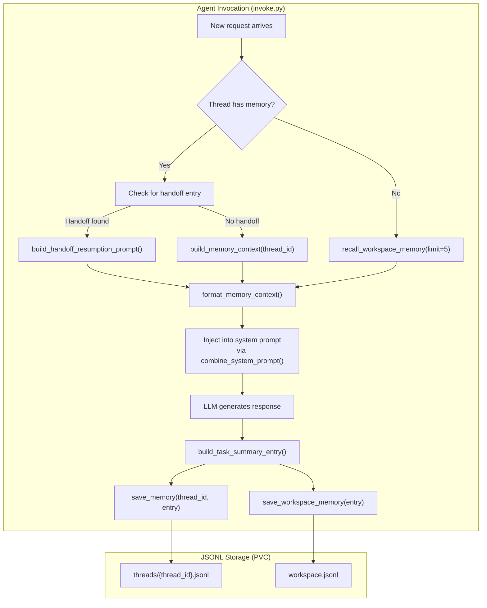
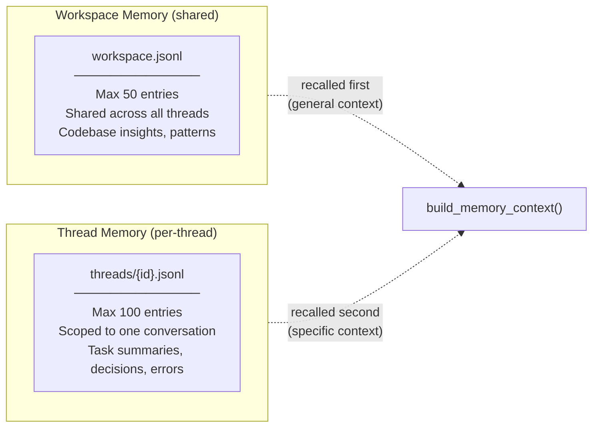
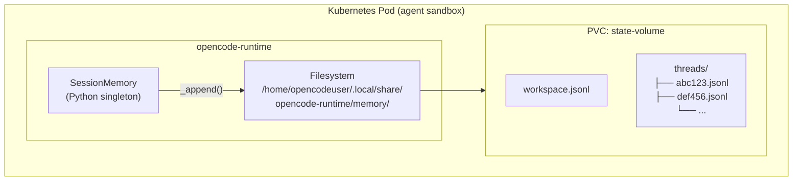
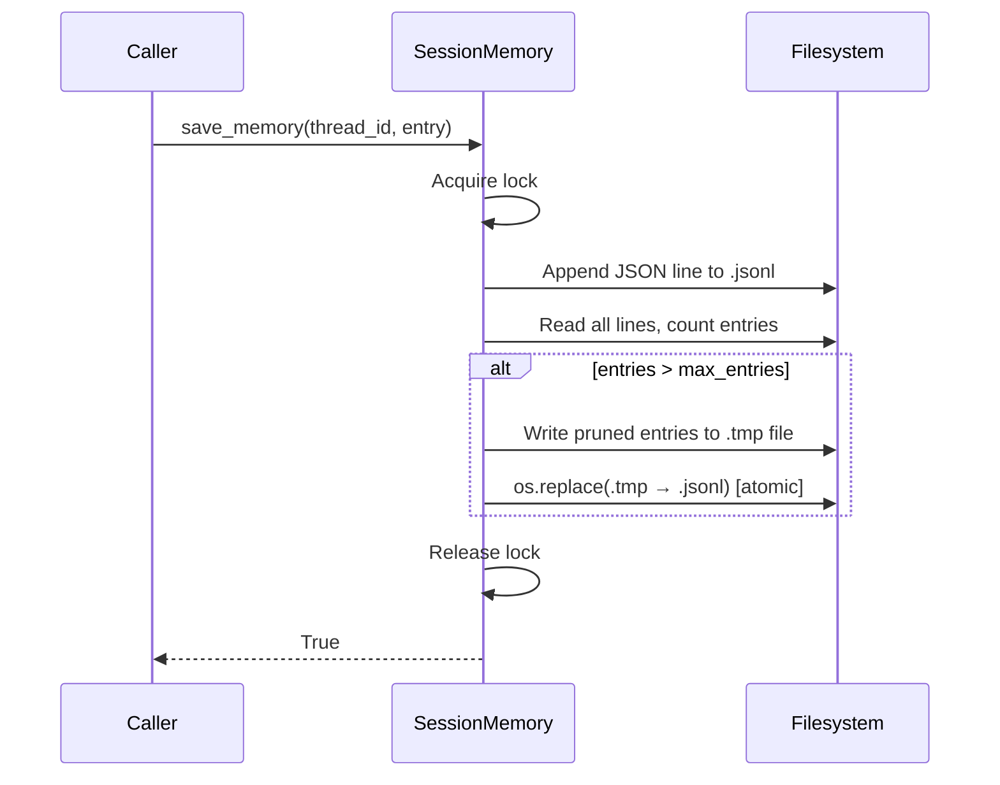
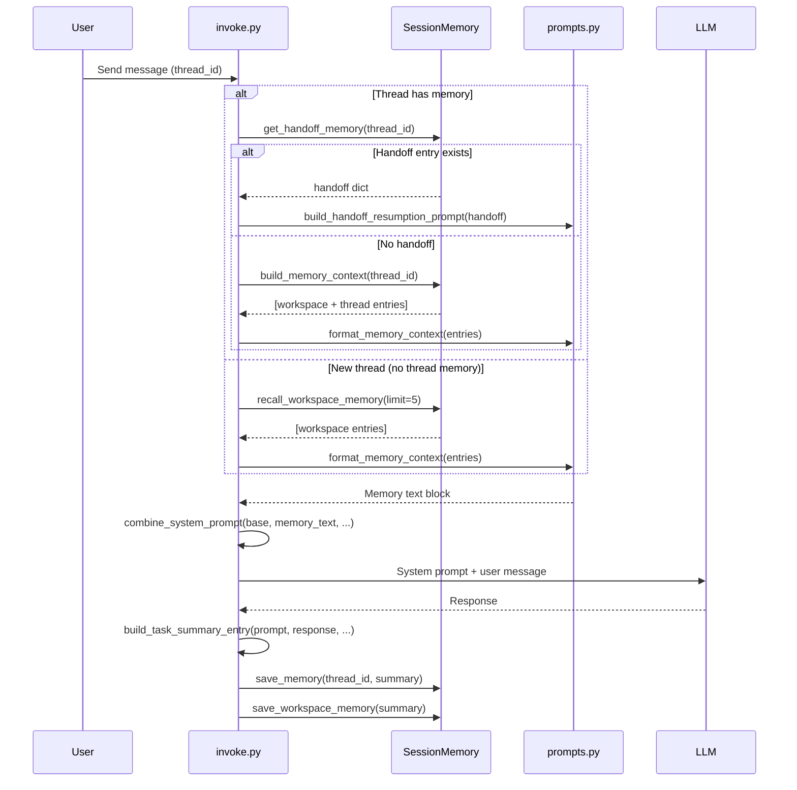
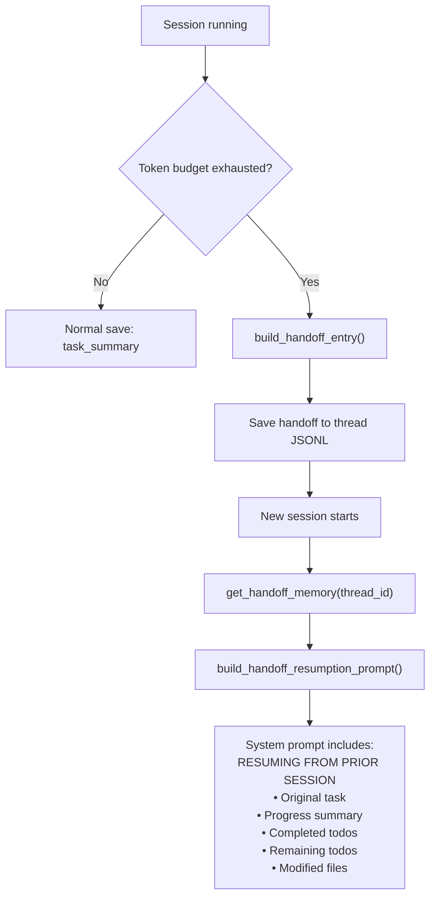

# Memory System Architecture

## Overview

The agent memory system is **not** a vector database. It is a **JSONL flat-file store** backed by a Kubernetes Persistent Volume Claim (PVC). Memory entries are plain JSON objects appended to `.jsonl` files on disk, recalled by reading the last N lines, and injected into the LLM system prompt as plain text. There is no embedding, no similarity search, and no external database — just append-only log files with atomic pruning.

---

## High-Level Flow



---

## Two-Tier Architecture

The system has **two tiers** of memory, stored as separate JSONL files:



| Tier | File | Max Entries | Scope | Purpose |
|------|------|-------------|-------|---------|
| **Workspace** | `workspace.jsonl` | 50 | All threads | Codebase structure, recurring patterns, tech stack info |
| **Thread** | `threads/{thread_id}.jsonl` | 100 | Single thread | Task summaries, decisions, errors, handoffs |

When composing context, `build_memory_context()` returns **workspace entries first** (general knowledge), then **thread entries** (specific to the conversation).

---

## Entry Types

There are **6 valid entry types**:

| Type | Purpose |
|------|---------|
| `task_summary` | Summary of completed work: prompt, status, artifacts, tools used, todos |
| `decision` | A key decision made during a session (e.g. "chose X over Y because Z") |
| `error_pattern` | An error that was encountered and how it was resolved |
| `codebase_insight` | Structural knowledge about the codebase (tech stack, conventions) |
| `file_map` | Key files and their roles in the project |
| `handoff` | Full context dump when a session exhausts its token budget |

Every entry is a JSON object with at least `type`, `content`, and an auto-set `timestamp`:

```json
{
  "type": "task_summary",
  "content": {
    "prompt_summary": "Fix the workspace persistence bug...",
    "status": "completed",
    "artifacts": ["operator/builders/manifests.py"],
    "tools_used": ["read_file", "grep_search", "run_in_terminal"],
    "completed": ["Mount PVC with subPath"],
    "remaining": [],
    "response_excerpt": "Changed all 4 runtime types..."
  },
  "timestamp": 1718900000.0
}
```

---

## Storage & Persistence Layer



- **Base directory**: `$XDG_DATA_HOME/opencode-runtime/memory/` (overridable via `OPENCODE_MEMORY_DIR`)
- **Kubernetes volume**: The `state-volume` PVC is mounted at `/workspace` with subPath, and the memory directory lives on the same PVC — so **memory survives pod restarts**
- **Thread ID sanitization**: Thread IDs are cleaned to `[a-zA-Z0-9_-]`, truncated to 64 chars

### Atomic Writes & Pruning

Writes use a **threading.Lock** for per-process thread safety. Pruning is **crash-safe** via atomic file replacement:



This ensures that if the pod crashes mid-prune, the original file is untouched — `os.replace()` is an atomic filesystem operation.

---

## Recall & Injection into LLM

When a new request arrives, memory is loaded and injected into the system prompt:



The formatted memory text looks like this in the system prompt:

```
PRIOR SESSION MEMORY (context carried from previous sessions):
- [codebase_insight] This project uses FastAPI with a Helm-based deployment...
- [task_summary] {"prompt_summary": "Fix workspace persistence...", "status": "completed", ...}
- [error_pattern] PVC mount was emptyDir — changed to subPath: workspace
```

---

## Handoff Mechanism (Context Exhaustion)

When the LLM's token budget is nearly exhausted, a **handoff entry** is saved instead of a normal task summary. This captures the full state needed to resume in a new session:



A handoff entry captures:
- `original_prompt` (up to 1000 chars)
- `summary` of progress (up to 2000 chars)
- `todos` — completed and pending (up to 30)
- `artifacts` — files created/modified (up to 30)
- `context_budget` — token usage stats

---

## Configuration

| Environment Variable | Default | Description |
|---------------------|---------|-------------|
| `OPENCODE_MEMORY_ENABLED` | `true` | Enable/disable the memory system |
| `OPENCODE_MEMORY_DIR` | `$XDG_DATA_HOME/opencode-runtime/memory` | Base directory for memory files |
| `MEMORY_MAX_THREAD_ENTRIES` | `100` | Max entries per thread JSONL file |
| `MEMORY_MAX_WORKSPACE_ENTRIES` | `50` | Max entries in workspace.jsonl |

---

## Key Design Decisions

1. **JSONL over a database**: Simple, no dependencies, human-readable, easy to debug. `cat workspace.jsonl` shows everything.
2. **No vector search**: Memory is injected as plain text into the system prompt — the LLM itself decides what's relevant. This avoids embedding model dependencies and keeps the system self-contained.
3. **Two tiers**: Workspace memory provides cross-thread continuity (the agent "remembers" the codebase); thread memory provides session-specific context.
4. **Atomic pruning**: `tempfile` + `os.replace()` ensures no data loss on crash.
5. **Bounded size**: Hard caps on entries (100 thread, 50 workspace) prevent unbounded growth that would blow up the system prompt.
6. **Handoff for continuity**: When tokens run out, a structured handoff entry preserves enough state for the next session to pick up exactly where it left off.
