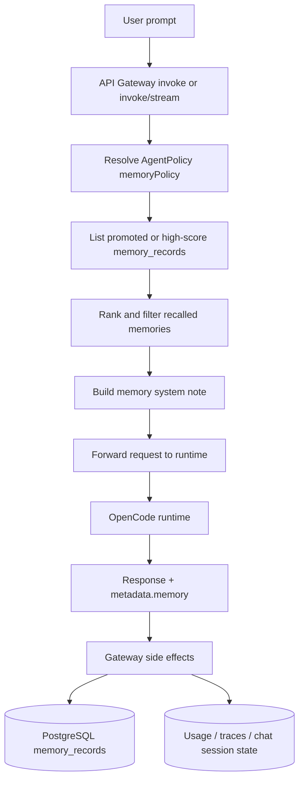

# Durable Memory Architecture

## Overview

KubeSynapse now uses a **layered memory model** rather than a single memory store.

There are two persisted memory surfaces:

1. **Gateway durable memory** in PostgreSQL, used for cross-session recall in the UI and API.
2. **Runtime-local memory** inside the OpenCode runtime, used for session continuity, handoff, and optional semantic retrieval.

The gateway layer is what powers user-visible persistent recall. The runtime layer still exists,
but it is no longer the only or primary durable-memory path.

---

## High-Level Flow



---

## Layer 1: Gateway Durable Memory

### What it stores

The gateway stores durable memory in PostgreSQL `memory_records` rows. Records are scoped by:

- namespace
- agent name
- username when the memory is user-specific
- topic / memory type
- promotion state and score

### Where durable memory comes from

The gateway persists memory from two main sources:

1. **Runtime-emitted memory candidates**
	The OpenCode runtime can return `metadata.memory` on invoke completion. The gateway records
	those candidates with `record_runtime_memory(...)`.
2. **Saved chat sessions**
	Saving chat messages can summarize the session and write an auto-promoted durable memory record.

### How recall works

At invoke time the gateway:

1. resolves the effective memory policy from the agent or chart defaults
2. loads promoted memories, or high-score fallback memories if nothing is promoted yet
3. ranks the candidates against the current prompt
4. filters out bad legacy memories such as `I don't have persistent memory...`
5. injects the ranked results into the request `system` prompt as a durable-memory note

The default chart-managed memory policy is:

```yaml
memoryPolicy:
  enabled: true
  name: default-memory-policy
  namespace: default
  autoPromote: true
  maxInjectedMemories: 8
  maxInjectedChars: 2400
  allowedMemoryTypes: []
```

### Stream parity

Both invoke surfaces use the same recall path:

- `POST /api/v1/agents/{name}/invoke`
- `POST /api/v1/agents/{name}/invoke/stream`

When recalled memory is injected on a streamed request, the gateway can fall back to a non-stream
runtime invoke and emit **synthetic SSE** so the streamed path preserves the same answer and still
records memory side effects.

---

## Layer 2: Runtime-Local Memory

The OpenCode runtime still keeps its own local memory manager under `OPENCODE_MEMORY_DIR`.

This layer is responsible for:

- thread and workspace continuity inside the runtime pod
- handoff entries when the runtime needs to resume work later
- local context fencing and retention rules
- optional semantic retrieval through Qdrant when `OPENCODE_MEMORY_SEMANTIC_ENABLED=true`

The runtime-local layer is file-backed by default and survives pod restarts when the runtime PVC is preserved.

### Runtime-local configuration

Important runtime-local settings include:

- `OPENCODE_MEMORY_ENABLED`
- `OPENCODE_MEMORY_DIR`
- `OPENCODE_MEMORY_MAX_THREAD_ENTRIES`
- `OPENCODE_MEMORY_MAX_WORKSPACE_ENTRIES`
- `OPENCODE_MEMORY_CONTEXT_FENCING`
- `OPENCODE_MEMORY_CONTEXT_MAX_TOKENS`
- `OPENCODE_MEMORY_SEMANTIC_ENABLED`
- `OPENCODE_MEMORY_QDRANT_URL`

This layer is complementary to the gateway layer. It does **not** replace PostgreSQL-backed durable recall.

---

## Memory Types

The current durable path commonly uses these practical categories:

| Category | Source | Typical use |
|---|---|---|
| `procedural` | Runtime `metadata.memory` or chat summaries | Stable instructions, preferences, conventions |
| `episodic` | Runtime `metadata.memory` | Tool-use history, notable completed work |
| `assistant-summary` / topic labels | Runtime summary text | Fast recall for user-visible facts |

The gateway can also rank by topic and score, and it can restrict injection through
`allowedMemoryTypes` when a policy uses that field.

---

## User and Ownership Model

Durable memories can be user-specific.

- user-scoped memories are recalled only for the matching user
- shared memories can be stored with no username and recalled more broadly within the namespace/agent scope
- memory edit and delete endpoints enforce namespace access and user ownership

Available mutation endpoints:

- `PATCH /api/v1/memory/{record_id}`
- `DELETE /api/v1/memory/{record_id}`

---

## Failure Modes the Current Design Handles

### Legacy false-denial memories

Older records like `I don't have persistent memory` can poison recall if they rank highly.
The gateway now filters those phrases during recall ranking so they are not reinjected as durable context.

### Stream / non-stream divergence

It is possible for `/invoke` to behave correctly while `/invoke/stream` diverges. The current design avoids
that by applying the same recall path on both endpoints and using sync-to-SSE fallback when required.

### Same-tag local redeploys

In local Kind development, reloading the same `:dev` image tag does not automatically roll workloads.
If the image reference string does not change, explicitly restart the touched deployment after loading the image.

---

## Mental Model

Use this simplified model when reasoning about memory in KubeSynapse:

- **Runtime memory** keeps the pod's own short-horizon working context alive.
- **Gateway durable memory** is the platform memory that users experience as persistent recall.
- **Policies** decide how much durable memory gets injected.
- **Chat saves and runtime metadata** are the main ways new durable memory is created.

That split is the key difference between the current implementation and the older JSONL-only design.
