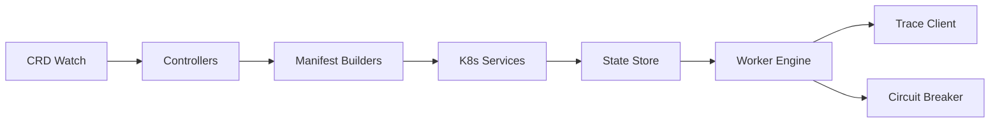

# KubeSynapse Operator

Kubernetes operator that reconciles `KubeSynapse.ai/v1alpha1` custom resources into running
Kubernetes workloads. Built with [Kopf](https://kopf.dev/) and Python 3.11+.

## Purpose

The operator watches `AIAgent`, `AgentWorkflow`, and `AgentEval` CRDs and materializes
them into Deployments, Services, PVCs, Jobs, and ConfigMaps. It is the control plane
that turns declarative agent specs into live runtime pods.

## Architecture



- **Controllers** — Kopf handlers for `AIAgent`, `AgentWorkflow`, and `AgentEval`.
  Enqueue events, manage finalizers, and drive status updates.
- **Manifest Builders** — Generate K8s objects (Deployment, Service, PVC, Job) from
  CRD spec snippets with sane defaults and label inheritance.
- **K8s Services** — Thin wrappers around `kubernetes-client` for create, patch,
  delete, and watch operations with optimistic locking.
- **State Store** — In-memory and persisted workflow execution state used by the
  worker engine to resume interrupted runs.
- **Worker Engine** — DAG executor that runs workflow steps, handles retries,
  approvals, and artifact collection.
- **Trace Client** — Batched trace emitter that ships step-level spans to the
  API-gateway trace store.
- **Circuit Breaker** — Prevents cascading failures when downstream runtimes or
  sidecars become unhealthy.

## Worker Engine Deep Dive

The worker engine is the heart of workflow execution:

- **DAG Execution** — Steps are resolved in topological order. Conditional branches
  and loops are expanded before the first step runs.
- **Translator Pattern** — Each step kind (`invoke`, `a2a`, `mcp`, `approval`) has
  a translator that turns the CRD step spec into an internal job description.
- **JSON-Contract Handling** — Input/output schemas are validated against JSON
  contracts before a step is marked complete.
- **Artifact PVC Creation** — Every workflow run gets a dedicated PVC for
  intermediate files. The PVC carries an `ownerReference` back to the workflow CR
  so garbage collection is automatic.
- **SSE Streaming Invoke** — For streaming runtimes, the worker opens an SSE
  connection, applies delta transforms, and reconstructs the final response from
  streamed chunks.

## Key Modules

| Module | Role |
|--------|------|
| `controllers/` | Kopf watch handlers for each CRD |
| `builders/` | Manifest generation and defaulting |
| `services/` | K8s API wrappers and resource lifecycle |
| `worker/` | DAG execution, translators, and artifact management |
| `trace/` | Trace batching and delivery |
| `circuit/` | Failure detection and backoff |
| `utils/` | Shared helpers for logging, validation, and templating |

## Development Setup

```bash
cd operator/
python -m venv .venv
source .venv/bin/activate
pip install -r requirements.txt
```

Run the operator locally against a cluster:

```bash
kopf run main.py --verbose
```

## Testing

```bash
pytest tests/ -v
```

Key regression tests include:

- **Workflow controller enqueue** — Verifies that status-only updates do not
  trigger duplicate enqueue events.
- **Worker artifact PVC ownerRef** — Confirms every artifact PVC references the
  parent workflow for correct garbage collection.
- **Streaming delta recovery** — Ensures truncated SSE streams are reconstructed
  into valid final payloads.
- **Trace client batching** — Validates that traces are flushed correctly at
  batch size and on graceful shutdown.

## Deployment

The operator is published as a container image:

```bash
docker pull docker.io/kubesynapse/kubesynapse-operator:v1.0.15
```

In the Helm chart it runs as a single-replica Deployment with a service account
bound to the `kubesynapse-operator` ClusterRole.
